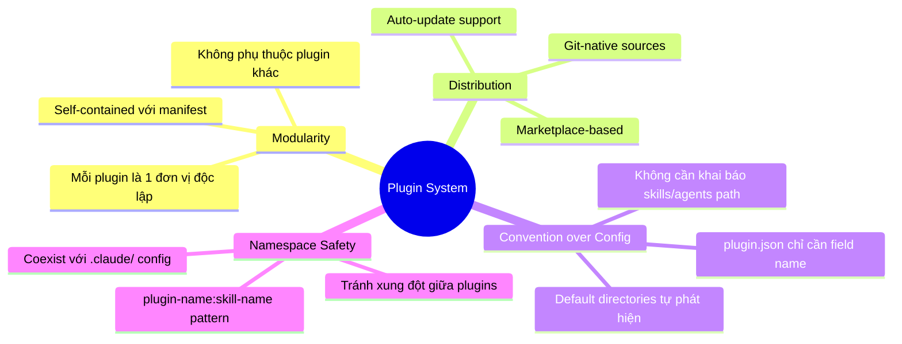
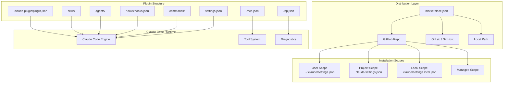
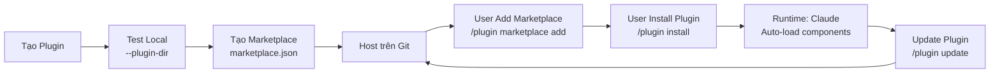

# Claude Code Plugins — Tổng quan

## Plugins là gì?

**Claude Code Plugins** là hệ thống extension chính thức, cho phép đóng gói và phân phối các **skills**, **agents**, **hooks**, **MCP servers** và **LSP servers** dưới dạng module tái sử dụng. Plugin giúp mở rộng Claude Code vượt xa cấu hình `.claude/` riêng lẻ, hướng tới chia sẻ, phiên bản hóa và marketplace.

> **Yêu cầu**: Claude Code ≥ **v1.0.33** (kiểm tra bằng `claude --version`)

---

## Vấn đề giải quyết

| Vấn đề | Mô tả | Cách Plugin giải quyết |
|---|---|---|
| **Cấu hình rời rạc** | Skills, hooks, agents nằm rải rác trong `.claude/` — khó chia sẻ giữa project | Đóng gói tất cả vào 1 plugin folder với `plugin.json` manifest |
| **Không có versioning** | Thay đổi config không track được phiên bản | Semantic versioning (`MAJOR.MINOR.PATCH`) trong `plugin.json` |
| **Xung đột tên** | 2 project dùng `/deploy` khác nhau → xung đột | Namespace tự động: `/plugin-name:skill-name` |
| **Phân phối khó** | Copy-paste thủ công giữa repos, thiếu cơ chế update | Marketplace system — `marketplace.json` + `/plugin install` |
| **Thiếu Code Intelligence** | Claude không thấy type errors, missing imports real-time | LSP server plugins — tích hợp Language Server Protocol |
| **Team không đồng bộ** | Mỗi dev tự config Claude khác nhau | Team marketplace + `extraKnownMarketplaces` trong `.claude/settings.json` |

---

## Triết lý thiết kế

**4 nguyên tắc cốt lõi:**

1. **Self-contained**: Plugin hoạt động độc lập, không cần setup phức tạp
2. **Convention-first**: Default locations (`commands/`, `skills/`, `agents/`, `hooks/`) tự động được phát hiện
3. **Namespace isolation**: Tên plugin prefix ngăn xung đột giữa plugins
4. **Git-native distribution**: Source trực tiếp từ GitHub/GitLab repos

---

## Ai nên dùng?

| Đối tượng | Use case |
|---|---|
| **Plugin Developer** | Tạo tools, skills, hooks đóng gói thành plugin chia sẻ cho community |
| **Team Lead / DevOps** | Thiết lập team marketplace chuẩn hóa workflow Claude cho toàn đội |
| **Individual Dev** | Cài đặt plugins từ marketplace để mở rộng Claude Code nhanh chóng |
| **Enterprise Admin** | Quản lý managed marketplace với security controls |

---

## Kiến trúc tổng quan

### Bảng Components

| Component | File/Directory | Chức năng |
|---|---|---|
| **Manifest** | `.claude-plugin/plugin.json` | Metadata plugin: name, version, description, author |
| **Skills** | `skills/<name>/SKILL.md` | Kỹ năng AI (slash commands) — auto-discovered |
| **Agents** | `agents/<name>.md` | Subagents chuyên biệt — hiện trong `/agents` |
| **Commands** | `commands/<name>.md` | Legacy slash commands |
| **Hooks** | `hooks/hooks.json` | Event handlers: PreToolUse, PostToolUse, Stop, v.v. |
| **MCP Servers** | `.mcp.json` | Model Context Protocol servers — external tool integration |
| **LSP Servers** | `.lsp.json` | Language Server Protocol — code intelligence (diagnostics, navigation) |
| **Settings** | `settings.json` | Default settings cho plugin (agent mặc định, v.v.) |

---

## Vòng đời Plugin

### Chi tiết các giai đoạn

| Giai đoạn | Hành động | Lệnh |
|---|---|---|
| **Develop** | Tạo folder + `plugin.json` + components | `mkdir`, edit files |
| **Test** | Load plugin locally | `claude --plugin-dir ./my-plugin` |
| **Package** | Tạo `marketplace.json` liệt kê plugins | Edit `marketplace.json` |
| **Distribute** | Push lên GitHub / Git host | `git push` |
| **Install** | User cài từ marketplace | `/plugin install name@marketplace` |
| **Manage** | Enable/disable/uninstall | `/plugin enable/disable/uninstall` |
| **Update** | Kéo phiên bản mới | `/plugin update name@marketplace` |

---

## Tính năng nổi bật

### 1. **Namespace System**
Plugin tự động prefix tên: `/my-plugin:hello` thay vì `/hello`. Tránh xung đột khi nhiều plugins cùng có skill tên giống nhau.

### 2. **Multi-Component Packaging**
Một plugin chứa đồng thời: skills + agents + hooks + MCP + LSP + settings. Tất cả auto-discovered theo convention.

### 3. **4 Installation Scopes**
- **User**: Áp dụng cho tất cả projects (`~/.claude/settings.json`)
- **Project**: Chia sẻ với team qua git (`.claude/settings.json`)
- **Local**: Riêng cá nhân, gitignored (`.claude/settings.local.json`)  
- **Managed**: Enterprise admin control

### 4. **LSP Integration (Code Intelligence)**
Plugin LSP cung cấp:
- **Auto diagnostics** — Type errors, missing imports phát hiện ngay sau mỗi edit
- **Code navigation** — Go to definition, find references, hover info
- Hỗ trợ sẵn: Go, Python, TypeScript, Rust, Java, C/C++, Kotlin, Lua, PHP, Swift, C#

### 5. **Official Anthropic Marketplace**
Marketplace chứa plugins chính thức:
- **Code Intelligence**: gopls-lsp, pyright-lsp, typescript-lsp, rust-analyzer-lsp, v.v.
- **External Integrations**: GitHub, GitLab, Slack, Jira, Linear, Figma, Sentry, v.v.
- **Workflow**: commit-commands, pr-review-toolkit, agent-sdk-dev, plugin-dev
- **Output Styles**: explanatory-output-style, learning-output-style

### 6. **Hot Reload**
Dùng `/reload-plugins` để reload sau khi sửa plugin code — không cần restart Claude Code session.

### 7. **`${CLAUDE_PLUGIN_ROOT}` Variable**
Environment variable trỏ tới plugin root, giúp hooks/scripts reference file paths tương đối portable.

---

## So sánh: Plugin vs `.claude/` Config

| Tiêu chí | `.claude/` Config | Plugin |
|---|---|---|
| **Phạm vi** | 1 project duy nhất | Cross-project, shareable |
| **Namespace** | Tên trực tiếp (`/hello`) | Prefixed (`/plugin:hello`) |
| **Versioning** | Không | Semantic versioning |
| **Distribution** | Copy thủ công | Marketplace + `/plugin install` |
| **Team sharing** | Manual sync | `extraKnownMarketplaces` config |
| **LSP support** | Không | Có (`.lsp.json`) |
| **MCP support** | Có (per-project) | Có (bundled trong plugin) |
| **Migration** | n/a | Có hỗ trợ chuyển đổi |
| **Khi nào dùng** | Config cá nhân, thử nghiệm | Chia sẻ, tái sử dụng, enterprise |

---

## Điểm mới đáng chú ý

- **Plugin Marketplace System** — Hệ sinh thái marketplace đầy đủ: official Anthropic marketplace + custom team marketplace
- **LSP Server Plugins** — Code intelligence cho 12+ ngôn ngữ lập trình
- **4 Hook Types** — `command`, `prompt`, `agent`, + async hooks
- **Managed Marketplace** — Enterprise-grade restrictions & security
- **Plugin Submission** — Submit qua `claude.ai/settings/plugins/submit` hoặc `platform.claude.com/plugins/submit`

---

## Xem thêm

- [[3-Research/Claude Code/claude-code-plugins/1. Architecture and Logic]] — Data flow, component specs, manifest schema
- [[3-Research/Claude Code/claude-code-plugins/2. Playbook]] — Cài đặt, tạo plugin, cheat sheet, troubleshooting
