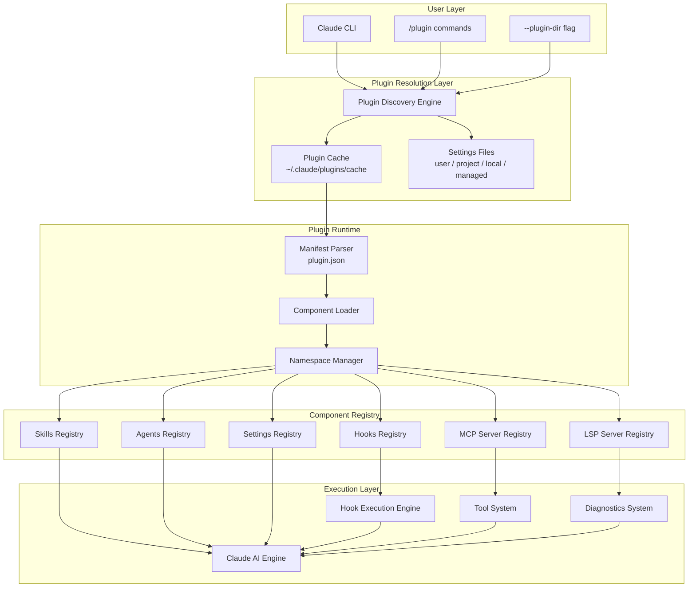
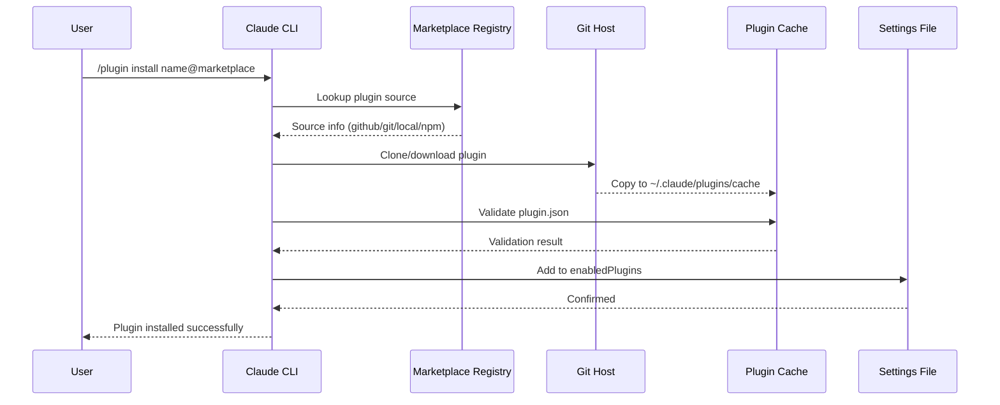
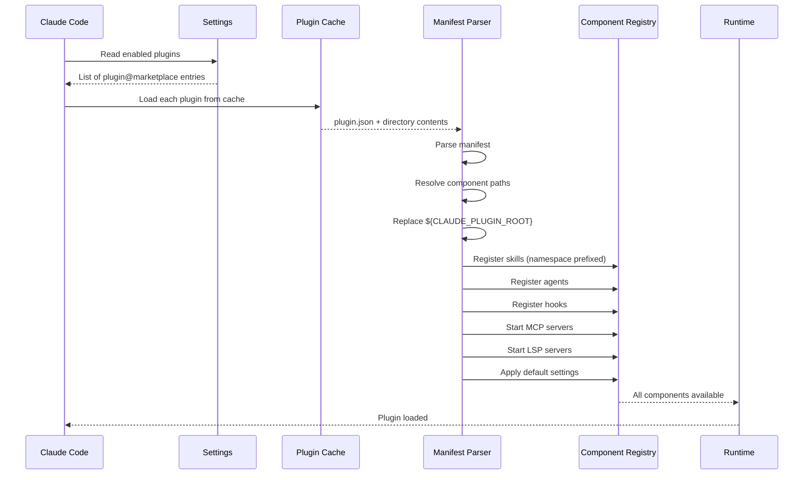
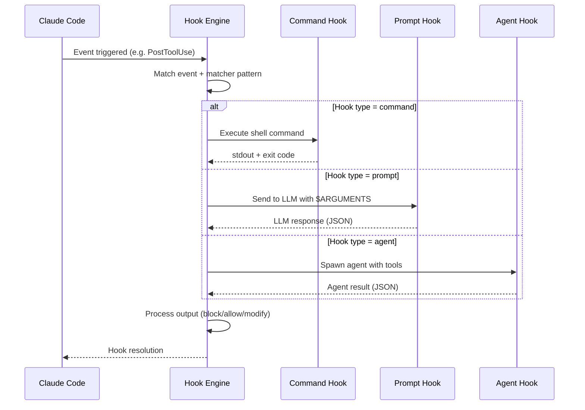
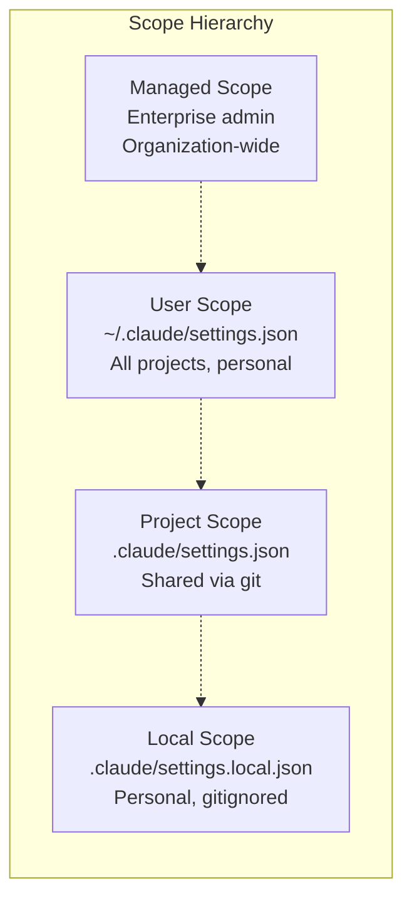
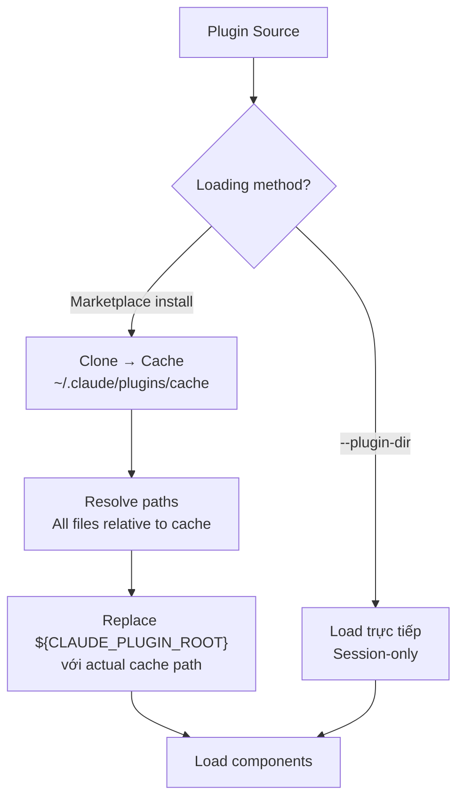

# Claude Code Plugins — Architecture and Logic

## 1. Mô hình kiến trúc tổng thể



### Giải thích các Layer

| Layer | Vai trò |
|---|---|
| **User Layer** | Điểm tương tác: CLI flags, slash commands trong session |
| **Resolution Layer** | Tìm và cache plugins từ marketplace/local, đọc settings để biết enable/disable |
| **Plugin Runtime** | Parse manifest, load components, gán namespace |
| **Component Registry** | Đăng ký tất cả components vào hệ thống Claude Code |
| **Execution Layer** | Claude AI sử dụng skills/agents/hooks/tools trong quá trình code |

---

## 2. Data Flow chi tiết

### 2.1 Plugin Installation Flow



### 2.2 Plugin Load Flow (Session Start)



### 2.3 Hook Execution Flow



---

## 3. Core Components — Chi tiết

### 3.1 Plugin Manifest (`plugin.json`)

**File location**: `.claude-plugin/plugin.json`

#### Required Fields

| Field | Type | Mô tả |
|---|---|---|
| `name` | `string` | Tên plugin — dùng làm namespace prefix, kebab-case |

#### Metadata Fields

| Field | Type | Default | Mô tả |
|---|---|---|---|
| `version` | `string` | — | Semantic version `MAJOR.MINOR.PATCH` |
| `description` | `string` | — | Mô tả ngắn về plugin |
| `author` | `object` | — | `{ name, email?, url? }` |
| `homepage` | `string` | — | URL documentation |
| `repository` | `string` | — | URL Git repository |
| `license` | `string` | — | SPDX license identifier |
| `keywords` | `string[]` | — | Tags tìm kiếm |

#### Component Path Fields

| Field | Type | Default Location | Mô tả |
|---|---|---|---|
| `commands` | `string\|string[]` | `commands/` | Path tới command `.md` files |
| `agents` | `string\|string[]` | `agents/` | Path tới agent `.md` files |
| `skills` | `string` | `skills/` | Path tới skills directory |
| `hooks` | `string` | `hooks/hooks.json` | Path tới hooks config |
| `mcpServers` | `string` | `.mcp.json` | Path tới MCP server config |
| `lspServers` | `string\|object` | `.lsp.json` | Path hoặc inline LSP config |
| `outputStyles` | `string` | — | Path tới output style directory |

#### Complete Schema Example

```json
{
  "name": "enterprise-tools",
  "version": "2.1.0",
  "description": "Enterprise development toolkit",
  "author": {
    "name": "DevTools Team",
    "email": "dev@company.com",
    "url": "https://github.com/company"
  },
  "homepage": "https://docs.company.com/plugin",
  "repository": "https://github.com/company/enterprise-tools",
  "license": "MIT",
  "keywords": ["enterprise", "deployment", "security"],
  "commands": ["./custom/commands/deploy.md"],
  "agents": "./custom/agents/",
  "skills": "./custom/skills/",
  "hooks": "./config/hooks.json",
  "mcpServers": "./mcp-config.json",
  "outputStyles": "./styles/",
  "lspServers": "./.lsp.json"
}
```

#### Path Behavior Rules

- Tất cả path **phải relative** và bắt đầu bằng `./`
- Nếu `commands/` tồn tại → auto-loaded, **kết hợp** với custom paths
- Commands từ custom paths cũng tuân theo naming & namespacing rules
- Có thể dùng array cho multiple paths

---

### 3.2 Skills Component

**Convention**: `skills/<skill-name>/SKILL.md`

```
skills/
├── code-review/
│   ├── SKILL.md          # Main skill definition
│   ├── reference.md      # Supporting files (optional)
│   └── scripts/          # Helper scripts (optional)
└── pdf-processor/
    └── SKILL.md
```

**SKILL.md Structure**:
```markdown
---
name: code-review
description: Reviews code for best practices and potential issues
disable-model-invocation: true   # Optional: chỉ inject prompt, không gọi model riêng
---

When reviewing code, check for:
1. Code organization and structure
2. Error handling
3. Security concerns
4. Test coverage
```

| Frontmatter Field | Mô tả |
|---|---|
| `name` | Tên skill (override folder name) |
| `description` | Mô tả — dùng cho auto-trigger context |
| `disable-model-invocation` | `true` = chỉ inject vào prompt hiện tại |

**Invocation**: `/plugin-name:skill-name [arguments]`
- `$ARGUMENTS` placeholder trong SKILL.md nhận user input

---

### 3.3 Agents Component

**Convention**: `agents/<agent-name>.md`

```markdown
---
name: security-reviewer
description: Specializes in security analysis and vulnerability detection
---

You are a security expert. Analyze code for:
- SQL injection, XSS, CSRF
- Authentication flaws
- Data exposure
- Dependency vulnerabilities
```

| Đặc điểm | Chi tiết |
|---|---|
| Hiển thị | Trong `/agents` interface |
| Invocation | Tự động (AI context-based) hoặc manual |
| Capabilities | Có thể restrict tools, set model riêng |
| Hooks | Có thể define hooks riêng cho agent |

---

### 3.4 Hooks Component

**Convention**: `hooks/hooks.json`

#### Hook Events đầy đủ

| Event | Timing | Mô tả |
|---|---|---|
| `SessionStart` | Session mở | Khởi tạo, setup environment |
| `InstructionsLoaded` | Sau khi load instructions | Modify/extend instructions |
| `UserPromptSubmit` | User gửi prompt | Validate/transform input |
| `PreToolUse` | Trước tool execution | Block, modify, approve tools |
| `PermissionRequest` | Dialog xin permission | Auto-approve patterns |
| `PostToolUse` | Sau tool thành công | Lint, format, validate output |
| `PostToolUseFailure` | Sau tool thất bại | Error handling, retry logic |
| `Notification` | Claude gửi notification | Custom notification handling |
| `Stop` | Claude muốn dừng | Extend execution, add tasks |
| `SubagentStart` | Subagent khởi động | Setup subagent context |
| `SubagentStop` | Subagent muốn dừng | Verify subagent output |
| `TeammateIdle` | Teammate sắp idle | Assign new work |
| `TaskCompleted` | Task hoàn thành | Report, cleanup |
| `PreCompact` | Trước compact history | Save important context |
| `ConfigChange` | Config thay đổi | React to settings |
| `WorktreeCreate` | Worktree được tạo | Setup environment |
| `WorktreeRemove` | Worktree bị xóa | Cleanup |
| `SessionEnd` | Session kết thúc | Final cleanup |

#### Hook Handler Types

| Type | Mô tả | Config |
|---|---|---|
| `command` | Chạy shell command/script | `{ "type": "command", "command": "..." }` |
| `prompt` | Gửi prompt cho LLM đánh giá | `{ "type": "prompt", "prompt": "..." }` |
| `agent` | Spawn agent verifier | `{ "type": "agent", "prompt": "..." }` |

#### Hook Config Example

```json
{
  "hooks": {
    "PostToolUse": [
      {
        "matcher": "Write|Edit",
        "hooks": [
          {
            "type": "command",
            "command": "${CLAUDE_PLUGIN_ROOT}/scripts/format-code.sh"
          }
        ]
      }
    ],
    "Stop": [
      {
        "hooks": [
          {
            "type": "prompt",
            "prompt": "Check if all tasks mentioned are complete. Return JSON: {\"decision\": \"allow\"} or {\"decision\": \"block\", \"reason\": \"...\"}"
          }
        ]
      }
    ]
  }
}
```

#### Hook I/O

- **Input**: JSON qua stdin chứa `session_id`, `tool_name`, `tool_input`, v.v.
- **Output**:
  - **Exit code** 0 = pass, non-zero = block
  - **JSON stdout**: `{ "decision": "allow|block", "reason": "..." }`
  - **Async hooks**: `"async": true` — chạy nền, không block

---

### 3.5 MCP Servers

**Convention**: `.mcp.json`

```json
{
  "mcpServers": {
    "plugin-database": {
      "command": "${CLAUDE_PLUGIN_ROOT}/servers/db-server",
      "args": ["--config", "${CLAUDE_PLUGIN_ROOT}/config.json"],
      "env": {
        "DB_PATH": "${CLAUDE_PLUGIN_ROOT}/data"
      }
    },
    "plugin-api-client": {
      "command": "npx",
      "args": ["@company/mcp-server", "--plugin-mode"],
      "cwd": "${CLAUDE_PLUGIN_ROOT}"
    }
  }
}
```

| Đặc điểm | Chi tiết |
|---|---|
| Auto-start | Khi plugin enabled, MCP servers tự khởi động |
| Tool integration | Servers xuất hiện như standard MCP tools |
| Independent config | Không ảnh hưởng user MCP servers |
| `${CLAUDE_PLUGIN_ROOT}` | Tự resolve tới plugin root path |

---

### 3.6 LSP Servers (Code Intelligence)

**Convention**: `.lsp.json` hoặc inline trong `plugin.json`

```json
{
  "go": {
    "command": "gopls",
    "args": ["serve"],
    "extensionToLanguage": {
      ".go": "go"
    }
  }
}
```

#### LSP Config Fields

| Field | Bắt buộc | Mô tả |
|---|---|---|
| `command` | ✅ | Binary executable |
| `extensionToLanguage` | ✅ | Map file extension → language ID |
| `args` | | Command arguments |
| `transport` | | `stdio` (default) hoặc `socket` |
| `env` | | Environment variables |
| `initializationOptions` | | LSP init options |
| `settings` | | Workspace settings |
| `workspaceFolder` | | Custom workspace path |
| `startupTimeout` | | Timeout khởi động |
| `shutdownTimeout` | | Timeout tắt |
| `restartOnCrash` | | Tự restart khi crash |
| `maxRestarts` | | Giới hạn lần restart |

#### LSP Capabilities mang lại

| Capability | Mô tả |
|---|---|
| **Auto Diagnostics** | Sau mỗi edit, Claude thấy errors/warnings ngay — tự sửa cùng turn |
| **Code Navigation** | Go to definition, find references, hover info |
| **Type Information** | Type info và documentation cho code symbols |

#### Official LSP Plugins

| Plugin | Language Server |
|---|---|
| `clangd-lsp` | `clangd` (C/C++) |
| `csharp-lsp` | `csharp-ls` (C#) |
| `gopls-lsp` | `gopls` (Go) |
| `jdtls-lsp` | `jdtls` (Java) |
| `kotlin-lsp` | `kotlin-language-server` |
| `lua-lsp` | `lua-language-server` |
| `php-lsp` | `intelephense` (PHP) |
| `pyright-lsp` | `pyright-langserver` (Python) |
| `rust-analyzer-lsp` | `rust-analyzer` (Rust) |
| `swift-lsp` | `sourcekit-lsp` (Swift) |
| `typescript-lsp` | `typescript-language-server` (TS/JS) |

---

## 4. Plugin Installation Scopes



| Scope | Settings File | Chia sẻ | Use case |
|---|---|---|---|
| **user** | `~/.claude/settings.json` | Không | Preferences cá nhân, global plugins |
| **project** | `.claude/settings.json` | Qua git | Team plugins, project-specific |
| **local** | `.claude/settings.local.json` | Không (gitignored) | Override cá nhân trong project |
| **managed** | Enterprise managed | Admin-controlled | Org-wide policies |

---

## 5. Marketplace Schema

### marketplace.json Structure

```json
{
  "name": "company-tools",
  "owner": {
    "name": "DevTools Team",
    "email": "dev@company.com"
  },
  "plugins": [
    {
      "name": "code-formatter",
      "source": "./plugins/formatter",
      "description": "Automatic code formatting on save",
      "version": "2.1.0",
      "author": { "name": "DevTools Team" }
    },
    {
      "name": "deployment-tools",
      "source": {
        "source": "github",
        "repo": "company/deploy-plugin"
      },
      "description": "Deployment automation tools"
    }
  ]
}
```

### Plugin Source Types

| Source Type | Config | Hỗ trợ `ref` | Hỗ trợ `sha` |
|---|---|---|---|
| **Relative path** | `"./my-plugin"` | — | — |
| **GitHub** | `{ "source": "github", "repo": "owner/repo" }` | ✅ | ✅ |
| **Git URL** | `{ "source": "url", "url": "https://..." }` | ✅ | ✅ |
| **Git Subdir** | `{ "source": "git-subdir", "url": "...", "path": "..." }` | ✅ | ✅ |
| **npm** | `{ "source": "npm", "package": "@scope/pkg" }` | — | — |
| **pip** | `{ "source": "pip", "package": "pkg" }` | — | — |

### Marketplace File Location
- **Git repos**: `.claude-plugin/marketplace.json`
- **Local**: Trỏ trực tiếp vào directory hoặc file `marketplace.json`
- **Remote**: URL tới hosted `marketplace.json`

---

## 6. Plugin Caching & File Resolution



**Path Traversal Limitations**:
- Plugins được copy vào cache → **không thể reference files ngoài plugin directory**
- Dùng `${CLAUDE_PLUGIN_ROOT}` cho tất cả internal references
- External dependencies phải bundled hoặc installable via package manager

---

## 7. Environment Variables

| Variable | Mô tả | Có ở đâu |
|---|---|---|
| `${CLAUDE_PLUGIN_ROOT}` | Absolute path tới plugin root directory | Hook commands, MCP configs, script paths |

---

## 8. Error Handling & Debugging

### Debugging Tools

| Tool | Cách dùng | Output |
|---|---|---|
| `claude --debug` | Start với debug mode | Plugin loading logs, errors |
| `/debug` | Trong session | Runtime debug info |
| `claude plugin validate` | CLI validation | Manifest validation errors |
| `/plugin validate` | Trong session | Plugin structure validation |
| `/plugin` → Errors tab | UI | Loading errors per plugin |

### Common Error Patterns

| Error | Nguyên nhân | Fix |
|---|---|---|
| `Invalid JSON syntax` | Missing commas, extra commas, unquoted strings | Validate JSON |
| `Validation errors: name: Required` | Thiếu field `name` trong `plugin.json` | Thêm `"name"` field |
| `No commands found in custom directory` | Command path tồn tại nhưng trống | Thêm `.md` files hoặc sửa path |
| `Plugin directory not found at path` | Source path trong marketplace sai | Sửa `source` trong `marketplace.json` |
| `Conflicting manifests` | Plugin có cả `plugin.json` và marketplace entry chỉ định components | Remove duplicate hoặc thêm `strict: false` |
| `Executable not found in $PATH` | LSP server binary chưa cài | Cài binary (npm/pip/brew) |

---

## Xem thêm

- [0. Overview](./0. Overview.md) — Tổng quan, triết lý, tính năng nổi bật
- [2. Playbook](./2. Playbook.md) — Hướng dẫn thực hành, cài đặt, cheat sheet, troubleshooting
