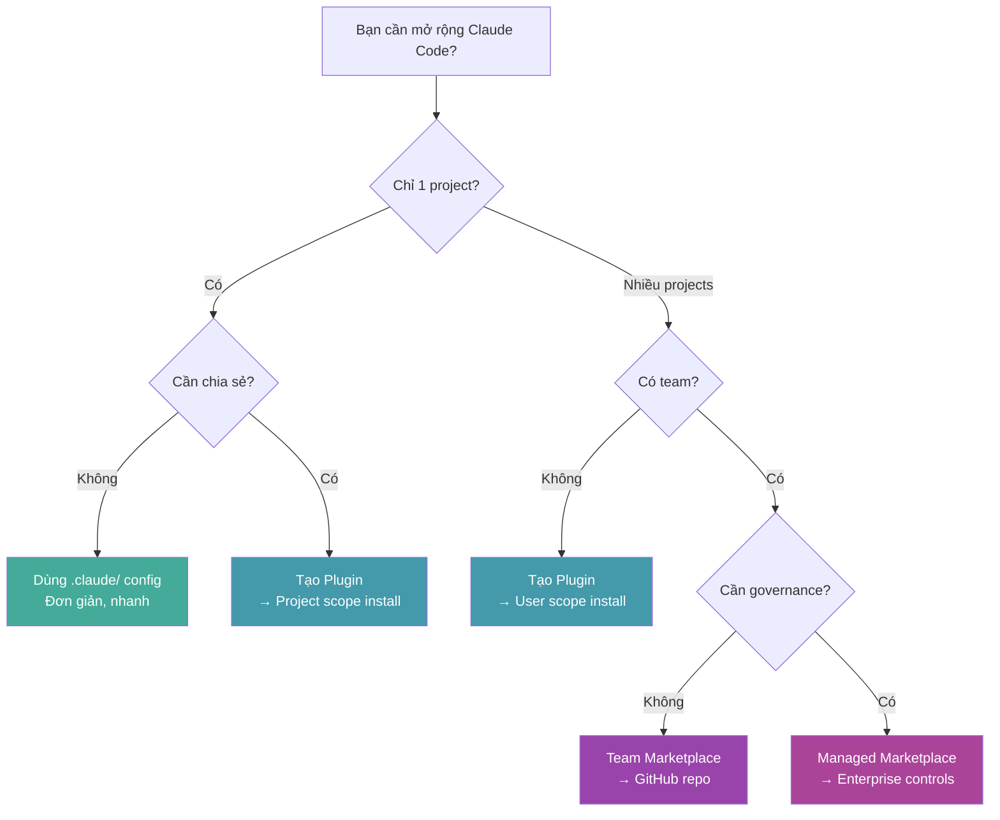
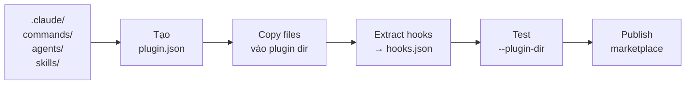
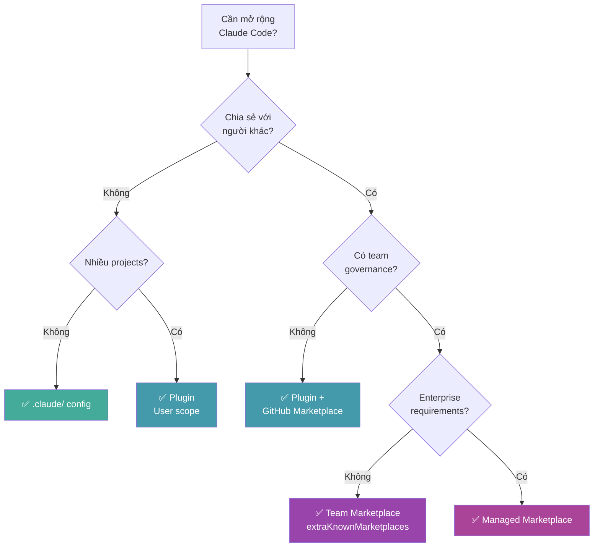

# Claude Code Plugins — Decision Guide

## 1. So sánh với Alternatives

### Plugin vs `.claude/` Standalone Config

| Tiêu chí | `.claude/` Config | Plugin System |
|---|---|---|
| **Setup complexity** | ⭐ Đơn giản — tạo folder, add files | ⭐⭐ Cần `plugin.json` manifest |
| **Namespace** | `/hello` — ngắn gọn | `/plugin-name:hello` — dài hơn nhưng an toàn |
| **Chia sẻ cross-project** | ❌ Copy thủ công | ✅ Marketplace + `/plugin install` |
| **Versioning** | ❌ Không track | ✅ Semantic versioning |
| **Team standardization** | ❌ Mỗi dev tự config | ✅ `extraKnownMarketplaces` + `enabledPlugins` |
| **LSP integration** | ❌ Không hỗ trợ | ✅ `.lsp.json` — code intelligence |
| **MCP servers** | ✅ Per-project `.mcp.json` | ✅ Bundled trong plugin |
| **Hooks** | ✅ Trong `settings.json` | ✅ Riêng `hooks/hooks.json` |
| **Skills** | ✅ `.claude/skills/` | ✅ `skills/` — auto-discovered |
| **Agents** | ✅ `.claude/agents/` | ✅ `agents/` — auto-discovered |
| **Update mechanism** | Git pull thủ công | `/plugin update` CLI |
| **Conflict risk** | ⚠️ Cao khi nhiều config | ✅ Namespace isolation |
| **Cache/portability** | Gắn với project dir | Cached tại `~/.claude/plugins/cache` |
| **Learning curve** | Thấp | Trung bình |

### Plugin vs MCP-Only Approach

| Tiêu chí | MCP Servers trực tiếp | Plugin (bundling MCP) |
|---|---|---|
| **Scope** | External tools only | Skills + Agents + Hooks + MCP + LSP |
| **Distribution** | Manual config `.mcp.json` per project | Marketplace install, bundled |
| **Kèm skills/hooks** | ❌ Phải setup riêng | ✅ Tất cả trong 1 package |
| **Team sharing** | Copy `.mcp.json` | `enabledPlugins` config |
| **Auto-start** | Tùy config | ✅ MCP servers auto-start khi plugin enabled |
| **Khi nào dùng** | Chỉ cần external tool | Cần combo skills + hooks + tools |

### Plugin vs Custom Shell Scripts / Makefile

| Tiêu chí | Custom Scripts | Plugin System |
|---|---|---|
| **Claude integration** | ❌ Gọi manual, không contextual | ✅ Claude auto-invoke dựa trên context |
| **Hook events** | ❌ Không có lifecycle hooks | ✅ 17+ event types |
| **AI-aware** | ❌ Scripts không biết Claude context | ✅ Hooks nhận JSON input từ Claude |
| **Namespace** | N/A | ✅ Plugin namespace system |
| **Distribution** | Copy scripts | ✅ Marketplace |
| **Khi nào dùng** | One-off automation | Repeatable AI-assisted workflows |

### Plugin vs IDE Extensions (VS Code, JetBrains)

| Tiêu chí | IDE Extension | Claude Code Plugin |
|---|---|---|
| **Target** | IDE features (UI, keybindings) | AI coding assistant features |
| **Runtime** | IDE process | Claude Code CLI session |
| **AI integration** | Tùy extension | ✅ Native — skills, agents, hooks |
| **Code intelligence** | ✅ LSP built-in | ✅ LSP via plugin |
| **Overhead** | Heavy (full IDE) | Light (CLI-based) |
| **Marketplace** | VS Code Marketplace, JetBrains | Claude Plugin Marketplace |
| **Coexistence** | — | ✅ Chạy song song — bổ sung cho IDE |

---

## 2. Khi nào NÊN dùng Plugins

### ✅ Use cases lý tưởng

| Scenario | Vì sao Plugin phù hợp |
|---|---|
| **Team cần chuẩn hóa workflow** | Marketplace + `extraKnownMarketplaces` → mọi dev dùng cùng config |
| **Chia sẻ skills/agents cross-project** | 1 lần tạo, install ở mọi project |
| **Cần code intelligence** | LSP plugins cho auto-diagnostics, type checking |
| **CI/CD hooks phức tạp** | Hook system với 17+ events, 3 handler types |
| **Open source community tools** | Publish lên Official Marketplace |
| **Enterprise standardization** | Managed marketplace + scope controls |
| **Multi-component package** | Skills + agents + hooks + MCP + LSP trong 1 unit |
| **Version tracking quan trọng** | Semantic versioning, update có kiểm soát |

### Cụ thể — Ai nên bắt đầu với Plugins ngay?



---

## 3. Khi nào KHÔNG nên dùng Plugins

### ❌ Anti-use-cases

| Scenario | Vì sao KHÔNG nên dùng Plugin | Nên dùng gì |
|---|---|---|
| **Thử nghiệm nhanh 1 skill** | Overhead tạo `plugin.json`, namespace dài | `.claude/skills/` trực tiếp |
| **Config cá nhân, không chia sẻ** | Plugin giải quyết bài toán distribution — thừa nếu chỉ cá nhân | `.claude/` config |
| **Project đơn giản, 1 người** | Complexity không cần thiết | `.claude/commands/` |
| **Chỉ cần 1 MCP server** | Plugin bundling là overkill | `.mcp.json` trực tiếp |
| **Claude Code < 1.0.33** | Plugin system chưa có | Upgrade trước |
| **Cần UI integration** | Plugin chỉ CLI-level | IDE extension |

### Limitations hiện tại

| Limitation | Impact | Workaround |
|---|---|---|
| **Namespace bắt buộc** | `/plugin:skill` dài hơn `/skill` | Chọn tên plugin ngắn |
| **Cache isolation** | Không reference file ngoài plugin dir | Bundle tất cả cần thiết |
| **Không hot-reload hoàn toàn** | Cần `/reload-plugins` khi dev | Dùng `--plugin-dir` cho dev loop |
| **LSP memory usage** | Language servers nặng trên project lớn | Disable plugin nếu cần |
| **Monorepo false positives** | LSP báo lỗi import nội bộ | Ignore — không ảnh hưởng editing |

---

## 4. Use Cases thực tế

### Case 1: Team Frontend — Chuẩn hóa Code Quality

**Bài toán**: Team 5 devs, mỗi người config Claude khác nhau. Code review không nhất quán.

**Giải pháp**: Tạo team plugin với:
- **Skill** `/team:review` — checklist review chuẩn
- **Hook** PostToolUse → auto-run `prettier` + `eslint` sau mỗi edit
- **Agent** `security-reviewer` — chuyên gia bảo mật
- **LSP** `typescript-lsp` — type checking real-time

**Kết quả**: Mọi dev có cùng workflow, code quality cải thiện đáng kể.

### Case 2: Solo Developer — Cross-project Utilities

**Bài toán**: Dev làm 10+ repos, mỗi repo cần cùng bộ skills (commit conventions, PR templates, testing patterns).

**Giải pháp**: Tạo personal plugin, install ở user scope.
- Skills: `/my-tools:commit`, `/my-tools:test-plan`, `/my-tools:pr`
- Hooks: Auto-format, auto-lint on save
- Install 1 lần, apply tất cả projects

### Case 3: Enterprise — Security Compliance

**Bài toán**: Tổ chức lớn cần đảm bảo Claude Code tuân thủ security policies.

**Giải pháp**: Managed marketplace:
- **Hook** PreToolUse → block sensitive file access patterns
- **Hook** PostToolUse → scan for secrets in output
- **Agent** compliance-checker — verify code trước khi commit
- **Managed scope** — admin bắt buộc install, dev không tắt được

### Case 4: Open Source Maintainer — Community Plugins

**Bài toán**: Muốn cung cấp AI-assisted workflows cho users của framework.

**Giải pháp**: Publish plugin lên Official Marketplace:
- Skills cụ thể cho framework (scaffolding, migration, debugging)
- MCP server cho project management integration
- Submit qua `claude.ai/settings/plugins/submit`

---

## 5. Chi phí & Tài nguyên

### Chi phí trực tiếp

| Hạng mục | Chi phí |
|---|---|
| **Claude Code Plugin System** | **Miễn phí** — built-in từ v1.0.33 |
| **Official Marketplace** | **Miễn phí** — browse, install, update |
| **Custom Marketplace** | **Miễn phí** — self-host trên GitHub/GitLab |
| **Plugin Development** | **Miễn phí** — chỉ cần text editor |
| **Submit Official** | **Miễn phí** — qua claude.ai hoặc console |

### Chi phí gián tiếp

| Hạng mục | Estimate | Ghi chú |
|---|---|---|
| **Thời gian tạo plugin cơ bản** | 15-30 phút | Manifest + 1 skill |
| **Thời gian tạo plugin phức tạp** | 2-4 giờ | Multi-component + hooks + scripts |
| **Thời gian tạo marketplace** | 30-60 phút | Structure + manifest + publish |
| **Maintenance** | Thấp | Update version, fix bugs |
| **LSP server memory** | 200MB-2GB | Tùy ngôn ngữ và project size |
| **Disk space (cache)** | 10-100MB | `~/.claude/plugins/cache` |

### Hardware Requirements

| Component | Requirement |
|---|---|
| **Plugin system** | Không yêu cầu thêm — chạy trong Claude Code |
| **LSP servers** | RAM bổ sung: ~200MB-2GB tùy language server |
| **MCP servers** | Tùy server — thường nhẹ |

---

## 6. Migration Paths

### Từ `.claude/` Config → Plugin

**Complexity**: ⭐⭐ Trung bình — Migration steps rõ ràng



**Những thay đổi khi migrate:**

| Trước | Sau | Breaking? |
|---|---|---|
| `/deploy` | `/plugin-name:deploy` | ✅ Tên thay đổi |
| Hooks trong `settings.json` | `hooks/hooks.json` riêng | ❌ Tự động load |
| `.claude/commands/` | `plugin/commands/` | ❌ Structure giữ nguyên |
| Không version | `plugin.json` version | ❌ Additive |
| Manual copy | `/plugin install` | ❌ Cải thiện |

**Thời gian ước tính**: 30-60 phút cho migration đơn giản.

### Từ MCP-Only → Plugin Bundle

```bash
# 1. Tạo plugin structure
mkdir -p my-plugin/.claude-plugin

# 2. Manifest 
echo '{"name":"my-plugin","version":"1.0.0"}' > my-plugin/.claude-plugin/plugin.json

# 3. Copy .mcp.json vào plugin root
cp .mcp.json my-plugin/.mcp.json

# 4. Thêm skills, agents nếu cần
# 5. Test: claude --plugin-dir ./my-plugin
```

### Từ Custom Scripts → Plugin Hooks

| Script hiện tại | Chuyển thành |
|---|---|
| `git hook pre-commit` | Plugin `PreToolUse` hook |
| `npm run lint` (manual) | Plugin `PostToolUse` hook với `matcher: "Write\|Edit"` |
| `make format` (manual) | Plugin `PostToolUse` hook auto-format |
| CI/CD validation | Plugin `Stop` hook verify trước khi end |

---

## 7. Roadmap & Tương lai

### Ecosystem Health

| Metric | Đánh giá |
|---|---|
| **Maintainer** | Anthropic — công ty lớn, well-funded |
| **Docs quality** | ⭐⭐⭐⭐⭐ — Comprehensive, nhiều examples |
| **Official plugins** | 25+ LSP, integrations, workflows, styles |
| **Community** | Đang phát triển — official marketplace mở submit |
| **Update frequency** | Active — features liên tục bổ sung |

### Hướng phát triển dự kiến

| Trend | Dự đoán |
|---|---|
| **Nhiều official plugins hơn** | Anthropic đang mở rộng marketplace liên tục |
| **LSP coverage rộng hơn** | Thêm ngôn ngữ, cải thiện performance |
| **Enterprise features** | Managed marketplace, RBAC, audit logs |
| **Plugin composition** | Plugins có thể depend/extend nhau |
| **Richer hook types** | Nhiều event hơn, richer input/output |
| **Visual plugin management** | UI cải thiện cho `/plugin` command |

---

## 8. Ma trận Ra quyết định

| Scenario | Recommendation | Lý do |
|---|---|---|
| **1 dev, 1 project, thử nghiệm** | `.claude/` config | Nhanh, đơn giản, không cần overhead |
| **1 dev, nhiều projects** | Plugin (user scope) | Install 1 lần, dùng everywhere |
| **Team nhỏ (2-5 devs)** | Plugin + Team marketplace | Chuẩn hóa workflow, easy sharing |
| **Team lớn (5+ devs)** | Plugin + `extraKnownMarketplaces` | Settings-based enforcement |
| **Enterprise** | Managed marketplace | Security, governance, compliance |
| **Cần code intelligence** | LSP plugin | Không có alternative trong Claude Code |
| **Chỉ cần MCP server** | `.mcp.json` trực tiếp | Plugin overkill |
| **Open source framework** | Official marketplace plugin | Reach community, easy install |
| **Security-critical project** | Plugin hooks | PreToolUse blocking, PostToolUse scanning |
| **Đang dùng `.claude/`, happy** | Giữ nguyên `.claude/` | Chuyển plugin khi cần share/cross-project |
| **Đang dùng `.claude/`, cần share** | Migrate → Plugin | Migration path rõ ràng, không breaking |

### Tóm tắt Decision Framework



---

## Xem thêm

- [0. Overview](./0. Overview.md) — Tổng quan system, triết lý, tính năng
- [1. Architecture and Logic](./1. Architecture and Logic.md) — Data flow, schemas, component specs
- [2. Playbook](./2. Playbook.md) — Hướng dẫn thực hành, cài đặt, cheat sheet
