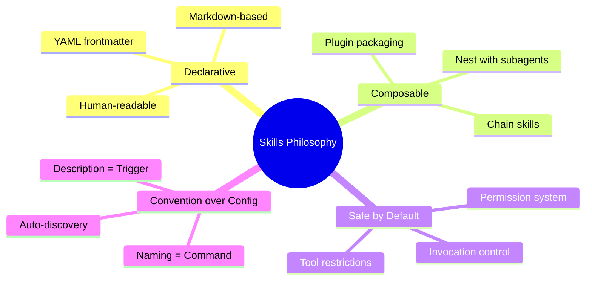
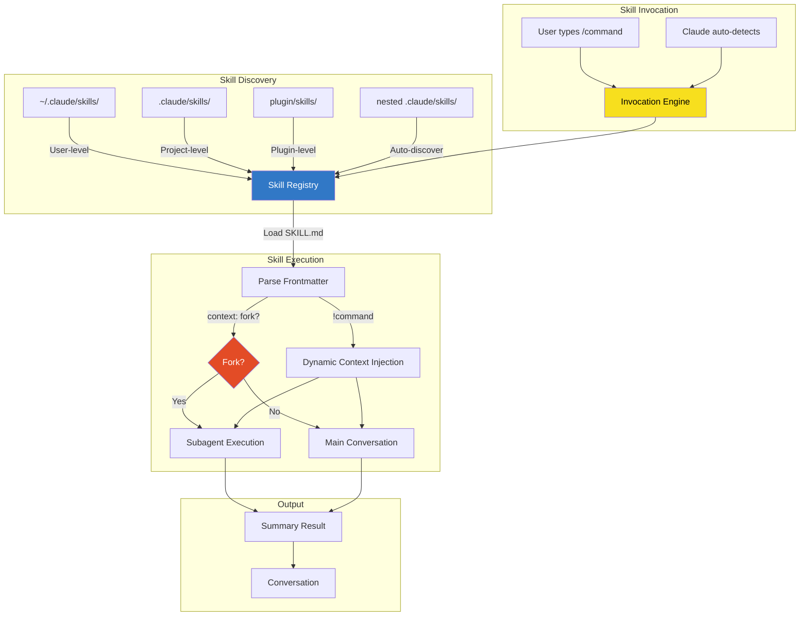
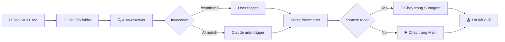

# Claude Code Skills — Tổng quan

## Skills là gì?

**Claude Code Skills** là hệ thống mở rộng (extensibility system) của Claude Code, cho phép developer tạo các **custom instructions có cấu trúc** dưới dạng file `SKILL.md`. Mỗi skill hoạt động như một **slash command** (`/skill-name`) hoặc **background knowledge** mà Claude tự động áp dụng khi phù hợp.

> [!IMPORTANT]
> Skills là cách chính thức để **dạy Claude Code những hành vi mới** — từ quy trình deploy, code review conventions, đến nghiên cứu codebase tự động.

| Thuộc tính | Mô tả |
|---|---|
| **Loại** | Extensibility system / Prompt engineering framework |
| **Thuộc về** | Claude Code (Anthropic) |
| **File chính** | `SKILL.md` (markdown + YAML frontmatter) |
| **Invocation** | `/skill-name` hoặc Claude tự trigger dựa trên `description` |
| **Ngôn ngữ** | Markdown (human-readable) |
| **Nền tảng** | Terminal, VS Code, JetBrains, Desktop, Web |

## Vấn đề mà Skills giải quyết

| Vấn đề | Mô tả | Cách Skills giải quyết |
|---|---|---|
| **Lặp lại instructions** | Phải nhắc Claude cùng quy trình mỗi lần | Đóng gói vào `SKILL.md`, Claude tự áp dụng |
| **Thiếu nhất quán** | Mỗi lần Claude trả lời khác nhau cho cùng task | Skill chuẩn hóa output format và workflow |
| **Workflow phức tạp** | Deploy, review, migration cần nhiều bước | Multi-step instructions với `$ARGUMENTS` |
| **Chia sẻ quy trình** | Team members dùng prompts khác nhau | Commit `.claude/skills/` vào version control |
| **Kiểm soát rủi ro** | Claude tự ý chạy deploy, commit | `disable-model-invocation: true` chặn tự trigger |
| **Context quá tải** | Main conversation bị đầy bởi tasks phụ | `context: fork` chạy skill trong subagent isolé |

## Triết lý thiết kế



**4 nguyên tắc cốt lõi:**

1. **Declarative** — Viết bằng Markdown, không cần code. `SKILL.md` là cả config lẫn instructions.
2. **Composable** — Skills kết hợp được: chạy trong subagent, chain với nhau, đóng gói thành plugin.
3. **Safe by Default** — Mặc định Claude CÓ THỂ tự trigger skill. Developer chủ động thêm `disable-model-invocation` cho actions nguy hiểm.
4. **Convention over Config** — Đặt `SKILL.md` đúng folder → tự động discover. Tên folder = tên command.

## Ai nên dùng?

| Đối tượng | Use case chính |
|---|---|
| **Solo Developer** | Tạo personal workflows: `/deploy`, `/review`, `/explain-code` |
| **Tech Lead / Team** | Chuẩn hóa coding standards, review process qua project skills |
| **Platform Engineer** | Đóng gói skills thành plugins, distribute qua marketplace |
| **Enterprise Admin** | Deploy organization-wide skills qua managed settings |
| **AI/Prompt Engineer** | Thiết kế complex multi-step AI workflows |

## Kiến trúc tổng quan



### Components chính

| Component | Vai trò | Vị trí |
|---|---|---|
| **SKILL.md** | File instructions + config | `skills/<name>/SKILL.md` |
| **Frontmatter** | YAML metadata (name, description, tools, model) | Header của `SKILL.md` |
| **Skill Registry** | Auto-discover và index tất cả skills | Internal engine |
| **Invocation Engine** | Match user input / AI context → skill | Internal engine |
| **Subagent Runtime** | Chạy skill trong isolated context | `context: fork` |
| **Dynamic Context** | Inject output CLI commands vào skill | `!command` syntax |
| **Bundled Skills** | Skills có sẵn: `/simplify`, `/batch`, `/debug`, `/loop`, `/claude-api` | Built-in |

## Vòng đời một Skill



## Tính năng nổi bật

### 1. Bundled Skills (có sẵn)

| Skill | Mô tả |
|---|---|
| `/simplify` | Review code vừa thay đổi → tìm issues về reuse, quality, efficiency → auto-fix. Spawn 3 agents song song |
| `/batch <instruction>` | Orchestrate large-scale changes. Decompose → spawn 1 agent/unit trong git worktree → mỗi agent mở PR |
| `/debug [description]` | Troubleshoot session hiện tại bằng cách đọc debug log |
| `/loop [interval] <prompt>` | Chạy prompt lặp đi lặp lại theo lịch. VD: `/loop 5m check if deploy finished` |
| `/claude-api` | Load API reference material cho ngôn ngữ đang dùng |

### 2. Dynamic Context Injection

Dùng `!command` để chạy CLI và inject output vào skill trước khi Claude xử lý:

```markdown
---
name: pr-summary
description: Summarize changes in a pull request
context: fork
agent: Explore
---
- PR diff: !`gh pr diff`
- PR comments: !`gh pr view --comments`
- Changed files: !`gh pr diff --name-only`
```

### 3. Arguments System

```markdown
# Positional: /fix-issue 123
Fix GitHub issue $ARGUMENTS

# Named: /migrate-component SearchBar React Vue
Migrate the $ARGUMENTS[0] component from $ARGUMENTS[1] to $ARGUMENTS[2]

# Shorthand: $0 = $ARGUMENTS[0]
Migrate the $0 component from $1 to $2
```

### 4. Invocation Control

| Setting | Hiệu ứng |
|---|---|
| `disable-model-invocation: true` | Chỉ user mới trigger được (VD: `/deploy`) |
| `user-invocable: false` | Chỉ Claude auto-trigger (background knowledge) |
| Mặc định | Cả user lẫn Claude đều trigger được |

### 5. Tool Restrictions

```yaml
allowed-tools: Read, Grep, Glob
```
→ Skill chỉ được dùng tools được liệt kê. An toàn cho read-only operations.

### 6. Subagent Execution

```yaml
context: fork
agent: Explore  # hoặc Plan, general-purpose, custom agent
```
→ Skill chạy trong isolated context, không ảnh hưởng main conversation.

## So sánh với các cơ chế mở rộng khác

| Feature | Skills | Commands (legacy) | Subagents | Plugins |
|---|---|---|---|---|
| **File** | `SKILL.md` | `.claude/commands/*.md` | `.claude/agents/*.md` | `plugin.json` + folder |
| **Invocation** | `/name` + auto-trigger | `/name` only | Delegation | Namespaced |
| **Model selection** | ✅ `model:` | ❌ | ✅ `model:` | Via agents |
| **Tool restrictions** | ✅ `allowed-tools:` | ❌ | ✅ `tools:` | Via agents |
| **Context isolation** | ✅ `context: fork` | ❌ | ✅ Always | Via skills/agents |
| **Supporting files** | ✅ Folder structure | ❌ Single file | ✅ | ✅ |
| **Dynamic context** | ✅ `!command` | ❌ | ❌ | Via skills |
| **Distribution** | Git / Plugin | Git | Git / Plugin | Marketplace |

## Xem thêm

- [[3-Research/Claude Code/claude-code-skills/1. Architecture and Logic]] — Chi tiết kiến trúc nội bộ, data flow, frontmatter reference
- [[3-Research/Claude Code/claude-code-skills/2. Playbook]] — Hướng dẫn cài đặt, Day 1 workflow, cheat sheet, troubleshooting
