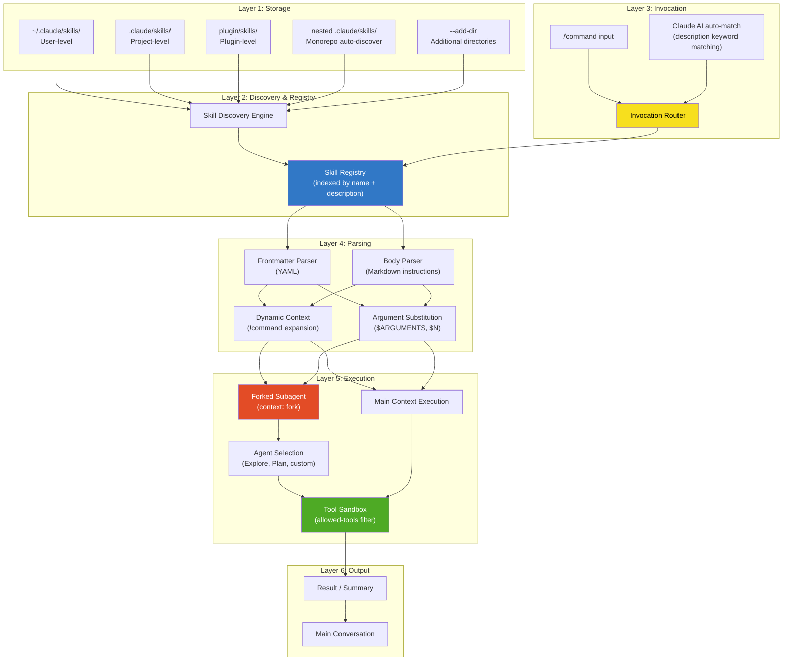
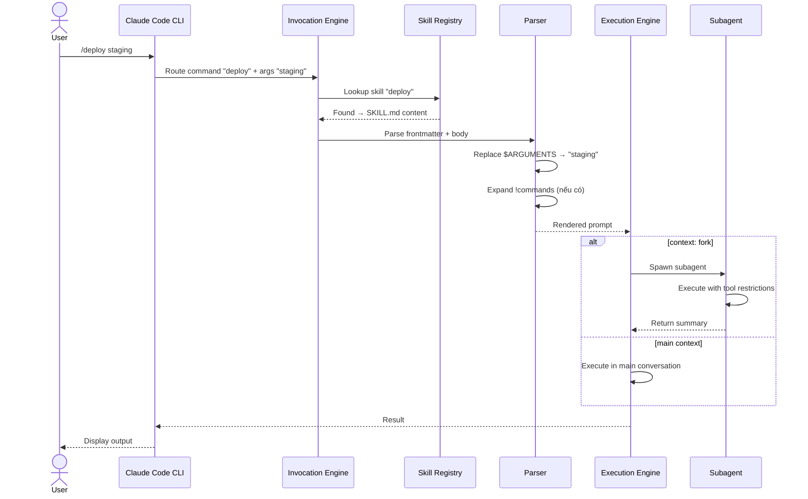
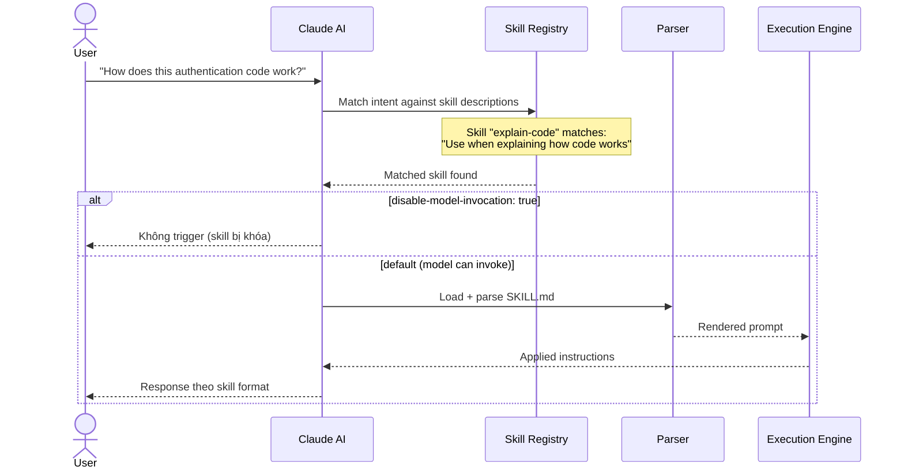
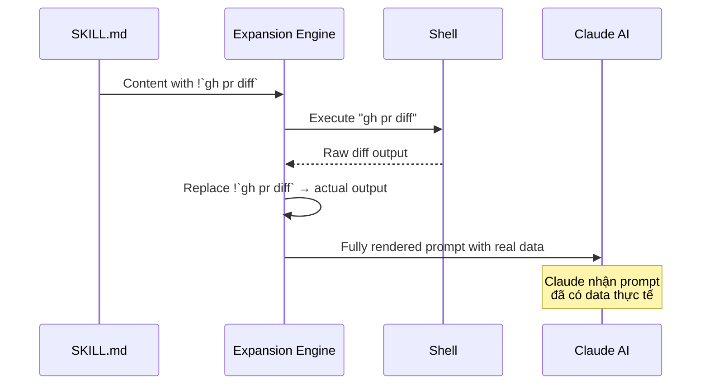
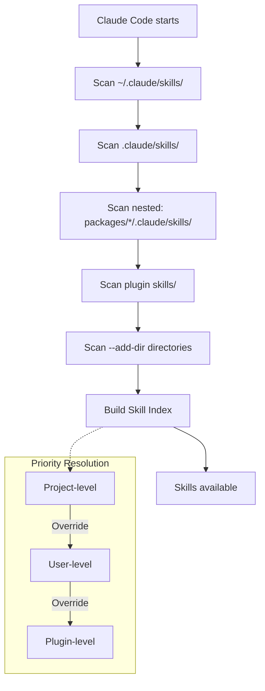
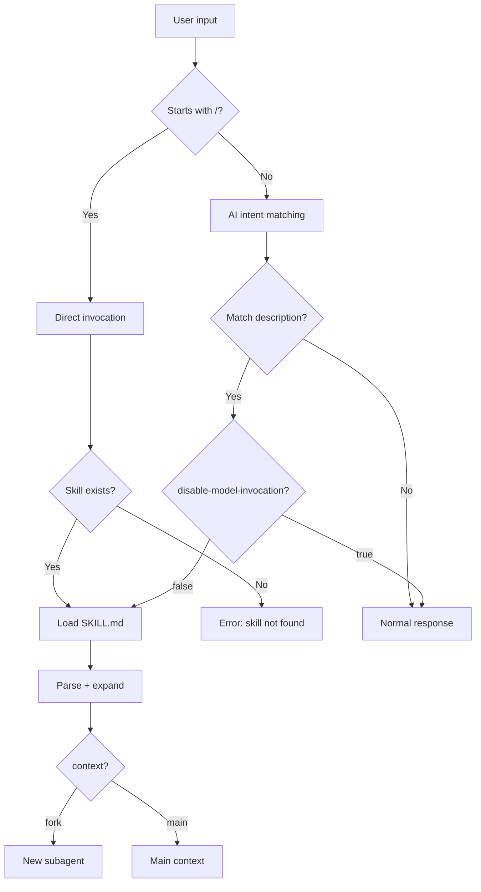
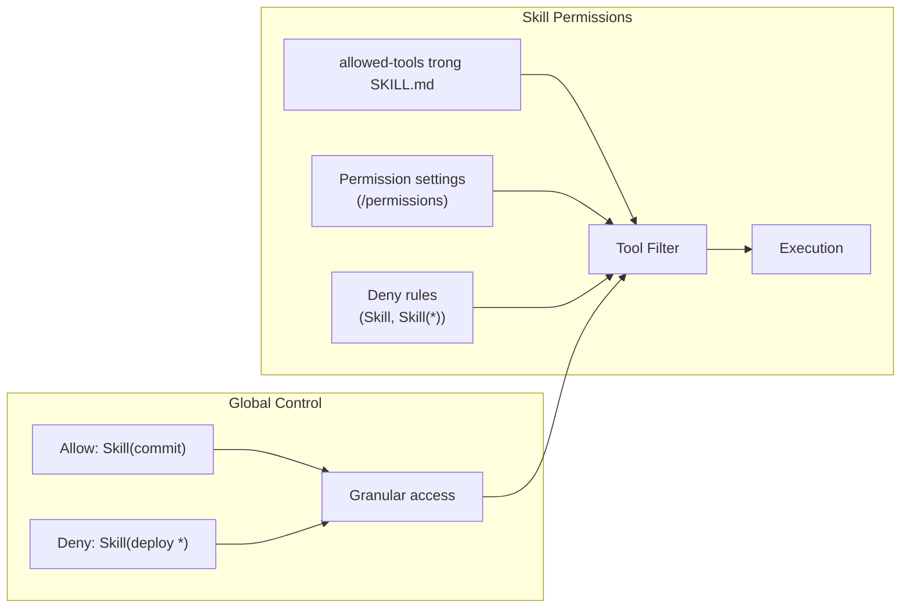
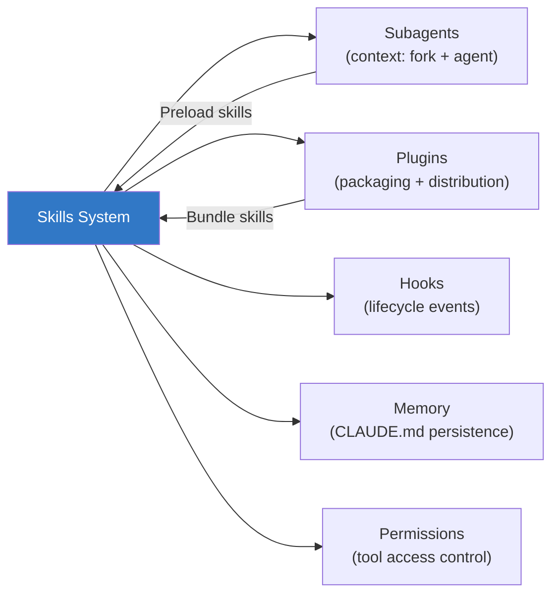

# Claude Code Skills — Architecture & Logic

## Mô hình kiến trúc tổng thể



### Giải thích các layers

| Layer | Component | Vai trò |
|---|---|---|
| **Storage** | Filesystem folders | Nơi lưu `SKILL.md` files ở nhiều scopes |
| **Discovery** | Scan engine | Tự động tìm `SKILL.md` trong tất cả folders, xây index |
| **Invocation** | Router | Match input (user `/cmd` hoặc AI intent) → đúng skill |
| **Parsing** | FM + Body parser | Tách YAML frontmatter, expand `!commands`, substitute `$ARGUMENTS` |
| **Execution** | Runtime | Chạy skill trong main context hoặc forked subagent |
| **Output** | Result pipeline | Trả summary về main conversation |

## Data Flow chi tiết

### Flow 1: User trực tiếp gọi `/deploy staging`



### Flow 2: Claude tự động trigger skill



### Flow 3: Dynamic Context Injection



## Core Modules / Components

### Skill File Structure

```
my-skill/
├── SKILL.md              # Required — Main instructions
├── reference.md          # Optional — Detailed docs (lazy-loaded)
├── examples.md           # Optional — Usage examples
├── template.md           # Optional — Template for output
└── scripts/
    ├── helper.py          # Optional — Utility script
    └── validate.sh        # Optional — Validation script
```

> [!NOTE]
> Chỉ `SKILL.md` được load tự động. Các file khác được Claude đọc **on-demand** thông qua relative links trong `SKILL.md`.

### SKILL.md Anatomy

```markdown
---
name: my-skill                         # Tên = slash command
description: What this skill does      # AI dùng để match intent
disable-model-invocation: true         # Chỉ user trigger
user-invocable: false                  # Chỉ AI trigger
allowed-tools: Read, Grep, Glob       # Restrict tools
model: haiku                           # Override model
context: fork                          # Chạy trong subagent
agent: Explore                         # Chọn agent type
argument-hint: "[filename] [format]"   # Gợi ý arguments
hooks:                                 # Lifecycle hooks
  pre_tool_use:
    - matcher: { tool_name: "Write" }
      hooks:
        - command: "./validate.sh"
---

Instructions cho Claude ở đây...

Dùng $ARGUMENTS để nhận input từ user
Dùng !`command` để inject dynamic context
Dùng ${CLAUDE_SESSION_ID} cho session-specific data
Dùng ${CLAUDE_SKILL_DIR} cho đường dẫn tới thư mục skill
```

## Frontmatter Reference — Chi tiết

| Field | Type | Default | Mô tả |
|---|---|---|---|
| `name` | `string` | Folder name | Tên skill, trở thành `/name` command |
| `description` | `string` | — | Mô tả ngắn. Claude dùng để **auto-match** intent |
| `argument-hint` | `string` | — | Gợi ý format arguments. VD: `[issue-number]`, `[filename] [format]` |
| `disable-model-invocation` | `bool` | `false` | `true` → chỉ user mới gọi được. Dùng cho `/deploy`, `/commit` |
| `user-invocable` | `bool` | `true` | `false` → chỉ Claude tự trigger. Dùng cho background knowledge |
| `allowed-tools` | `string` | All tools | Comma-separated list. VD: `Read, Grep, Glob` |
| `model` | `string` | Inherit | Override model: `sonnet`, `opus`, `haiku`, `inherit` |
| `context` | `string` | Main | `fork` → chạy trong isolated subagent |
| `agent` | `string` | — | Agent type khi fork: `Explore`, `Plan`, `general-purpose`, hoặc custom agent name |
| `hooks` | `object` | — | Lifecycle hooks (pre/post tool use). Xem [Hooks docs](https://code.claude.com/docs/en/hooks) |

## String Substitutions

| Substitution | Mô tả | Ví dụ |
|---|---|---|
| `$ARGUMENTS` | Toàn bộ arguments sau `/command` | `/fix 123 urgent` → `"123 urgent"` |
| `$ARGUMENTS[N]` | Argument thứ N (0-indexed) | `$ARGUMENTS[0]` → `"123"` |
| `$N` | Shorthand cho `$ARGUMENTS[N]` | `$0` = `$ARGUMENTS[0]` |
| `${CLAUDE_SESSION_ID}` | ID session hiện tại | `abc123-def456` |
| `${CLAUDE_SKILL_DIR}` | Absolute path tới thư mục chứa `SKILL.md` | `/home/user/.claude/skills/my-skill` |

## Cơ chế hoạt động nội bộ

### Skill Discovery Algorithm



**Auto-discovery quy tắc:**
1. Scan **user-level**: `~/.claude/skills/*/SKILL.md`
2. Scan **project-level**: `.claude/skills/*/SKILL.md`
3. Scan **nested** (monorepo): `packages/*/.claude/skills/*/SKILL.md`
4. Scan **plugins**: `<plugin>/skills/*/SKILL.md`
5. Scan **additional dirs**: từ `--add-dir` flag hoặc `CLAUDE_CODE_ADDITIONAL_DIRECTORIES_CLAUDE_MD=1`
6. Nếu trùng tên → **project-level wins**

### Invocation Logic



### Context Fork vs Main

| Aspect | Main Context | Forked (context: fork) |
|---|---|---|
| **Conversation** | Shared | Isolated — không thấy history |
| **Tool access** | Theo session permissions | Theo `allowed-tools` + agent type |
| **Output** | Trực tiếp vào conversation | Summary được return về |
| **Token usage** | Cumulative | Independent context window |
| **Use case** | Quick, interactive skills | Heavy research, batch operations |

### Agent Types khi Fork

| Agent | Model | Tools | Best for |
|---|---|---|---|
| `Explore` | Haiku (fast) | Read-only (Read, Grep, Glob) | File discovery, code search |
| `Plan` | Inherit | Read-only | Codebase research, planning |
| `general-purpose` | Inherit | All tools | Complex operations, code modifications |
| Custom agent | Configurable | Configurable | Domain-specific tasks |

## Permission & Security Model



**Permission rules syntax:**

| Rule | Hiệu ứng |
|---|---|
| `Skill(name)` | Allow/deny skill cụ thể (exact match) |
| `Skill(name *)` | Allow/deny skill + tất cả arguments |
| `Skill` | Allow/deny TẤT CẢ skills |

**Kịch bản bảo mật:**

```yaml
# Cho phép review nhưng chặn deploy
Allow: Skill(review-pr *)
Deny: Skill(deploy *)
```

## Context Budget & Limits

| Constraint | Chi tiết |
|---|---|
| **Skill count** | Giới hạn bởi `SLASH_COMMAND_TOOL_CHAR_BUDGET` environment variable |
| **SKILL.md size** | Nên giữ concise, lazy-load supporting files |
| **Subagent context** | Mỗi forked agent có context window riêng |
| **Concurrent agents** | `/batch` spawn 5-30 agents song song |

> [!TIP]
> Dùng `/context` command để debug khi Claude không thấy tất cả skills. Có thể cần tăng `SLASH_COMMAND_TOOL_CHAR_BUDGET`.

## Error Handling

| Vấn đề | Nguyên nhân | Giải pháp |
|---|---|---|
| Skill không trigger | Description không match intent | Thêm keywords vào `description` |
| Skill trigger quá nhiều | Description quá generic | Thu hẹp description, thêm `disable-model-invocation: true` |
| Claude không thấy skills | Quá nhiều skills, vượt budget | Tăng `SLASH_COMMAND_TOOL_CHAR_BUDGET` |
| `!command` lỗi | Command không tồn tại hoặc fail | Kiểm tra CLI tool đã cài (VD: `gh`) |
| Subagent không có tool | `allowed-tools` quá restrictive | Thêm tools cần thiết vào list |
| Arguments sai | Sai index `$ARGUMENTS[N]` | Kiểm tra thứ tự, dùng `argument-hint` |

## Mối quan hệ với các hệ thống khác



| Related System | Mối quan hệ |
|---|---|
| **Subagents** | Skills có thể chạy trong subagent (`context: fork`). Subagents có thể preload skills. |
| **Plugins** | Skills được đóng gói trong plugin directory (`skills/`). Namespaced: `/plugin:skill` |
| **Hooks** | Skills có thể define lifecycle hooks trong frontmatter. Hooks trigger actions pre/post tool use. |
| **Memory (CLAUDE.md)** | Persistent context. Skills có thể reference CLAUDE.md knowledge. |
| **Permissions** | Global permission rules control skill access: `Skill(name)`, `Skill(*)` |

## Xem thêm

- [[3-Research/Claude Code/claude-code-skills/0. Overview]] — Tổng quan, vấn đề giải quyết, tính năng nổi bật
- [[3-Research/Claude Code/claude-code-skills/2. Playbook]] — Hướng dẫn cài đặt, Day 1 workflow, cheat sheet, troubleshooting
