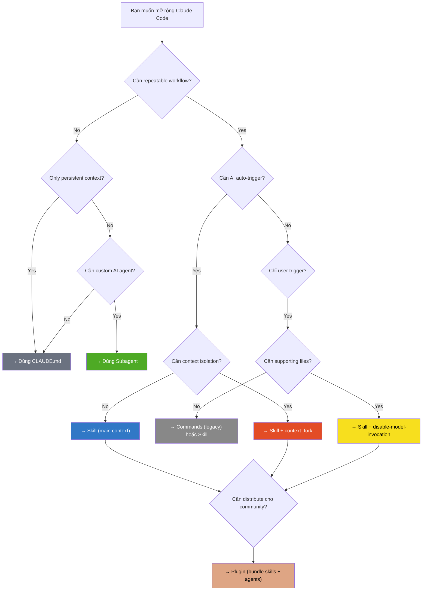
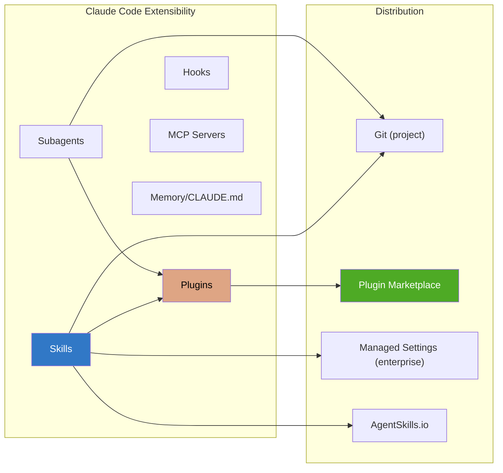

# Claude Code Skills — Decision Guide

## So sánh với các cơ chế mở rộng khác

### Skills vs Commands vs Subagents vs Plugins

| Tiêu chí | Skills | Commands (Legacy) | Subagents | Plugins |
|---|---|---|---|---|
| **File chính** | `SKILL.md` | `.claude/commands/*.md` | `.claude/agents/*.md` | `plugin.json` + folder |
| **Vị trí** | `skills/<name>/SKILL.md` | `commands/<name>.md` | `agents/<name>.md` | External directory |
| **Invocation** | `/name` + AI auto-trigger | `/name` only | Delegation by Claude | `/plugin:skill` (namespaced) |
| **AI auto-trigger** | ✅ Dựa trên `description` | ❌ | ✅ Dựa trên `description` | ✅ (through skills) |
| **Model override** | ✅ `model: haiku/sonnet/opus` | ❌ | ✅ | Via agents |
| **Tool restrictions** | ✅ `allowed-tools:` | ❌ | ✅ `tools:`/`disallowedTools:` | Via agents/skills |
| **Context isolation** | ✅ `context: fork` | ❌ | ✅ Always isolated | Via skills/agents |
| **Supporting files** | ✅ Folder structure | ❌ Single file only | ✅ | ✅ |
| **Dynamic context** | ✅ `!command` injection | ❌ | ❌ | Via skills |
| **Arguments** | ✅ `$ARGUMENTS`, `$N` | ✅ `$ARGUMENTS` | ❌ (natural language) | Via skills |
| **Lifecycle hooks** | ✅ `hooks:` frontmatter | ❌ | ✅ `hooks:` | ✅ `hooks/` folder |
| **Background execution** | Via subagent | ❌ | ✅ Ctrl+B / background | Via agents |
| **Distribution** | Git / Plugin | Git | Git / Plugin | Marketplace |
| **Persistent memory** | Via CLAUDE.md | Via CLAUDE.md | ✅ `memory:` scope | Via settings |
| **Complexity** | Thấp-Trung | Rất thấp | Trung-Cao | Cao |

### Skills vs CLAUDE.md

| Tiêu chí | Skills | CLAUDE.md |
|---|---|---|
| **Mục đích** | Workflow instructions có cấu trúc | Persistent context / project memory |
| **Trigger** | `/command` hoặc AI auto-match | Luôn loaded vào context |
| **Scope** | Từng task cụ thể | Toàn bộ session |
| **Token cost** | Chỉ khi triggered | Luôn chiếm context |
| **Best for** | Repeatable workflows | Project rules, coding standards |

### Flow ra quyết định



## Khi nào NÊN dùng Skills

### Use cases lý tưởng

| Use Case | Ví dụ cụ thể | Tại sao Skills phù hợp |
|---|---|---|
| **Chuẩn hóa workflow** | `/deploy staging`, `/review-pr` | Đóng gói multi-step process, team consistency |
| **Code review automation** | `/simplify`, custom `/thorough-review` | Bundled `/simplify` đã có, dễ extend |
| **Teaching/Onboarding** | `/explain-code`, `/architecture-overview` | AI auto-trigger khi phù hợp, lazy-load docs |
| **CI/CD integration** | `/ci-pipeline`, `/run-tests` | `disable-model-invocation` bảo vệ actions nguy hiểm |
| **PR workflow** | `/pr-summary` với `!gh pr diff` | Dynamic context inject real data |
| **Migration tasks** | `/migrate-component SearchBar React Vue` | Arguments system cho flexible input |
| **Background knowledge** | Legacy system context, API conventions | `user-invocable: false` → Claude tự biết khi cần |
| **Codebase exploration** | `/deep-research auth module` | `context: fork` + `agent: Explore` |
| **Large-scale refactoring** | `/batch migrate src/ from Solid to React` | Bundled `/batch` orchestrate parallel agents |

### Đối tượng phù hợp nhất

| Đối tượng | Lý do |
|---|---|
| **Developer dùng Claude Code hàng ngày** | ROI cao nhất — tiết kiệm prompt typing mỗi ngày |
| **Team leads muốn chuẩn hóa** | Commit skills vào git → team consistency |
| **Developer làm việc với nhiều repos** | User-level skills (`~/.claude/skills/`) áp dụng mọi nơi |
| **Người mới học codebase** | Skills giúp auto-explain, auto-research khi hỏi |

## Khi nào KHÔNG nên dùng Skills

### Limitations & Anti-use-cases

| Khi nào KHÔNG dùng | Lý do | Thay thế |
|---|---|---|
| **Cần stateful agent liên tục** | Skills là one-shot, không giữ state giữa invocations | **Subagent** với `memory:` scope |
| **Complex multi-model orchestration** | Skills chỉ dùng 1 model per invocation | **Agent Teams** hoặc custom subagents |
| **Cần GUI/visual interface** | Skills là text-only | **MCP servers** hoặc external tools |
| **Real-time monitoring** | Skills trigger on-demand, không push | **Hooks** cho event-driven actions |
| **Cross-tool integration** | Skills chỉ hoạt động trong Claude Code | **MCP servers** cho tool integration |
| **Token-intensive background jobs** | Skills load vào context budget | Giữ `SKILL.md` concise, lazy-load files |
| **Non-Anthropic AI tools** | Skills chỉ cho Claude Code | Custom scripts, Makefiles |

### Hạn chế kỹ thuật

| Hạn chế | Chi tiết | Workaround |
|---|---|---|
| **Context budget** | `SLASH_COMMAND_TOOL_CHAR_BUDGET` giới hạn tổng skills | Tăng env var hoặc giảm số skills |
| **No persistent state** | Skills không nhớ giữa invocations | Kết hợp với CLAUDE.md hoặc file-based state |
| **Single model per skill** | Không thể mix models trong 1 skill | Chain multiple skills hoặc dùng subagents |
| **No UI/visual feedback** | Output chỉ text trong terminal | Dùng scripts tạo HTML (VD: codebase-visualizer) |
| **Dynamic context blocking** | `!commands` chạy synchronously trước Claude | Giữ commands nhanh, tránh long-running |

## Case Studies / Ví dụ thực tế

### Case 1: Team Coding Standards

**Kịch bản:** Team 5 developers, mỗi người viết code style khác nhau.

**Giải pháp Skills:**
```
.claude/skills/
├── code-standards/
│   ├── SKILL.md         # Convention rules, auto-trigger on code review
│   └── examples.md      # Good/bad code examples
├── commit-format/
│   └── SKILL.md         # Enforce conventional commits
└── pr-checklist/
    └── SKILL.md         # PR review checklist
```

**Kết quả:** Commit `.claude/skills/` vào git → mọi developer có cùng AI assistant behavior.

### Case 2: Solo Developer — Personal Workflows

**Kịch bản:** Freelancer làm việc với 10+ projects khác nhau.

**Giải pháp Skills:**
```
~/.claude/skills/
├── deploy/              # disable-model-invocation: true
├── daily-standup/       # Summarize git log since yesterday
├── explain-code/        # With analogies and diagrams
└── session-logger/      # Log activities per session
```

**Kết quả:** User-level skills hoạt động ở MỌI project. Một lần setup, dùng mãi.

### Case 3: Platform Team — Enterprise Distribution

**Kịch bản:** Company 50+ developers, cần chuẩn hóa security practices.

**Giải pháp:**
1. Tạo plugin `security-toolkit` với skills: `/security-audit`, `/dependency-check`
2. Deploy qua managed settings → tự động available cho tất cả developers
3. `disable-model-invocation: true` cho destructive skills

**Kết quả:** Organization-wide security practices bằng AI-powered skills.

### Case 4: Bundled `/batch` cho Large Codebase Migration

**Kịch bản:** Migrate 200 React components từ class-based sang functional.

**Giải pháp:**
```
/batch migrate all class components in src/ to functional components with hooks
```

**Kết quả:** `/batch` decompose → 30 work units → 30 parallel agents trong git worktrees → 30 PRs. Mỗi agent hoạt động isolé.

## Chi phí & Tài nguyên

### Token Cost Model

| Action | Token Impact | Ghi chú |
|---|---|---|
| **Skill discovery** | Nhỏ — chỉ load `name` + `description` | Budget: `SLASH_COMMAND_TOOL_CHAR_BUDGET` |
| **Skill invocation (main)** | Trung bình — full `SKILL.md` vào context | Supporting files chỉ load on-demand |
| **Skill invocation (fork)** | Riêng biệt — context mới cho subagent | Không ảnh hưởng main conversation |
| **`!command` expansion** | Tùy output size | Command output thay thế placeholder |
| **`/batch`** | Cao — N agents song song | Mỗi agent dùng context riêng |
| **`/simplify`** | Trung bình — 3 agents song song | Fixed workflow |

### Pricing

| Model | Chi phí tương đối | Khi nào dùng |
|---|---|---|
| **Haiku** (`model: haiku`) | Thấp nhất, nhanh nhất | Read-only research, simple tasks |
| **Sonnet** (default) | Trung bình | General-purpose skills |
| **Opus** (`model: opus`) | Cao nhất, thông minh nhất | Complex reasoning, architecture decisions |

> [!TIP]
> Dùng `model: haiku` cho read-only skills (research, search) để tiết kiệm đáng kể. Dùng `model: opus` chỉ khi cần deep reasoning.

### Hardware Requirements

| Yêu cầu | Chi tiết |
|---|---|
| **Local** | Không — tất cả xử lý trên Anthropic cloud |
| **Network** | Cần internet connection |
| **Disk** | Minimal — chỉ `SKILL.md` files (KB-level) |
| **RAM** | Không ảnh hưởng — Claude Code CLI nhẹ |

## Migration Path

### Từ `.claude/commands/` (Legacy) sang Skills

**Commands (cũ):**
```
.claude/commands/deploy.md
```

```markdown
Deploy $ARGUMENTS to production:
1. Run tests
2. Build
3. Deploy
```

**Skills (mới):**
```
.claude/skills/deploy/SKILL.md
```

```markdown
---
name: deploy
description: Deploy the application to production
disable-model-invocation: true
---
Deploy $ARGUMENTS to production:
1. Run tests
2. Build
3. Deploy
```

**Khác biệt khi migrate:**

| Aspect | Commands | Skills |
|---|---|---|
| **File** | Single `.md` file | Folder + `SKILL.md` |
| **Frontmatter** | Không bắt buộc | YAML với `name`, `description` |
| **AI auto-trigger** | ❌ Không | ✅ Dựa trên `description` |
| **Supporting files** | ❌ | ✅ Cùng folder |
| **Tool restrictions** | ❌ | ✅ `allowed-tools` |
| **Model override** | ❌ | ✅ `model:` |
| **Context isolation** | ❌ | ✅ `context: fork` |

**Migration steps:**

```bash
# 1. Tạo skills folder từ commands
for cmd in .claude/commands/*.md; do
  name=$(basename "$cmd" .md)
  mkdir -p .claude/skills/$name
  cp "$cmd" .claude/skills/$name/SKILL.md
  echo "Migrated: $name"
done

# 2. Thêm frontmatter vào mỗi SKILL.md (thủ công)
# Mở từng file, thêm:
# ---
# name: <skill-name>
# description: <what it does>
# ---

# 3. Test
# Trong Claude Code: "What skills are available?"

# 4. (Optional) Xóa commands cũ sau khi verify
# rm -rf .claude/commands/
```

> [!WARNING]
> `.claude/commands/` vẫn hoạt động song song với Skills. Không cần migrate ngay. Nhưng Skills có nhiều tính năng hơn và là hướng phát triển chính thức.

### Từ Scripts/Makefiles sang Skills

**Trước (Makefile):**
```makefile
.PHONY: deploy
deploy:
	npm test && npm run build && npm run deploy
```

**Sau (Skill):**
```yaml
---
name: deploy
description: Deploy the application
disable-model-invocation: true
context: fork
agent: general-purpose
---
Deploy $ARGUMENTS:
1. Run `npm test` — if any fail, fix them first
2. Run `npm run build`
3. Run `npm run deploy -- $ARGUMENTS`
4. Verify deployment succeeded
5. Report status
```

**Lợi ích:** Skill có thể **tự fix lỗi** khi test fail, **adapt** theo context, và **report** kết quả rõ ràng — Makefile thì không.

## Roadmap & Tương lai

### Ecosystem hiện tại (2026)



### Xu hướng phát triển

| Xu hướng | Chi tiết |
|---|---|
| **Plugin Marketplace** | Skills được distribute qua marketplace → community ecosystem |
| **AgentSkills.io** | Third-party registry cho community skills |
| **Agent Teams** | Skills kết hợp với multi-agent orchestration |
| **Deeper IDE integration** | VS Code, JetBrains, Desktop app → skills có visual UI |
| **Managed deployment** | Enterprise admin deploy skills organization-wide |

### Community Health

| Indicator | Status |
|---|---|
| **Maintainer** | Anthropic (backed by major AI company) |
| **Update frequency** | Liên tục — Claude Code cập nhật thường xuyên |
| **Documentation** | Comprehensive — official docs tại code.claude.com |
| **Community** | Growing — AgentSkills.io, plugin marketplace |
| **Breaking changes** | Thấp — backward compatible với `.claude/commands/` |

## Ma trận ra quyết định — Tổng kết

| Scenario | Recommendation | Lý do |
|---|---|---|
| **Tạo custom workflow cho bản thân** | ✅ **User-level Skill** | Đơn giản, hoạt động mọi project |
| **Chuẩn hóa process cho team** | ✅ **Project-level Skill** | Commit vào git, team consistency |
| **Background knowledge/conventions** | ✅ **Skill** (`user-invocable: false`) | AI tự biết khi cần, không chiếm context liên tục |
| **Dangerous action (deploy, delete)** | ✅ **Skill** (`disable-model-invocation: true`) | Protected nhưng vẫn structured |
| **Heavy codebase research** | ✅ **Skill** (`context: fork` + `agent: Explore`) | Isolated, không pollute main context |
| **PR review với real data** | ✅ **Skill** (dynamic context `!commands`) | Inject actual PR data |
| **Large-scale refactoring** | ✅ **Bundled `/batch`** | Parallel agents, git worktrees |
| **Complex multi-agent orchestration** | ⚠️ **Subagents** + Skills | Skills cho instructions, subagents cho execution |
| **Cross-project distribution** | ⚠️ **Plugin** (bundle skills) | Namespaced, versioned, marketplace |
| **Enterprise-wide deployment** | ⚠️ **Managed Settings** + Skills | Admin control, centralized |
| **Real-time event handling** | ❌ **Hooks** thay vì Skills | Skills là on-demand, hooks là event-driven |
| **External tool integration** | ❌ **MCP Servers** thay vì Skills | Skills chỉ trong Claude Code ecosystem |
| **Stateful long-running agent** | ❌ **Subagent** với `memory:` | Skills không giữ state |
| **Chỉ cần project rules** | ❌ **CLAUDE.md** thay vì Skills | CLAUDE.md luôn loaded, không cần trigger |

> [!IMPORTANT]
> **Rule of thumb:** Nếu bạn đang typing cùng instructions hơn 2 lần → đó nên là một Skill. Nếu instructions cần luôn active → dùng CLAUDE.md. Nếu cần complex agent behavior → dùng Subagent.

## Xem thêm

- [0. Overview](./0. Overview.md) — Tổng quan, vấn đề giải quyết, tính năng nổi bật
- [1. Architecture and Logic](./1. Architecture and Logic.md) — Chi tiết kiến trúc nội bộ, data flow, frontmatter reference
- [2. Playbook](./2. Playbook.md) — Hướng dẫn cài đặt, Day 1 workflow, cheat sheet, troubleshooting
