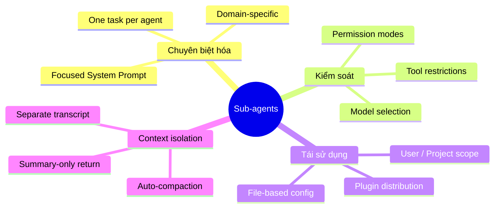
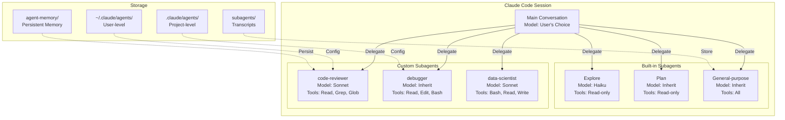
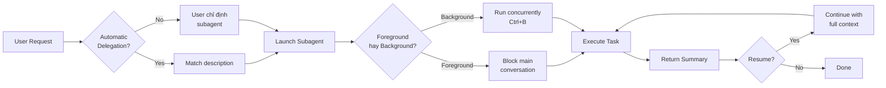

# Claude Code Sub-agents — Tổng quan

## Subagents là gì?

**Claude Code Sub-agents** là hệ thống cho phép tạo và sử dụng các AI agent chuyên biệt bên trong Claude Code. Mỗi subagent là một phiên Claude Code riêng biệt với **system prompt riêng**, **bộ tools giới hạn**, và **model tùy chọn** — được thiết kế để thực hiện một nhiệm vụ cụ thể (review code, debug, phân tích data, v.v.).

> [!NOTE]
> Subagents **khác** với Agent Teams. Subagents chạy bên trong conversation hiện tại (in-process), còn Agent Teams là nhiều Claude Code sessions độc lập phối hợp với nhau.

## Vấn đề giải quyết

| Vấn đề | Mô tả | Cách Sub-agents Giải quyết |
|---|---|---|
| **Context pollution** | Thao tác dài, output lớn làm "ô nhiễm" conversation chính | Subagent chạy trong sandbox riêng, chỉ trả summary về conversation chính |
| **Thiếu chuyên biệt hóa** | Một agent làm mọi thứ → không tối ưu | Mỗi subagent có system prompt chuyên biệt cho domain cụ thể |
| **Lãng phí chi phí** | Dùng model mạnh (Opus) cho task đơn giản | Subagent cho phép chọn model rẻ hơn (Haiku) cho task phù hợp |
| **Rủi ro bảo mật** | Agent có quyền truy cập quá rộng | Giới hạn tools cụ thể cho từng subagent (Read-only, no Write, v.v.) |
| **Thiếu tái sử dụng** | Cấu hình agent lặp lại mỗi phiên | Subagent lưu thành file `.md`, chia sẻ qua version control hoặc plugins |

## Triết lý thiết kế

**3 nguyên tắc cốt lõi:**
1. **Single Responsibility** — Mỗi subagent chỉ giỏi một việc cụ thể
2. **Least Privilege** — Chỉ cấp quyền tối thiểu cần thiết
3. **Configuration as Code** — Cấu hình bằng Markdown files, version-controlled

## Ai nên dùng?

| Đối tượng | Lý do sử dụng |
|---|---|
| **Developer cá nhân** | Tự động hóa review, debug, test — giảm context switching |
| **Engineering Team** | Chia sẻ subagent chuẩn qua `.claude/agents/` trong repo |
| **DevOps / Platform** | Subagent chuyên biệt cho CI/CD, database queries, infrastructure |
| **AI Power Users** | Tối ưu cost bằng model routing (Haiku cho read-only, Opus cho complex) |

## Kiến trúc tổng quan

### Bảng Components chính

| Component | Vai trò | Vị trí |
|---|---|---|
| **Built-in Subagents** | 3 agent có sẵn (Explore, Plan, General-purpose) | Tích hợp trong Claude Code |
| **Custom Subagent Files** | File `.md` với frontmatter YAML chứa config | `~/.claude/agents/` hoặc `.claude/agents/` |
| **Permission System** | Kiểm soát tools, model, permission mode | Frontmatter fields |
| **Hooks System** | Lifecycle hooks cho subagent (Pre/PostToolUse, Stop) | Frontmatter hoặc `settings.json` |
| **Persistent Memory** | MEMORY.md file lưu kiến thức qua các sessions | `agent-memory/<name>/` |
| **Transcript Storage** | Lịch sử conversation của subagent | `subagents/agent-{id}.jsonl` |

## Vòng đời hoạt động

## Tính năng nổi bật

| # | Tính năng | Mô tả |
|---|---|---|
| 1 | **Auto-delegation** | Claude tự chọn subagent phù hợp dựa trên `description` |
| 2 | **Model routing** | Chọn `haiku`, `sonnet`, `opus` hoặc `inherit` cho mỗi subagent |
| 3 | **Tool restrictions** | `tools` + `disallowedTools` — kiểm soát truy cập chặt chẽ |
| 4 | **Permission modes** | 5 modes: `default`, `acceptEdits`, `dontAsk`, `bypassPermissions`, `plan` |
| 5 | **Persistent Memory** | Subagent tích lũy kiến thức qua `MEMORY.md` (user/project/local scope) |
| 6 | **Lifecycle Hooks** | `PreToolUse`, `PostToolUse`, `Stop`, `SubagentStart`, `SubagentStop` |
| 7 | **Background execution** | Chạy subagent song song với conversation chính |
| 8 | **Resume context** | Tiếp tục subagent đã hoàn thành với full context trước đó |
| 9 | **Skills preloading** | Load skills vào subagent qua `skills` field |
| 10 | **Agent spawning control** | `Agent(type)` — giới hạn subagent nào được spawn |
| 11 | **Git worktree isolation** | `isolation: worktree` — mỗi subagent làm việc trên branch riêng |
| 12 | **Plugin distribution** | Chia sẻ subagent qua Claude Code plugins system |

## So sánh: Subagents vs Agent Teams

| Tiêu chí | Subagents | Agent Teams |
|---|---|---|
| **Mô hình** | In-process, trong cùng session | Multi-session, processes riêng |
| **Context sharing** | Summary-based | Message-based (inter-agent) |
| **Điều khiển** | Tự động hoặc manual delegation | Lead-Teammate orchestration |
| **Use case** | Task đơn lẻ, chuyên biệt | Large-scale parallel work |
| **Cost** | Shared context window | Mỗi teammate = session riêng |
| **Persistence** | Transcript trong session | Tmux sessions, git worktrees |

## Xem thêm

- [1. Architecture and Logic](./1. Architecture and Logic.md) — Data flow chi tiết, cấu hình nâng cao, hooks system
- [2. Playbook](./2. Playbook.md) — Hướng dẫn cài đặt, Day 1 workflow, cheat sheet, troubleshooting
