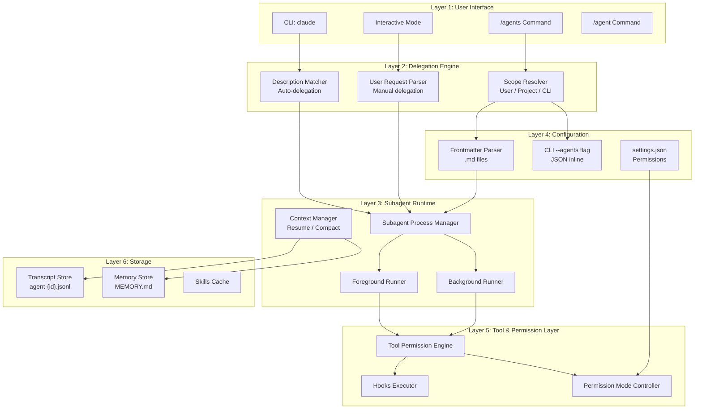
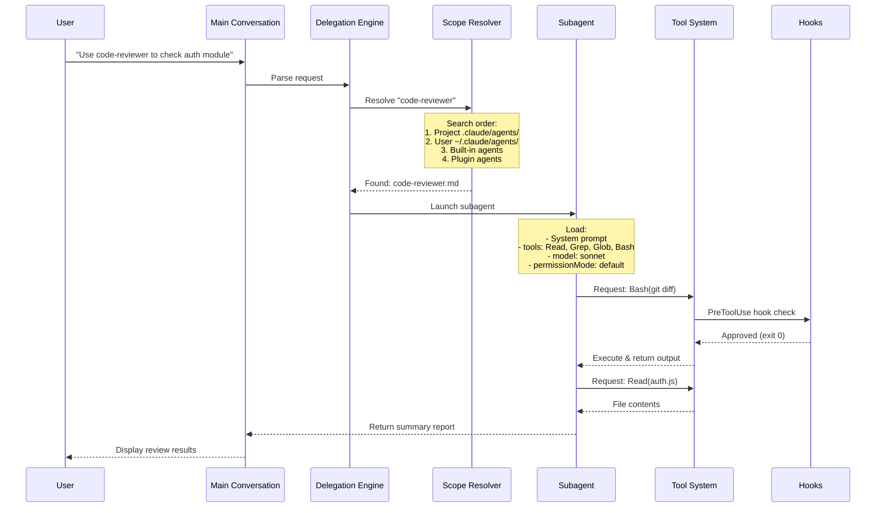
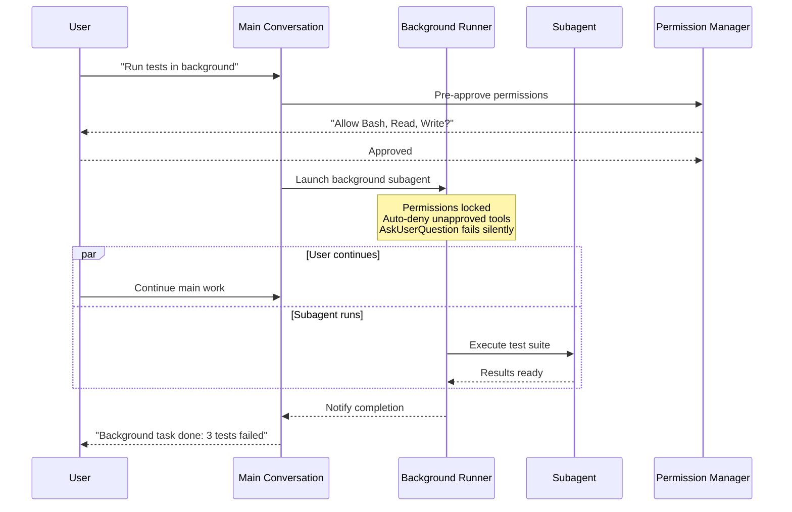
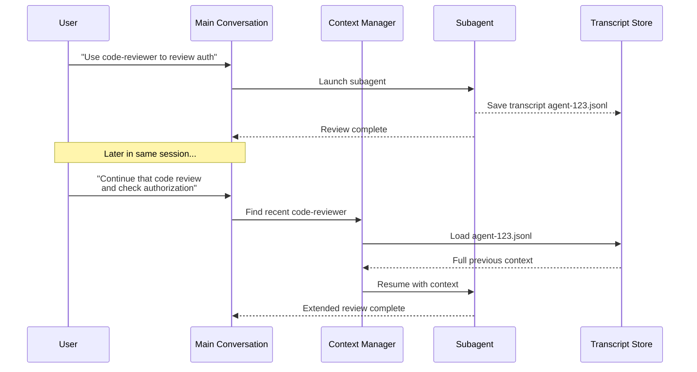
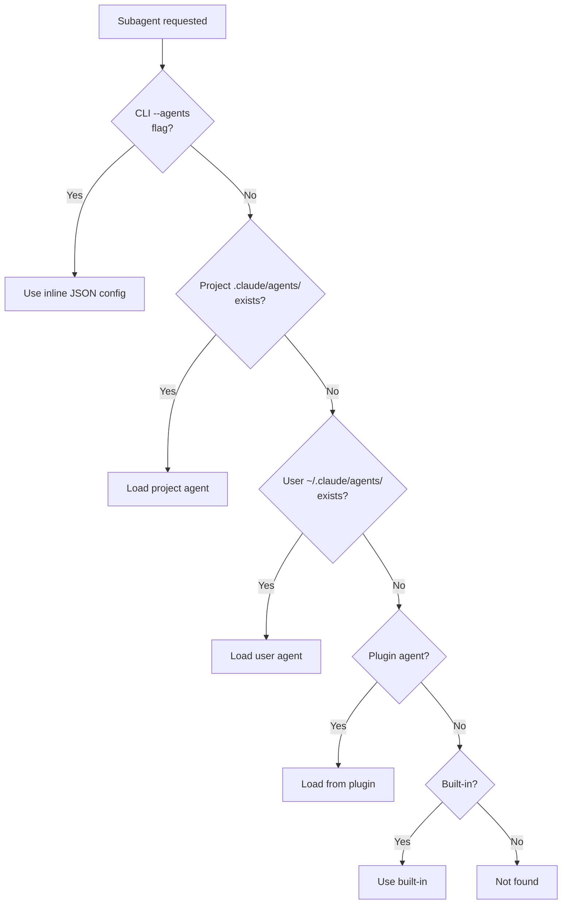

# Claude Code Sub-agents — Architecture and Logic

## 1. Mô hình kiến trúc tổng thể



### Layer mô tả

| Layer | Vai trò | Chi tiết |
|---|---|---|
| **User Interface** | Điểm vào của user | CLI, Interactive mode, `/agents` và `/agent` commands |
| **Delegation Engine** | Quyết định subagent nào chạy | Auto-delegation (match description) hoặc manual |
| **Subagent Runtime** | Quản lý vòng đời subagent | Foreground/Background, Resume, Auto-compaction |
| **Configuration** | Đọc và parse cấu hình | Frontmatter `.md`, CLI `--agents` JSON, `settings.json` |
| **Tool & Permission** | Kiểm soát quyền truy cập | Tools whitelist/blacklist, permission modes, hooks |
| **Storage** | Lưu trữ state | Transcripts, Memory, Skills cache |

## 2. Data Flow chi tiết

### 2.1 Flow chính: Delegation & Execution



### 2.2 Flow: Background Execution



### 2.3 Flow: Resume Subagent



## 3. Core Modules / Components

### 3.1 Bảng Modules

| Module | Vai trò | Input | Output |
|---|---|---|---|
| **Description Matcher** | Auto-delegate task tới subagent phù hợp | User request text | Matched subagent name |
| **Scope Resolver** | Tìm file config theo scope priority | Subagent name | Parsed frontmatter config |
| **Frontmatter Parser** | Parse YAML frontmatter trong `.md` file | `.md` file | Structured config object |
| **Tool Permission Engine** | Whitelist/blacklist tools cho subagent | `tools` + `disallowedTools` | Allowed tool set |
| **Permission Mode Controller** | Áp dụng permission mode | `permissionMode` field | Permission handling strategy |
| **Hooks Executor** | Chạy lifecycle hooks | Hook event + matcher | Hook script output |
| **Context Manager** | Resume, compact, cleanup transcripts | Session state | Restored/compacted context |
| **Memory Manager** | Read/Write MEMORY.md | Memory scope | Persistent knowledge |
| **Background Runner** | Concurrent execution management | Subagent config | Async results |

### 3.2 Built-in Subagents chi tiết

| Subagent | Model | Tools | Purpose | Khi nào dùng |
|---|---|---|---|---|
| **Explore** | Haiku | Read-only | File discovery, code search | Tìm file, scan codebase nhanh |
| **Plan** | Inherit | Read-only | Codebase research for planning | `/plan` mode, phân tích kiến trúc |
| **General-purpose** | Inherit | All tools | Complex research, multi-step ops | Task phức tạp cần full quyền |

## 4. Cơ chế hoạt động nội bộ

### 4.1 Subagent File Format

Mỗi subagent được định nghĩa bằng file Markdown với YAML frontmatter:

```markdown
---
name: agent-name
description: Mô tả ngắn — Claude dùng để auto-delegate
tools: Read, Grep, Glob, Bash
disallowedTools: Write, Edit
model: sonnet
permissionMode: default
maxTurns: 20
skills:
  - api-conventions
  - error-handling-patterns
memory: user
background: false
isolation: worktree
mcpServers:
  slack: { ... }
hooks:
  PreToolUse:
    - matcher: "Bash"
      hooks:
        - type: command
          command: "./scripts/validate.sh"
---

System prompt nội dung ở đây.
Phần dưới dấu `---` là system prompt của subagent.
```

### 4.2 Scope Resolution Order



**Khi có duplicate** (cùng tên ở nhiều scope), dùng `/agents` command để xem agent nào đang active.

### 4.3 Permission Mode Logic

| Mode | Behavior | Use case |
|---|---|---|
| `default` | Hỏi user cho mỗi sensitive operation | Subagent cần kiểm soát chặt |
| `acceptEdits` | Auto-accept file edits, vẫn hỏi cho Bash | Subagent cần write code |
| `dontAsk` | Tự skip sensitive operations (không thực hiện) | Read-only analysis |
| `bypassPermissions` | Bỏ qua tất cả permission prompts | ⚠️ **Cần thận trọng** — full trust |
| `plan` | Read-only mode giống Plan subagent | Research, planning |

### 4.4 Auto-compaction

Subagent có hệ thống auto-compaction riêng:

- **Trigger:** Khi context đạt ngưỡng `CLAUDE_AUTOCOMPACT_PCT_OVERRIDE` (default: 50% token limit)
- **Mechanism:** Tạo `compact_boundary` system message
- **Isolation:** Main conversation compaction **KHÔNG** ảnh hưởng subagent transcripts
- **Storage:** Transcripts lưu tại `~/.claude/projects/{project}/{sessionId}/subagents/agent-{agentId}.jsonl`

## 5. Configuration / API

### 5.1 Frontmatter Fields đầy đủ

| Field | Type | Default | Mô tả |
|---|---|---|---|
| `name` | `string` | Filename | Tên subagent (dùng để reference) |
| `description` | `string` | — | Mô tả — Claude dùng để auto-delegate |
| `tools` | `string[]` | All | Danh sách tools được phép |
| `disallowedTools` | `string[]` | — | Tools bị cấm |
| `model` | `string` | `inherit` | `sonnet` / `opus` / `haiku` / `inherit` |
| `permissionMode` | `string` | `default` | `default` / `acceptEdits` / `dontAsk` / `bypassPermissions` / `plan` |
| `maxTurns` | `number` | — | Giới hạn số turns |
| `skills` | `string[]` | — | Skills preload vào context |
| `mcpServers` | `object` | — | MCP server config (e.g., `"slack": {...}`) |
| `hooks` | `object` | — | Lifecycle hooks |
| `memory` | `string` | — | `user` / `project` / `local` |
| `background` | `boolean` | `false` | Chạy background mặc định? |
| `isolation` | `string` | — | `worktree` — git worktree isolation |

### 5.2 Available Tools

| Tool | Mô tả |
|---|---|
| `Read` | Đọc file |
| `Write` | Ghi file mới |
| `Edit` | Sửa file hiện có |
| `Bash` | Chạy shell commands |
| `Grep` | Pattern search |
| `Glob` | File pattern matching |
| `Agent` | Spawn sub-subagent |
| `Agent(type)` | Spawn subagent cụ thể |
| `Task(...)` | Tạo task |

### 5.3 CLI API

```bash
# Inline agent definition qua CLI
claude --agents '{ "code-reviewer": { "description": "...", "prompt": "...", "tools": ["Read", "Grep"], "model": "sonnet" } }'

# Disable subagent cụ thể
claude --disallowedTools "Agent(Explore)"

# Manage agents
claude agents
```

### 5.4 Settings.json Permissions

```json
{
  "permissions": {
    "deny": ["Agent(Explore)", "Agent(my-custom-agent)"]
  }
}
```

## 6. Hooks System chi tiết

### 6.1 Hai vị trí định nghĩa hooks

| Vị trí | Events hỗ trợ | Scope |
|---|---|---|
| **Subagent Frontmatter** | `PreToolUse`, `PostToolUse`, `Stop`, `SubagentStop` | Chỉ khi subagent đó active |
| **settings.json** | `SubagentStart`, `SubagentStop` | Project-level, mọi subagent |

### 6.2 Hook trong Frontmatter

```yaml
hooks:
  PreToolUse:
    - matcher: "Bash"
      hooks:
        - type: command
          command: "./scripts/validate-command.sh $TOOL_INPUT"
  PostToolUse:
    - matcher: "Edit|Write"
      hooks:
        - type: command
          command: "./scripts/run-linter.sh"
```

**Hook exit codes:**

| Exit Code | Behavior |
|---|---|
| `0` | Cho phép — tool execution tiếp tục |
| `2` | Block — tool bị từ chối, stderr message hiển thị cho agent |
| Khác | Error handling theo mặc định |

### 6.3 Project-level Hooks cho Subagent Events

```json
{
  "hooks": {
    "SubagentStart": [
      {
        "matcher": "db-agent",
        "hooks": [
          {
            "type": "command",
            "command": "./scripts/setup-db-connection.sh"
          }
        ]
      }
    ],
    "SubagentStop": [
      {
        "hooks": [
          {
            "type": "command",
            "command": "./scripts/cleanup-db-connection.sh"
          }
        ]
      }
    ]
  }
}
```

### 6.4 Conditional Rules — Read-only Database Example

```bash
#!/bin/bash
# ./scripts/validate-readonly-query.sh
INPUT=$(cat)
COMMAND=$(echo "$INPUT" | jq -r '.tool_input.command // empty')

# Block SQL write operations (case-insensitive)
if echo "$COMMAND" | grep -iE '\b(INSERT|UPDATE|DELETE|DROP|CREATE|ALTER|TRUNCATE|REPLACE|MERGE)\b' > /dev/null; then
  echo "Blocked: Write operations not allowed. Use SELECT queries only." >&2
  exit 2
fi

exit 0
```

## 7. Agent Spawning Control

### 7.1 Giới hạn subagent nào được spawn

```yaml
---
name: coordinator
description: Coordinates work across specialized agents
tools: Agent(worker, researcher), Read, Bash
---
```

- `Agent(worker, researcher)` — chỉ cho phép spawn `worker` và `researcher` subagents
- `Agent` (không params) — cho phép spawn bất kỳ subagent
- Bỏ `Agent` khỏi `tools` — không cho spawn subagent nào

### 7.2 Disable subagent qua permissions.deny

```json
{
  "permissions": {
    "deny": ["Agent(Explore)", "Agent(my-custom-agent)"]
  }
}
```

## 8. Persistent Memory System

### 8.1 Memory Scopes

| Scope | Vị trí lưu | Chia sẻ |
|---|---|---|
| `user` | `~/.claude/agent-memory/<name>/` | Across all projects |
| `project` | `.claude/agent-memory/<name>/` | Within project, team-shared |
| `local` | `.claude/agent-memory-local/<name>/` | Within project, personal |

### 8.2 Cơ chế hoạt động

1. System prompt tự động include instructions đọc/ghi `MEMORY.md`
2. 200 dòng đầu của `MEMORY.md` được inject vào system prompt
3. Nếu vượt 200 dòng → subagent tự curate lại
4. `Read`, `Write`, `Edit` tools tự động enabled cho memory management

### 8.3 Best Practices

- Dùng `user` scope làm default
- Yêu cầu subagent "check memory before starting"
- Yêu cầu subagent "save what you learned" sau khi hoàn thành
- Embed memory instructions trực tiếp trong system prompt

## Xem thêm

- [[3-Research/Claude Code/claude-code-sub-agents/0. Overview]] — Tổng quan về Sub-agents, so sánh với Agent Teams
- [[3-Research/Claude Code/claude-code-sub-agents/2. Playbook]] — Hướng dẫn thực hành, Day 1 workflow, cheat sheet
