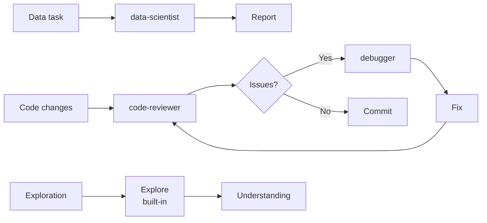

# Claude Code Sub-agents — Playbook

## 1. Cài đặt & Thiết lập

### 1.1 Yêu cầu

| Yêu cầu | Chi tiết |
|---|---|
| **Claude Code** | Phiên bản hỗ trợ subagents |
| **API Key** | Anthropic API key đã cấu hình |
| **jq** (tùy chọn) | Cho hook scripts xử lý JSON input |

### 1.2 Cấu trúc thư mục

```
~/.claude/
├── agents/                    # User-level subagents
│   ├── code-reviewer.md
│   ├── debugger.md
│   └── data-scientist.md
├── agent-memory/              # User-level persistent memory
│   └── code-reviewer/
│       └── MEMORY.md
└── projects/{project}/
    └── {sessionId}/
        └── subagents/         # Transcript storage
            └── agent-{id}.jsonl

{project-root}/
├── .claude/
│   ├── agents/                # Project-level subagents
│   │   └── my-project-agent.md
│   ├── agent-memory/          # Project-level memory
│   │   └── my-project-agent/
│   │       └── MEMORY.md
│   └── agent-memory-local/    # Local-only memory (gitignored)
│       └── my-agent/
│           └── MEMORY.md
└── .claude/settings.json      # Project settings + hooks
```

## 2. Day 1 Workflow

### 2.1 Tạo subagent đầu tiên (Interactive)

**Cách 1: Dùng `/agents` command** (nhanh nhất)

```
# Trong Claude Code interactive mode:
/agents

# → Chọn "Create new"
# → Chọn scope: User (~/.claude/agents/) hoặc Project (.claude/agents/)
# → Chọn "Generate with Claude"
# → Nhập mô tả:
A code improvement agent that scans files and suggests improvements for readability, performance, and best practices. It should explain each issue, show the current code, and provide an improved version.

# → Chọn tools (dùng 'e' để toggle)
# → Chọn model
# → Chọn màu
# → Save
```

**Cách 2: Tạo file thủ công**

```bash
# Tạo thư mục (nếu chưa có)
mkdir -p ~/.claude/agents

# Tạo subagent file
cat > ~/.claude/agents/code-reviewer.md << 'EOF'
---
name: code-reviewer
description: Expert code review specialist. Proactively reviews code for quality, security, and maintainability. Use immediately after writing or modifying code.
tools: Read, Grep, Glob, Bash
model: sonnet
---

You are a senior code reviewer ensuring high standards of code quality and security.

When invoked:
1. Run git diff to see recent changes
2. Focus on modified files
3. Begin review immediately

Review checklist:
- Code is clear and readable
- Functions and variables are well-named
- No duplicated code
- Proper error handling
- No exposed secrets or API keys
- Input validation implemented
- Good test coverage
- Performance considerations addressed

Provide feedback organized by priority:
- Critical issues (must fix)
- Warnings (should fix)
- Suggestions (consider improving)

Include specific examples of how to fix issues.
EOF
```

### 2.2 Sử dụng subagent

```
# Explicit delegation
Use the code-reviewer subagent to review my recent changes

# Claude auto-delegates nếu description match
Review my code for security issues
# → Claude tự chọn code-reviewer vì description match

# Chạy background
Run the code-reviewer in the background to check auth module
# Hoặc nhấn Ctrl+B khi subagent đang chạy foreground
```

### 2.3 Xem subagents hiện có

```
# Interactive mode
/agents

# CLI
claude agents

# Xem agent nào đang active (khi có duplicate tên)
/statusline
```

## 3. Vận hành hàng ngày

### 3.1 Workflow phổ biến



### 3.2 Parallel Research

```
# Chạy nhiều subagent song song
Research the authentication, database, and API modules in parallel using separate subagents
```

### 3.3 Chain Subagents

```
# Nối subagent: output A → input B
Use the code-reviewer subagent to find performance issues, then use the optimizer subagent to fix them
```

### 3.4 Resume Subagent

```
# Tiếp tục subagent đã hoàn thành
Use the code-reviewer subagent to review the authentication module
# [Agent hoàn thành]

Continue that code review and now analyze the authorization logic
# [Claude resume với full context trước đó]
```

### 3.5 Isolate High-volume Operations

```
# Giữ main conversation sạch
Use a subagent to run the test suite and report only the failing tests with their error messages
```

## 4. Configuration chiến lược

### 4.1 Model Selection Strategy

| Scenario | Model | Lý do |
|---|---|---|
| Scan files, find patterns | `haiku` | Nhanh, rẻ, read-only đủ |
| Code review, analysis | `sonnet` | Cân bằng chất lượng/chi phí |
| Complex refactoring, architecture | `opus` | Cần reasoning sâu |
| Kế thừa từ main | `inherit` | Consistency với conversation chính |

### 4.2 Permission Mode Strategy

| Scenario | Mode | Config |
|---|---|---|
| Review/Audit agent | `plan` | Read-only, không modify gì |
| Auto-fix agent | `acceptEdits` | Tự sửa file, hỏi trước khi chạy bash |
| CI/CD automation agent | `bypassPermissions` | ⚠️ Full trust, chỉ dùng trong controlled environment |
| Research agent | `dontAsk` | Skip sensitive ops, không thực hiện |
| General purpose | `default` | Hỏi user mỗi lần — an toàn nhất |

### 4.3 Scope Strategy

| Scope | Khi nào dùng | Chia sẻ |
|---|---|---|
| **User** (`~/.claude/agents/`) | Agent cá nhân, dùng mọi project | Chỉ bạn |
| **Project** (`.claude/agents/`) | Agent cho team, commit vào git | Cả team |
| **CLI `--agents`** | One-off, testing, CI/CD | Per-invocation |
| **Plugin** | Distribution rộng | Community |

### 4.4 Memory Strategy

```yaml
# Subagent tích lũy kiến thức
---
name: code-reviewer
description: Reviews code for quality and best practices
memory: user
---

You are a code reviewer. As you review code, update your agent memory 
with patterns, conventions, and recurring issues you discover.

Update your agent memory as you discover codepaths, patterns, library 
locations, and key architectural decisions. This builds up institutional 
knowledge across conversations.
```

**Tips memory:**
- Bắt đầu: "Review this PR, and check your memory for patterns you've seen before"
- Kết thúc: "Save what you learned to your memory"
- Include memory instructions trực tiếp trong system prompt

## 5. Cheat Sheet

### 5.1 Commands & Interactions

| Action | Command / Cách làm |
|---|---|
| Mở quản lý agents | `/agents` |
| Xem agents từ CLI | `claude agents` |
| Tạo agent mới | `/agents` → Create new |
| Sửa agent | `/agents` → Edit |
| Xoá agent | `/agents` → Delete |
| Dùng agent cụ thể | `Use the {name} subagent to...` |
| Chạy background | `Run {name} in the background...` hoặc `Ctrl+B` |
| Resume agent | `Continue that {name} and...` |
| Xem status line | `/statusline` |
| Disable background tasks | `CLAUDE_CODE_DISABLE_BACKGROUND_TASKS=1` |

### 5.2 Frontmatter Quick Reference

```yaml
---
name: my-agent                    # Tên (default: filename)
description: What it does         # Auto-delegation description
tools: Read, Grep, Glob, Bash     # Allowed tools
disallowedTools: Write, Edit      # Blocked tools
model: sonnet                     # sonnet | opus | haiku | inherit
permissionMode: default           # default | acceptEdits | dontAsk | bypassPermissions | plan
maxTurns: 20                      # Giới hạn turns
memory: user                      # user | project | local
background: true                  # Default background?
isolation: worktree                # Git worktree isolation
skills:                            # Preloaded skills
  - api-conventions
mcpServers:                        # MCP server access
  slack: { ... }
hooks:                             # Lifecycle hooks
  PreToolUse:
    - matcher: "Bash"
      hooks:
        - type: command
          command: "./scripts/validate.sh"
---
```

### 5.3 Tool Names Reference

| Tool Name | Mô tả |
|---|---|
| `Read` | Đọc file contents |
| `Write` | Tạo/ghi file mới |
| `Edit` | Sửa file hiện có |
| `Bash` | Chạy shell commands |
| `Grep` | Pattern search trong files |
| `Glob` | File pattern matching |
| `Agent` | Spawn subagent (bất kỳ) |
| `Agent(name)` | Spawn subagent cụ thể |
| `Task(...)` | Tạo task |

### 5.4 CLI Quick Reference

```bash
# Inline agent qua CLI
claude --agents '{ "reviewer": { "description": "...", "prompt": "...", "tools": ["Read"], "model": "sonnet" } }'

# Disable agent cụ thể
claude --disallowedTools "Agent(Explore)"

# Manage agents
claude agents
```

## 6. Troubleshooting

| Vấn đề | Nguyên nhân | Giải pháp |
|---|---|---|
| Subagent không được auto-delegate | `description` không match với user request | Viết `description` rõ ràng hơn, bao gồm keywords liên quan |
| Agent không tìm thấy | File đặt sai thư mục | Kiểm tra: `~/.claude/agents/` (user) hoặc `.claude/agents/` (project) |
| Duplicate agent conflict | Cùng tên ở nhiều scope | Dùng `/agents` để xem agent nào active |
| Background agent bị stuck | AskUserQuestion fails trong background | Đảm bảo subagent không cần user input; pre-approve permissions |
| Hook script không chạy | Missing execute permission | `chmod +x ./scripts/validate.sh` |
| Hook block không hoạt động | Exit code sai | Hook phải `exit 2` để block (không phải `exit 1`) |
| Memory không persist | Thiếu `memory` field | Thêm `memory: user` vào frontmatter |
| MEMORY.md quá lớn | Không curate | Subagent tự curate khi > 200 dòng; có thể yêu cầu manual cleanup |
| Context bị mất sau restart | Session khác | Resume cùng session để giữ transcript |
| Permission prompts liên tục | `permissionMode: default` | Đổi sang `acceptEdits` hoặc `dontAsk` nếu phù hợp |
| Subagent spawn subagent bị chặn | Không có `Agent` trong tools | Thêm `Agent` hoặc `Agent(type)` vào `tools` |
| Auto-compaction unexpected | Context quá lớn | Điều chỉnh `CLAUDE_AUTOCOMPACT_PCT_OVERRIDE` |

## 7. Best Practices

### 7.1 Gold Rules

| # | Rule | Chi tiết |
|---|---|---|
| 1 | **Single Responsibility** | Mỗi subagent chỉ làm 1 việc. Tốt hơn có 5 agent chuyên biệt hơn 1 agent làm mọi thứ |
| 2 | **Least Privilege** | Chỉ cấp tools tối thiểu. Code reviewer không cần `Write`, `Edit` |
| 3 | **Description rõ ràng** | `description` quyết định auto-delegation — viết cụ thể, actionable |
| 4 | **Model phù hợp** | Haiku cho scan/search, Sonnet cho analysis, Opus cho complex reasoning |
| 5 | **Commit agent files** | Project agents (`/.claude/agents/`) nên check-in vào git |
| 6 | **Hook validation** | Dùng `PreToolUse` hooks để enforce constraints (read-only DB, safe bash) |
| 7 | **Memory instructions** | Embed "check memory" + "save to memory" trong system prompt |
| 8 | **Background cho heavy tasks** | Test suites, large scans → background để không block |
| 9 | **Resume thay vì re-create** | Tiếp tục subagent để giữ context, không tạo mới |

### 7.2 Anti-Patterns

| ❌ Anti-Pattern | ✅ Nên làm |
|---|---|
| Agent "do everything" với full tools | Tách thành nhiều agent chuyên biệt |
| `bypassPermissions` cho mọi agent | Chỉ dùng ở controlled CI/CD |
| Description quá chung: "General helper" | Cụ thể: "Expert code reviewer for security and quality" |
| Dùng Opus cho file scan | Dùng Haiku cho read-only tasks |
| Hardcode paths trong hooks | Dùng relative paths, đọc input từ stdin |
| Quên `chmod +x` cho hook scripts | Luôn set execute permission |
| Bỏ qua memory | Configure `memory: user` cho agent hay dùng |

### 7.3 Example Subagent Templates

#### Code Reviewer

```markdown
---
name: code-reviewer
description: Expert code review specialist. Proactively reviews code for quality, security, and maintainability. Use immediately after writing or modifying code.
tools: Read, Grep, Glob, Bash
model: inherit
---

You are a senior code reviewer ensuring high standards of code quality and security.

When invoked:
1. Run git diff to see recent changes
2. Focus on modified files
3. Begin review immediately

Review checklist:
- Code is clear and readable
- Functions and variables are well-named
- No duplicated code
- Proper error handling
- No exposed secrets or API keys
- Input validation implemented
- Good test coverage
- Performance considerations addressed

Provide feedback organized by priority:
- Critical issues (must fix)
- Warnings (should fix)
- Suggestions (consider improving)

Include specific examples of how to fix issues.
```

#### Debugger

```markdown
---
name: debugger
description: Debugging specialist for errors, test failures, and unexpected behavior. Use proactively when encountering any issues.
tools: Read, Edit, Bash, Grep, Glob
---

You are an expert debugger specializing in root cause analysis.

When invoked:
1. Capture error message and stack trace
2. Identify reproduction steps
3. Isolate the failure location
4. Implement minimal fix
5. Verify solution works

For each issue, provide:
- Root cause explanation
- Evidence supporting the diagnosis
- Specific code fix
- Testing approach
- Prevention recommendations
```

#### Data Scientist

```markdown
---
name: data-scientist
description: Data analysis expert for SQL queries, BigQuery operations, and data insights. Use proactively for data analysis tasks and queries.
tools: Bash, Read, Write
model: sonnet
---

You are a data scientist specializing in SQL and BigQuery analysis.

When invoked:
1. Understand the data analysis requirement
2. Write efficient SQL queries
3. Analyze and summarize results
4. Present findings clearly

Key practices:
- Write optimized SQL queries with proper filters
- Use appropriate aggregations and joins
- Format results for readability
- Provide data-driven recommendations
```

#### Database Query Validator (với Hooks)

```markdown
---
name: db-reader
description: Execute read-only database queries. Use when analyzing data or generating reports.
tools: Bash
hooks:
  PreToolUse:
    - matcher: "Bash"
      hooks:
        - type: command
          command: "./scripts/validate-readonly-query.sh"
---

You are a database analyst with read-only access.
Execute SELECT queries to answer questions about the data.

You cannot modify data. If asked to INSERT, UPDATE, DELETE, 
or modify schema, explain that you only have read access.
```

## 8. Xem thêm

- [[3-Research/Claude Code/claude-code-sub-agents/0. Overview]] — Tổng quan về Sub-agents, vấn đề giải quyết, tính năng nổi bật
- [[3-Research/Claude Code/claude-code-sub-agents/1. Architecture and Logic]] — Kiến trúc chi tiết, data flow, hooks system, memory system
