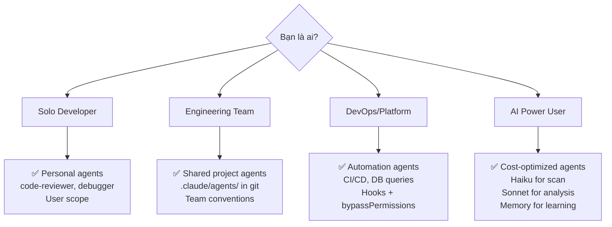
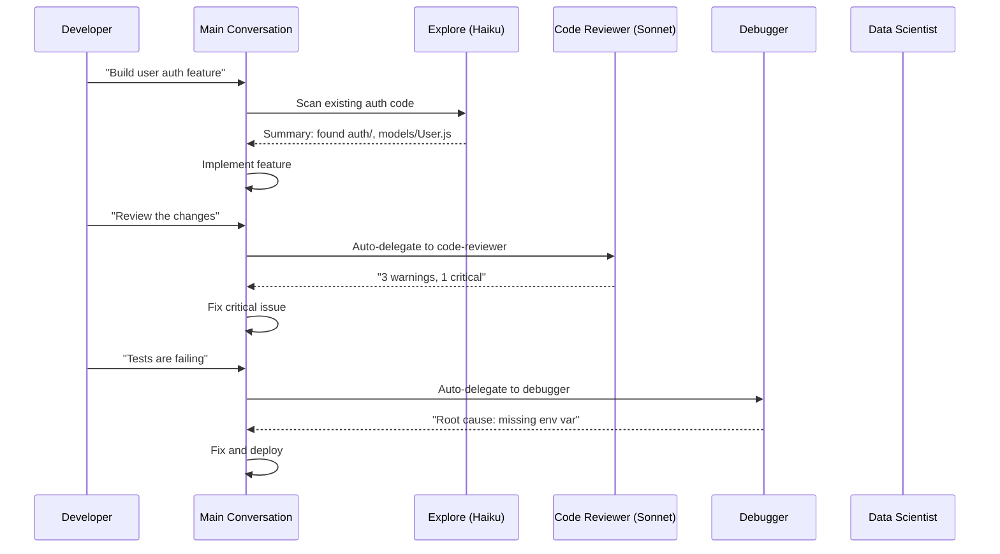
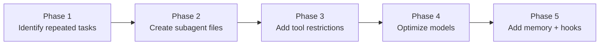
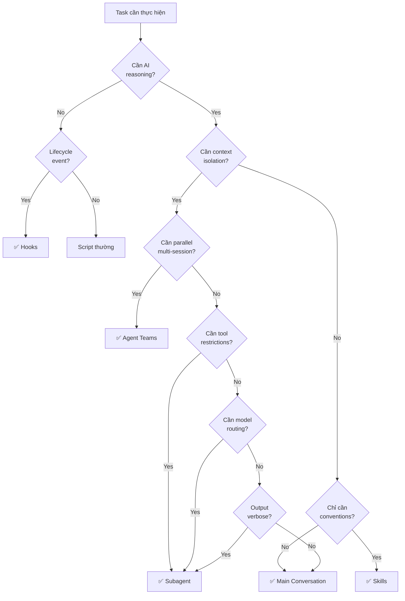

# Claude Code Sub-agents — Decision Guide

## 1. So sánh với Alternatives

### 1.1 Feature Matrix tổng quan

| Tiêu chí | Sub-agents | Agent Teams | Skills | Hooks | MCP Servers | `/btw` Side Questions |
|---|---|---|---|---|---|---|
| **Mô hình** | In-process agent | Multi-process sessions | Reusable instructions | Event-driven scripts | External tool servers | Quick inline question |
| **Context isolation** | ✅ Transcript riêng | ✅ Session riêng | ❌ Shared context | N/A | N/A | ❌ Shared context |
| **Custom model** | ✅ Per-agent | ✅ Per-teammate | ❌ | N/A | N/A | ❌ |
| **Tool restrictions** | ✅ Granular | ❌ Full tools | ❌ | ✅ Block via exit 2 | N/A | ❌ |
| **Parallel execution** | ✅ Background mode | ✅ Native parallel | ❌ | ❌ | ❌ | ❌ |
| **Persistent memory** | ✅ MEMORY.md | ❌ | ❌ | ❌ | ❌ | ❌ |
| **Reusable config** | ✅ .md files | ❌ Ad-hoc | ✅ .md files | ✅ settings.json | ✅ Config files | ❌ |
| **Version control** | ✅ Git-friendly | ❌ | ✅ Git-friendly | ✅ Git-friendly | ✅ Git-friendly | ❌ |
| **Distribution** | ✅ Plugins | ❌ | ✅ Plugins | ❌ | ❌ | ❌ |
| **Cost control** | ✅ Model routing | ❌ Mỗi session = full cost | ❌ | ❌ | ❌ | ❌ |
| **Setup effort** | Thấp–Trung bình | Trung bình | Thấp | Trung bình | Cao | Không cần |

### 1.2 Sub-agents vs Agent Teams — So sánh chi tiết

| Khía cạnh | Sub-agents | Agent Teams |
|---|---|---|
| **Kiến trúc** | In-process, trong conversation hiện tại | Multi-process, mỗi teammate = Claude Code session riêng |
| **Communication** | Summary return về main conversation | Inter-agent messaging, shared task board |
| **Parallelism** | Background mode (1 foreground + N background) | Native parallel (N sessions đồng thời) |
| **Context sharing** | Chỉ summary, không full context | File-based, message-based |
| **Git conflicts** | Có thể xảy ra nếu cùng edit files | Hỗ trợ git worktrees để tránh conflict |
| **Cost** | Shared context window, model routing tiết kiệm | Mỗi teammate = context window riêng |
| **Complexity** | Đơn giản, chỉ cần 1 file .md | Phức tạp hơn: tmux, display modes, task management |
| **Best for** | Focused tasks, context isolation, cost optimization | Large-scale parallel work, multi-file refactoring |

### 1.3 Sub-agents vs Skills

| Khía cạnh | Sub-agents | Skills |
|---|---|---|
| **Bản chất** | Agent riêng biệt với system prompt + tools riêng | Instructions được inject vào context hiện tại |
| **Context** | Isolated — không pollute main conversation | Shared — instructions nằm trong main context |
| **Tools** | Có thể restrict | Không restrict, dùng tools của main |
| **Model** | Có thể chọn khác main | Luôn dùng model của main |
| **Khi nào dùng Skills** | Khi cần conventions, patterns cho main conversation | ✅ |
| **Khi nào dùng Sub-agents** | ✅ Khi cần isolation, tool restriction, cost control | |
| **Kết hợp** | ✅ Subagent có thể preload skills qua `skills` field | |

### 1.4 Sub-agents vs Hooks

| Khía cạnh | Sub-agents | Hooks |
|---|---|---|
| **Bản chất** | AI agent thực hiện task | Script chạy tại lifecycle events |
| **Intelligence** | ✅ AI reasoning | ❌ Deterministic scripts |
| **Khi nào dùng Hooks** | | Validation, linting, auto-formatting |
| **Khi nào dùng Sub-agents** | Analysis, review, complex reasoning | |
| **Kết hợp** | ✅ Subagent có thể có hooks riêng trong frontmatter | |

## 2. Khi nào NÊN dùng Sub-agents

### 2.1 Use Cases lý tưởng

| Use Case | Lý do | Config gợi ý |
|---|---|---|
| **Code review sau mỗi change** | Output review verbose, không cần trong main context | `model: sonnet`, `tools: Read, Grep, Glob, Bash` |
| **Debug lỗi phức tạp** | Cần explore nhiều, tránh context pollution | `tools: Read, Edit, Bash, Grep, Glob` |
| **Scan codebase nhanh** | Task đơn giản, dùng model rẻ | `model: haiku`, `tools: Read, Grep, Glob` |
| **Database queries read-only** | Cần enforce read-only constraints | `tools: Bash` + hook validate SQL |
| **Test suite execution** | Output test rất dài, chỉ cần summary | Background mode, `tools: Bash, Read` |
| **Parallel research** | Nghiên cứu nhiều module cùng lúc | Multiple background subagents |
| **CI/CD automation** | Headless, không cần user interaction | `permissionMode: bypassPermissions` |
| **Domain-specific analysis** | Mỗi domain cần prompt chuyên biệt | User-level agents, `memory: user` |

### 2.2 Đối tượng phù hợp nhất



## 3. Khi nào KHÔNG nên dùng Sub-agents

| Scenario | Lý do | Dùng gì thay thế |
|---|---|---|
| **Task cần back-and-forth liên tục** | Subagent không interactive — chạy rồi return | Main conversation |
| **Nhiều phases chia sẻ context** | Plan → Implement → Test cùng context hiệu quả hơn | Main conversation hoặc Skills |
| **Quick, targeted change** | Overhead launch subagent > benefit | Main conversation |
| **Latency-sensitive tasks** | Subagent cần thời gian gather context | Main conversation |
| **Large-scale parallel refactoring** | Cần nhiều sessions edit cùng lúc, tránh git conflicts | Agent Teams với git worktrees |
| **Chỉ cần conventions/patterns** | Không cần isolation hay tool restriction | Skills |
| **Chỉ cần validate/lint** | Deterministic, không cần AI reasoning | Hooks |
| **Cần external tool access** | MCP servers cung cấp tools, không cần agent riêng | MCP Servers (nhưng có thể kết hợp) |

## 4. Case Studies / Ví dụ Thực tế

### 4.1 Workflow: Feature Development với Subagents



**Kết quả:** Main conversation giữ sạch (chỉ chứa summaries), mỗi task chuyên biệt được xử lý bởi agent tối ưu.

### 4.2 Cost Optimization Example

| Phase | Không có Subagents | Có Subagents | Tiết kiệm |
|---|---|---|---|
| File scanning | Opus ($$$$) | Haiku ($) | ~90% |
| Code review | Opus ($$$$) | Sonnet ($$) | ~50% |
| Complex refactor | Opus ($$$$) | Opus ($$$$) | 0% |
| Test execution | Opus ($$$$) | Haiku ($) | ~90% |
| **Tổng ước tính** | **16x** | **~6x** | **~60%** |

> [!NOTE]
> Số liệu ước tính minh họa. Chi phí thực tế phụ thuộc vào task complexity và token usage.

### 4.3 Team Workflow Example

```
project/
├── .claude/
│   ├── agents/
│   │   ├── pr-reviewer.md        # Team standard: review mọi PR
│   │   ├── test-fixer.md         # Auto-fix failing tests
│   │   └── security-scanner.md   # Scan security vulnerabilities
│   └── settings.json             # Project-level hooks
├── scripts/
│   ├── validate-readonly-query.sh
│   └── run-linter.sh
└── src/
```

**Benefit:** Mọi team member dùng cùng bộ agents chuẩn, đảm bảo consistency.

## 5. Chi phí & Tài nguyên

### 5.1 Cost Model

| Component | Cost Factor | Ghi chú |
|---|---|---|
| **Subagent execution** | Token usage theo model chọn | Haiku rẻ nhất, Opus đắt nhất |
| **Context window** | Shared — subagent dùng context window của session | Không tốn thêm context riêng |
| **Memory storage** | Disk space (MEMORY.md files) | Miễn phí, local files |
| **Transcript storage** | Disk space (.jsonl files) | Auto-cleanup sau 30 ngày |

### 5.2 Model Pricing Tương đối

| Model | Speed | Quality | Cost | Best for |
|---|---|---|---|---|
| `haiku` | ⚡⚡⚡ | ⭐⭐ | 💲 | File scan, pattern search, quick tasks |
| `sonnet` | ⚡⚡ | ⭐⭐⭐ | 💲💲 | Code review, analysis, general tasks |
| `opus` | ⚡ | ⭐⭐⭐⭐ | 💲💲💲💲 | Complex reasoning, architecture decisions |
| `inherit` | Varies | Varies | Varies | Consistency với main conversation |

### 5.3 Resource Requirements

| Resource | Requirement |
|---|---|
| **Disk** | ~KB per agent file, ~MB per transcript |
| **Network** | API calls to Anthropic |
| **CPU** | Minimal (hook scripts) |
| **RAM** | Minimal (CLI process) |

## 6. Migration Path

### 6.1 Từ "Everything in Main Conversation"



| Phase | Action | Effort |
|---|---|---|
| 1 | Xác định tasks lặp lại (review, debug, scan) | 30 min |
| 2 | Tạo `.md` files với system prompts | 1 hour |
| 3 | Thêm `tools` restrictions cho mỗi agent | 30 min |
| 4 | Chọn model phù hợp (haiku/sonnet/opus) | 15 min |
| 5 | Cấu hình memory và hooks nếu cần | 1 hour |

### 6.2 Từ Agent Teams sang Subagents

| Khi nào migrate | Cách làm |
|---|---|
| Task đơn lẻ, không cần parallel sessions | Chuyển thành subagent file |
| Chỉ cần 1-2 agents, không cần tmux | User-level subagent |
| Muốn tiết kiệm cost (model routing) | Subagent với `model: haiku/sonnet` |

> [!WARNING]
> **Không nên migrate** nếu bạn cần: parallel file editing (git conflicts), multi-session orchestration, hoặc heavy inter-agent communication.

### 6.3 Từ Skills sang Subagents

| Khi nào upgrade | Cách làm |
|---|---|
| Skill output quá verbose, pollute context | Chuyển thành subagent |
| Cần restrict tools | Thêm `tools` field |
| Cần model khác main | Thêm `model` field |
| Giữ skill + dùng trong subagent | `skills` field trong subagent frontmatter |

## 7. Roadmap & Tương lai

### 7.1 Hướng phát triển

| Feature | Status | Ghi chú |
|---|---|---|
| Built-in subagents (Explore, Plan, General) | ✅ Available | Sẵn có trong Claude Code |
| Custom subagents via files | ✅ Available | `.md` files với frontmatter |
| `/agents` UI command | ✅ Available | Guided creation, editing |
| Background execution | ✅ Available | Ctrl+B, `background: true` |
| Persistent memory | ✅ Available | MEMORY.md, 3 scopes |
| Plugin distribution | ✅ Available | Share agents qua plugins |
| Git worktree isolation | ✅ Available | `isolation: worktree` |
| Agent Teams integration | ✅ Available | Complement, not replace |
| Hooks trong subagent | ✅ Available | PreToolUse, PostToolUse, Stop |

### 7.2 Community Health

| Indicator | Status |
|---|---|
| **Maintainer** | Anthropic (core team) |
| **Documentation** | Comprehensive, official docs |
| **Update frequency** | Active, regular releases |
| **Community** | Growing, part of Claude Code ecosystem |
| **Plugin ecosystem** | Emerging, supports agent distribution |

## 8. Ma trận Ra quyết định

### 8.1 Quick Decision Table

| Scenario | Recommendation | Lý do |
|---|---|---|
| Code review sau mỗi commit | ✅ **Subagent** | Context isolation, reusable, auto-delegate |
| Debug lỗi phức tạp | ✅ **Subagent** | Focused prompt, tool control |
| Quick file edit | ❌ **Main conversation** | Overhead không đáng |
| Scan 1000+ files | ✅ **Subagent (Haiku)** | Cost optimization, background |
| Parallel refactor 5 modules | ✅ **Agent Teams** | Cần parallel sessions, git worktrees |
| Enforce coding conventions | ✅ **Skills** (+ Subagent optional) | Skills cho conventions, subagent cho enforcement |
| Auto-lint on save | ✅ **Hooks** | Deterministic, không cần AI |
| Read-only DB queries | ✅ **Subagent + Hooks** | Hook validate SQL, subagent xử lý logic |
| CI/CD pipeline | ✅ **Subagent (headless)** | `bypassPermissions`, automation |
| Ad-hoc question while coding | ❌ **`/btw`** | Fastest, no context switch |

### 8.2 Decision Flowchart



### 8.3 Tổng kết: Khi nào dùng gì

| Công cụ | Một câu tóm tắt |
|---|---|
| **Sub-agents** | Khi cần **AI chuyên biệt** với **context riêng**, **tools giới hạn**, hoặc **model tối ưu** |
| **Agent Teams** | Khi cần **nhiều sessions song song** xử lý **large-scale parallel work** |
| **Skills** | Khi cần **inject conventions/patterns** vào conversation **mà không cần isolation** |
| **Hooks** | Khi cần **validation/automation deterministic** tại **lifecycle events** |
| **MCP Servers** | Khi cần **kết nối external tools** (Slack, DB, APIs) |
| **Main Conversation** | Khi task **interactive**, **cần back-and-forth**, hoặc **đủ đơn giản** |
| **`/btw`** | Khi cần **hỏi nhanh** mà **không gián đoạn** workflow hiện tại |

## 9. Xem thêm

- [0. Overview](./0. Overview.md) — Tổng quan, vấn đề giải quyết, kiến trúc, tính năng nổi bật
- [1. Architecture and Logic](./1. Architecture and Logic.md) — Data flow chi tiết, hooks system, memory, config
- [2. Playbook](./2. Playbook.md) — Cài đặt, Day 1 workflow, cheat sheet, troubleshooting, templates
