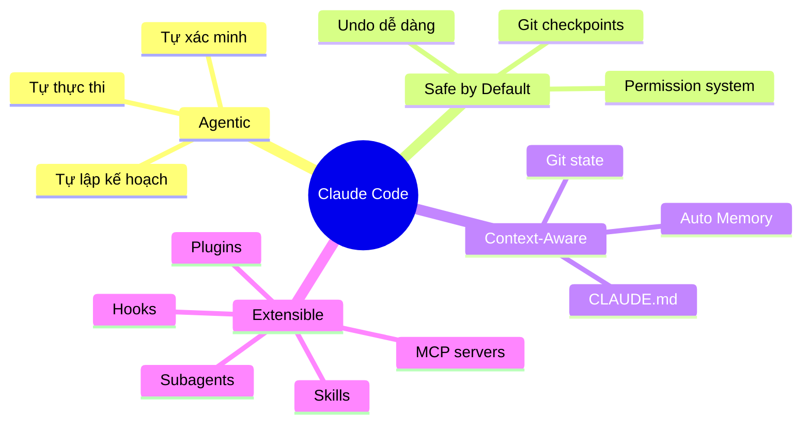
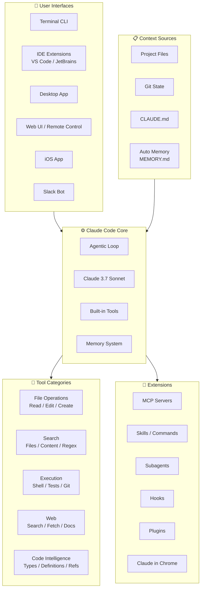
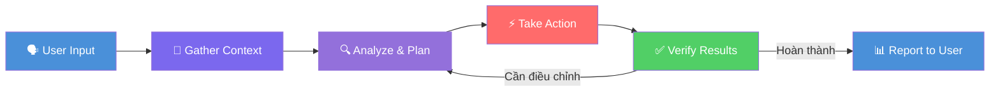

# How Claude Code Works — Tổng quan

## Claude Code là gì?

**Claude Code** là một công cụ **agentic coding** do [Anthropic](https://www.anthropic.com) phát triển. Nó đọc codebase, chỉnh sửa file, chạy lệnh terminal, và tích hợp trực tiếp vào quy trình phát triển phần mềm. Có mặt trên **terminal**, **IDE** (VS Code, JetBrains), **desktop app**, **web**, và **mobile**.

> **Điểm khác biệt cốt lõi:** Claude Code không chỉ là code completion — nó là một **agent tự chủ** có khả năng lập kế hoạch, thực thi nhiều bước, và tự xác minh kết quả.

---

## Vấn đề giải quyết

| Vấn đề | Mô tả | Cách Claude Code giải quyết |
|:---|:---|:---|
| Context switching | Dev phải nhảy giữa editor, terminal, browser, docs | Agent tích hợp tất cả trong 1 interface — đọc, sửa, chạy, tìm kiếm |
| Repetitive tasks | Viết test, fix lint, commit, tạo PR là công việc lặp lại | Tự động hóa end-to-end — từ viết test đến chạy và fix |
| Codebase understanding | Repo lớn khó nắm bắt nhanh | Agent đọc, search, trace code tự động trước khi hành động |
| Multi-step debugging | Debug cần nhiều bước thủ công | Agentic loop tự động: chạy test → đọc lỗi → tìm file → sửa → verify |
| Knowledge silos | Kiến thức dự án phân tán | CLAUDE.md + Auto Memory lưu trữ context xuyên sessions |
| Permission anxiety | Lo ngại AI thay đổi code không kiểm soát | Checkpoint system + permission modes cho từng mức độ trust |

---

## Triết lý thiết kế

| Nguyên tắc | Giải thích |
|:---|:---|
| **Agentic-first** | Không chỉ suggest — tự hành động qua vòng lặp gather → act → verify |
| **Safety by design** | Git checkpoint trước mỗi thay đổi lớn, permission system 3 tier |
| **Context persistence** | CLAUDE.md + Auto Memory giữ kiến thức xuyên sessions |
| **Extensibility** | MCP, Skills, Subagents, Hooks — mở rộng không giới hạn |
| **Universal access** | Terminal, IDE, Desktop, Web, Mobile, Slack, CI/CD |

---

## Ai nên dùng?

| Đối tượng | Use case chính |
|:---|:---|
| **Individual developers** | Tăng tốc phát triển, tự động hóa tasks lặp lại |
| **Dev teams** | Shared CLAUDE.md cho conventions, code review tự động |
| **DevOps/SRE** | CI/CD integration, monitoring, automated fixes |
| **Open-source maintainers** | PR review tự động, triage issues |
| **Learners** | Hiểu codebase mới, nhận giải thích chi tiết |

---

## Kiến trúc tổng quan

### Components chính

| Component | Vai trò | Chi tiết |
|:---|:---|:---|
| **Agentic Loop** | Vòng lặp xử lý chính | Gather context → Take action → Verify results |
| **Claude 3.7 Sonnet** | Model AI nền tảng | Reasoning + Coding capabilities |
| **Built-in Tools** | Tương tác với environment | File ops, Search, Execution, Web, Code Intelligence |
| **Memory System** | Lưu trữ kiến thức | CLAUDE.md (explicit) + Auto Memory (implicit) |
| **Permission System** | Kiểm soát quyền | Default / Auto-accept / Plan mode |
| **Checkpoint System** | An toàn thay đổi | Git checkpoints tự động, undo/reset dễ dàng |
| **Extension System** | Mở rộng khả năng | MCP, Skills, Subagents, Hooks, Plugins |

---

## Vòng đời / Workflow chính

### Chi tiết vòng lặp Agentic Loop

| Phase | Mô tả | Tools thường dùng |
|:---|:---|:---|
| **Gather Context** | Đọc files, search codebase, hiểu structure | Read, Search, Git status |
| **Analyze & Plan** | Xác định vấn đề, lập kế hoạch hành động | Reasoning (internal) |
| **Take Action** | Thực thi thay đổi — edit files, run commands | Edit, Bash, Create |
| **Verify Results** | Kiểm tra kết quả — chạy tests, review output | Bash (tests), Read |
| **Report** | Tóm tắt những gì đã làm cho user | — |

> **Đặc điểm quan trọng:** Vòng lặp **tự thích ứng** — câu hỏi đơn giản có thể chỉ cần Gather, bug fix thì cycle qua tất cả phases nhiều lần.

---

## Tính năng nổi bật

### 1. Multi-Interface Access
Sử dụng Claude Code ở **mọi nơi**:
- **Terminal** — Interface chính, full power
- **VS Code / JetBrains** — IDE extensions tích hợp
- **Desktop App** — Visual diff review
- **Web / Remote Control** — Truy cập từ browser
- **iOS App** — Làm việc từ mobile, `/teleport` về terminal
- **Slack** — `@Claude` trong team chat
- **CI/CD** — GitHub Actions, GitLab CI/CD

### 2. Memory System
- **CLAUDE.md** — File markdown lưu instructions, conventions, context cho dự án
- **Auto Memory** — Claude tự học patterns và preferences khi làm việc, lưu vào `MEMORY.md`
- **`.claude/rules/`** — Rules theo thư mục cho monorepo

### 3. Session Management
- **`--continue`** — Tiếp tục session trước
- **`--resume`** — Chọn session cụ thể để tiếp tục
- **`--fork-session`** — Fork session để thử approach khác
- **`/compact`** — Nén context khi gần đầy
- **`/context`** — Xem trạng thái context window

### 4. Safety & Control
- **Git Checkpoints** — Tự động tạo checkpoint trước thay đổi lớn
- **3 Permission Modes** — Default (hỏi), Auto-accept edits, Plan mode
- **Fine-grained Permissions** — Allow/Ask/Deny rules cho từng tool
- **Undo/Reset** — Revert dễ dàng bất kỳ lúc nào

### 5. Extension Ecosystem
- **MCP Servers** — Kết nối external services
- **Skills** — Custom workflows và commands
- **Subagents** — Delegate tasks cho agents chuyên biệt
- **Hooks** — Event-driven automation
- **Plugins** — Code intelligence và marketplace

---

## So sánh với Alternatives

| Tính năng | Claude Code | GitHub Copilot | Cursor | Aider |
|:---|:---|:---|:---|:---|
| **Agentic execution** | ✅ Full loop | ⚠️ Limited | ✅ Composer | ⚠️ CLI only |
| **Terminal-native** | ✅ | ❌ | ❌ | ✅ |
| **IDE integration** | ✅ VS Code + JetBrains | ✅ | ✅ Built-in | ❌ |
| **Web/Mobile access** | ✅ | ❌ | ❌ | ❌ |
| **Memory system** | ✅ CLAUDE.md + Auto | ❌ | ⚠️ Rules | ⚠️ .aider |
| **Git checkpoints** | ✅ Tự động | ❌ | ❌ | ✅ |
| **Permission system** | ✅ 3 modes + rules | N/A | ❌ | ⚠️ |
| **Subagents** | ✅ | ❌ | ❌ | ❌ |
| **MCP support** | ✅ | ❌ | ❌ | ❌ |
| **CI/CD integration** | ✅ GH Actions + GitLab | ✅ | ❌ | ⚠️ |
| **Slack integration** | ✅ | ❌ | ❌ | ❌ |
| **Pricing** | Pay-per-use / Max plan | Subscription | Subscription | Free (BYOK) |

---

## Tools có sẵn

| Category | Khả năng |
|:---|:---|
| **File Operations** | Read files, edit code, create new files, rename và reorganize |
| **Search** | Find files by pattern, search content with regex, explore codebases |
| **Execution** | Run shell commands, start servers, run tests, use git |
| **Web** | Search the web, fetch documentation, look up error messages |
| **Code Intelligence** | Type errors/warnings, jump to definitions, find references (qua plugins) |

---

## Xem thêm

- [1. Architecture and Logic](./1. Architecture and Logic.md) — Data flow chi tiết, modules, cơ chế hoạt động nội bộ
- [2. Playbook](./2. Playbook.md) — Hướng dẫn cài đặt, Day 1 workflow, cheat sheet, troubleshooting
