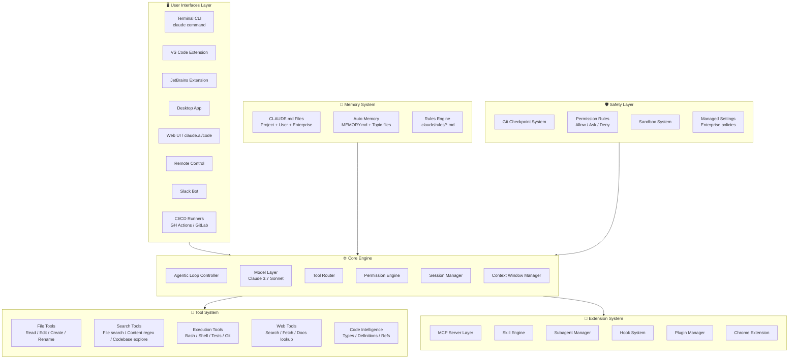
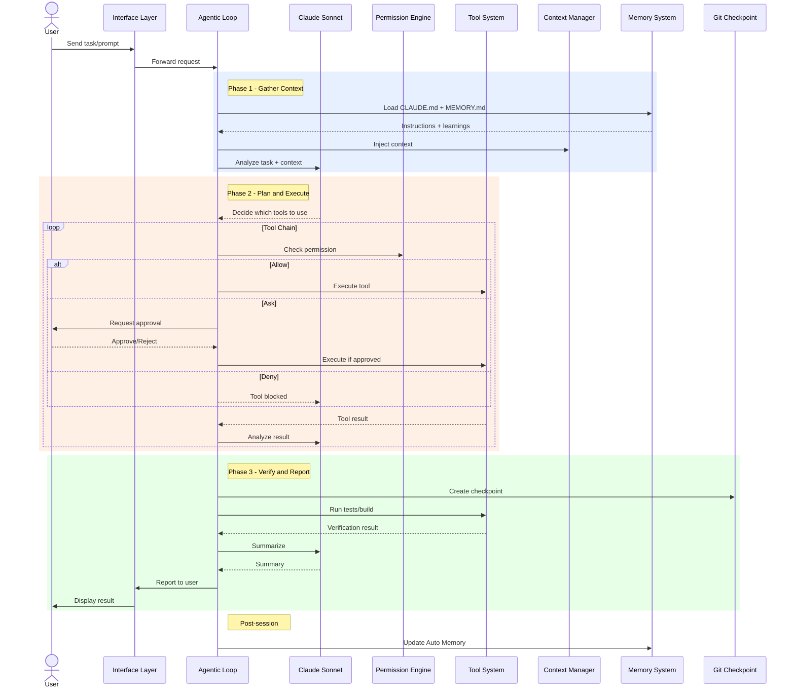
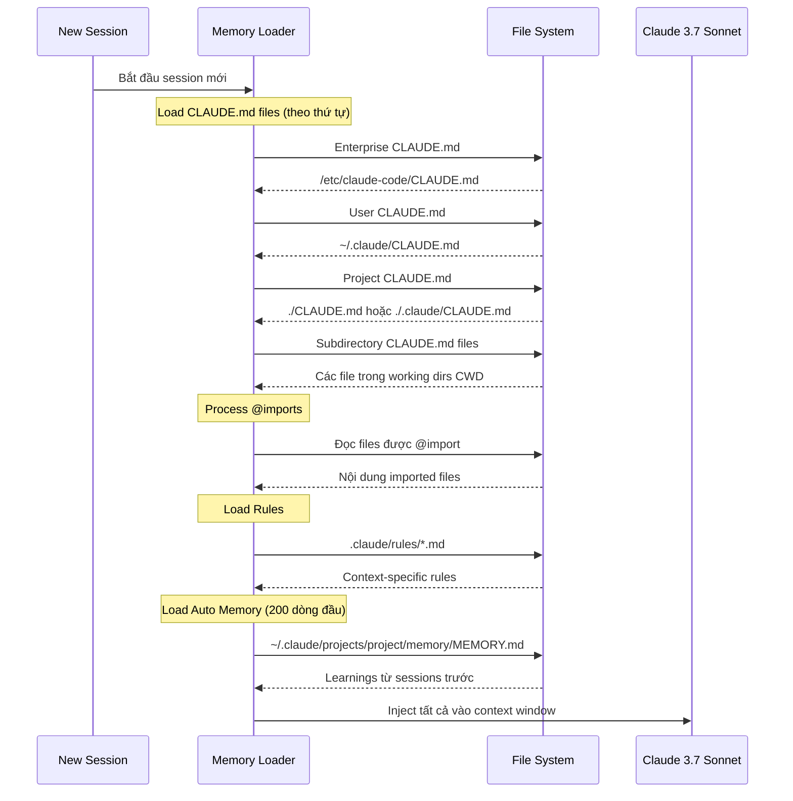
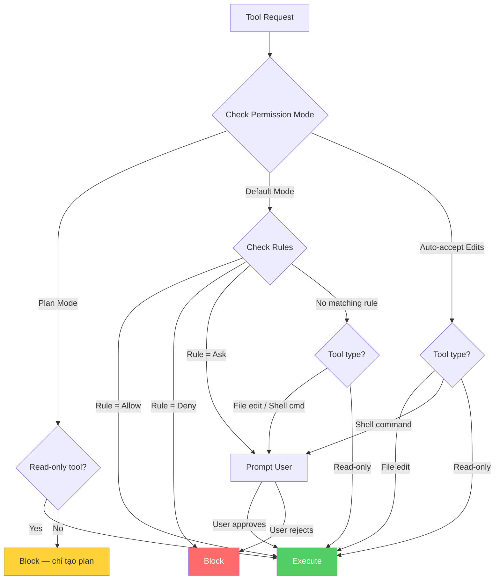
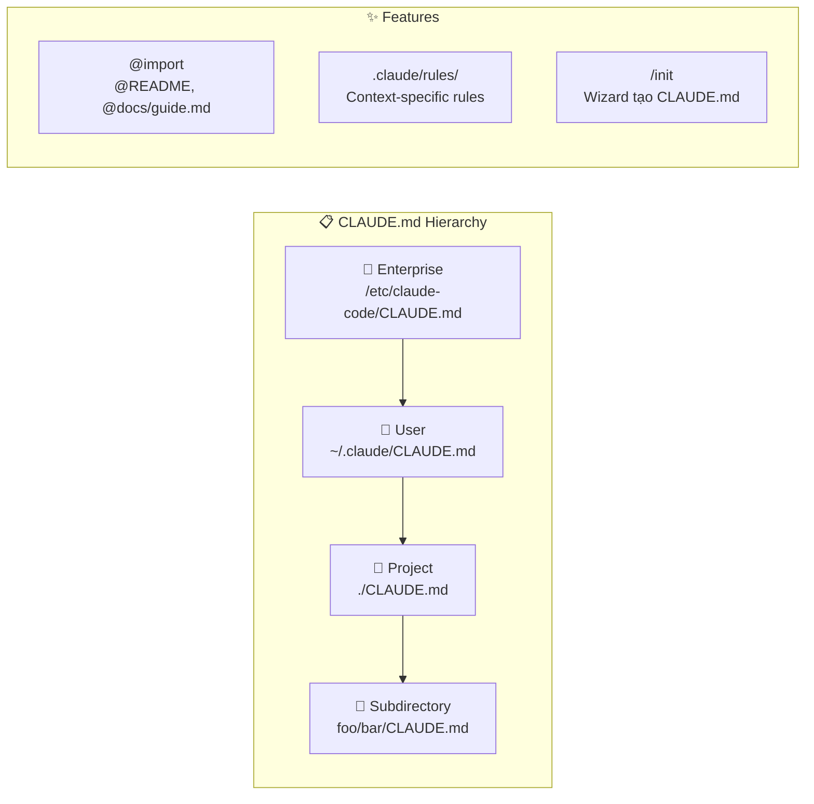
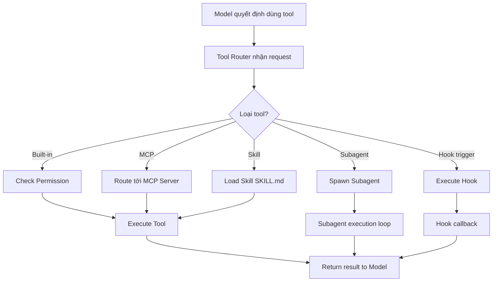
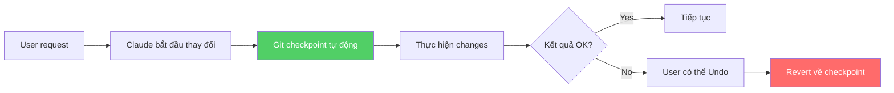
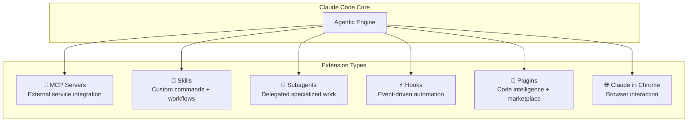

# How Claude Code Works — Architecture & Logic

## Mô hình kiến trúc tổng thể



### Layers giải thích

| Layer | Chức năng | Components chính |
|:---|:---|:---|
| **Interfaces** | Điểm tiếp xúc với user | CLI, IDE extensions, Desktop, Web, Slack, CI/CD |
| **Core Engine** | Bộ não xử lý trung tâm | Agentic Loop, Model, Tool Router, Permission, Session, Context |
| **Tool System** | Tương tác với environment | File ops, Search, Execution, Web, Code Intelligence |
| **Memory System** | Lưu trữ kiến thức dài hạn | CLAUDE.md, Auto Memory, Rules |
| **Extension System** | Mở rộng khả năng | MCP, Skills, Subagents, Hooks, Plugins |
| **Safety Layer** | Bảo vệ và kiểm soát | Checkpoints, Permissions, Sandbox, Managed Settings |

---

## Data Flow chi tiết

### Flow 1: Agentic Loop — Vòng xử lý chính



### Flow 2: Memory Loading — Cách Claude nhớ dự án



### Flow 3: Permission Check — Kiểm soát quyền



---

## Core Modules / Components

### Agentic Loop Controller

| Thuộc tính | Chi tiết |
|:---|:---|
| **Vai trò** | Điều phối toàn bộ quá trình xử lý request |
| **3 Phases** | Gather Context → Take Action → Verify Results |
| **Đặc điểm** | Tự thích ứng — câu hỏi đơn giản chỉ cần Gather, bug fix cycle nhiều lần |
| **Tool chaining** | Tự động chuỗi hàng chục actions dựa trên kết quả bước trước |
| **Course-correcting** | Tự điều chỉnh khi phát hiện sai lầm hoặc thông tin mới |

### Model Layer

| Thuộc tính | Chi tiết |
|:---|:---|
| **Default model** | Claude 3.7 Sonnet |
| **Thay đổi model** | `/model` command hoặc `claude --model <name>` |
| **Multi-model** | Hỗ trợ cấu hình nhiều models cho các tasks khác nhau |
| **Settings** | `ANTHROPIC_MODEL` env var, `model` trong settings.json |
| **Haiku-class** | `ANTHROPIC_SMALL_FAST_MODEL` cho background tasks |

### Context Window Manager

| Thuộc tính | Chi tiết |
|:---|:---|
| **Vai trò** | Quản lý context window (có giới hạn) |
| **Auto-management** | Truncate output dài, summarize files đã đọc, drop conversation cũ |
| **`/compact`** | Nén context thủ công — `/compact focus on the API changes` |
| **`/context`** | Xem trạng thái hiện tại của context window |
| **Autocompact** | `CLAUDE_AUTOCOMPACT_PCT_OVERRIDE` — trigger tự động |
| **1M context** | Extended context window (có thể disable) |

### Session Manager

| Thuộc tính | Chi tiết |
|:---|:---|
| **Vai trò** | Quản lý lifecycle của sessions |
| **Continue** | `claude --continue` — tiếp tục session cuối |
| **Resume** | `claude --resume` — chọn session cụ thể |
| **Fork** | `claude --continue --fork-session` — branch off session |
| **Git-aware** | Nhận biết branch, uncommitted changes, commit history |
| **Worktrees** | Hỗ trợ git worktrees cho parallel sessions |

---

## Cơ chế hoạt động nội bộ

### Memory System — Cách Claude nhớ

Claude Code có **2 hệ thống bộ nhớ** hoạt động song song:

#### CLAUDE.md Files (Explicit Memory)



| Scope | Đường dẫn | Chia sẻ | Use case |
|:---|:---|:---|:---|
| **Enterprise** | `/etc/claude-code/CLAUDE.md` | Toàn org | Company-wide policies |
| **User** | `~/.claude/CLAUDE.md` | Chỉ user | Personal preferences |
| **Project** | `./CLAUDE.md` hoặc `./.claude/CLAUDE.md` | Team (git) | Project conventions |
| **Subdirectory** | `foo/CLAUDE.md` | Team (git) | Module-specific rules |

**Viết CLAUDE.md hiệu quả:**
- ✅ "Use 2-space indentation" — cụ thể
- ❌ "Format code properly" — mơ hồ
- ✅ "Run `npm test` before committing" — hành động rõ ràng
- ❌ "Test your changes" — không rõ bằng cách nào

#### Auto Memory (Implicit Memory)

| Thuộc tính | Chi tiết |
|:---|:---|
| **Cách hoạt động** | Claude tự lưu patterns, preferences khi làm việc |
| **Storage** | `~/.claude/projects/<project>/memory/` |
| **Index file** | `MEMORY.md` — 200 dòng đầu load mỗi session |
| **Topic files** | `debugging.md`, `api-conventions.md`, etc. |
| **Enable/Disable** | `/memory` command hoặc `autoMemoryEnabled` setting |
| **Audit** | `/memory` để xem và chỉnh sửa |

```
~/.claude/projects/<project>/memory/
├── MEMORY.md           # Index, load vào mỗi session
├── debugging.md        # Patterns khi debug
├── api-conventions.md  # API design decisions
└── ...                 # Topic files khác
```

---

### Tool Router — Routing và Execution



### Built-in Tools chi tiết

| Tool Category | Specific Actions | Permission Default |
|:---|:---|:---|
| **Read** | Đọc file content | Auto-allow |
| **Edit** | Chỉnh sửa file content | Ask (Default), Allow (Auto-accept) |
| **Create** | Tạo file mới | Ask |
| **Bash** | Chạy shell commands | Ask |
| **Search** | Find files, grep content | Auto-allow |
| **WebFetch** | Fetch URL content | Ask (domain-based) |
| **Agent** | Spawn subagent | Ask |

---

### Permission System — Chi tiết

#### Permission Modes

| Mode | Hành vi | Khi nào dùng |
|:---|:---|:---|
| **`default`** | Hỏi trước file edits + shell commands | Daily work — kiểm soát đầy đủ |
| **`acceptEdits`** | Auto-allow edits, vẫn hỏi commands | Tin tưởng edits, muốn kiểm soát commands |
| **`plan`** | Chỉ read-only tools, tạo plan | Review trước khi thực thi |
| **`dontAsk`** | Bypass tất cả permissions | Automation/CI — cẩn thận! |

#### Permission Rule Syntax

```json
{
  "permissions": {
    "allow": [
      "Bash(npm run *)",
      "Bash(git commit *)",
      "Read"
    ],
    "deny": [
      "Bash(git push *)",
      "Bash(rm -rf *)"
    ]
  }
}
```

| Syntax | Ví dụ | Ý nghĩa |
|:---|:---|:---|
| `Tool` | `Bash` | Match tất cả uses của tool |
| `Tool(command)` | `Bash(npm run build)` | Match chính xác command |
| `Tool(pattern*)` | `Bash(npm run *)` | Wildcard matching |
| `Tool(specifier)` | `WebFetch(domain:example.com)` | Specifier-based matching |

---

### Checkpoint System — Git Safety Net



| Action | Mô tả | Cách thực hiện |
|:---|:---|:---|
| **Checkpoint** | Git snapshot trước thay đổi lớn | Tự động |
| **Undo** | Revert thay đổi cuối | `Esc` hoặc undo command |
| **Reset** | Quay về trạng thái đầu session | Reset command |
| **Interrupt** | Dừng Claude giữa chừng | `Esc` key |

---

### Extension System — Mở rộng Claude Code



| Extension | Mục đích | Ví dụ |
|:---|:---|:---|
| **MCP Servers** | Kết nối APIs/services bên ngoài | GitHub API, database, Jira |
| **Skills** | Custom slash commands + workflows | `/review-pr`, `/deploy-staging` |
| **Subagents** | Delegate tasks cho agent riêng | Research agent, test agent |
| **Hooks** | Automation khi events xảy ra | Pre-commit checks, auto-format |
| **Plugins** | Market place + code intelligence | Type checking, linting |
| **Chrome** | Tương tác với browser content | Screenshot, DOM reading |

---

## Configuration / Settings

### Settings Files

| Scope | Đường dẫn | Chia sẻ |
|:---|:---|:---|
| **Enterprise** | Managed deployment | Toàn org |
| **User** | `~/.claude/settings.json` | Cá nhân |
| **Project** | `.claude/settings.json` | Team (commit vào git) |
| **Local** | `.claude/settings.local.json` | Cá nhân (gitignore) |

### Cài đặt chính

| Setting | Giá trị | Mô tả |
|:---|:---|:---|
| `permissions` | `{allow:[], deny:[]}` | Permission rules |
| `model` | `"claude-sonnet-4-6"` | Model mặc định |
| `hooks` | `{...}` | Hook configurations |
| `env` | `{"FOO": "bar"}` | Environment variables |
| `autoMemoryEnabled` | `true/false` | Bật/tắt auto memory |
| `includeGitInstructions` | `true/false` | Git instructions trong system prompt |
| `defaultMode` | `default/acceptEdits/plan` | Permission mode mặc định |
| `cleanupPeriodDays` | `20` | Dọn sessions cũ sau X ngày |

### Environment Variables quan trọng

| Variable | Mô tả |
|:---|:---|
| `ANTHROPIC_API_KEY` | API key cho Anthropic |
| `ANTHROPIC_MODEL` | Override model mặc định |
| `ANTHROPIC_SMALL_FAST_MODEL` | Model cho background tasks |
| `CLAUDE_CODE_DISABLE_AUTO_MEMORY` | Tắt auto memory |
| `CLAUDE_AUTOCOMPACT_PCT_OVERRIDE` | Ngưỡng autocompact |
| `BASH_DEFAULT_TIMEOUT_MS` | Timeout cho bash commands |
| `BASH_MAX_OUTPUT_LENGTH` | Giới hạn output length |
| `CLAUDE_CODE_EFFORT_LEVEL` | `low/medium/high` — mức nỗ lực |
| `MAX_THINKING_TOKENS` | Giới hạn thinking tokens |

---

## Error Handling / Recovery

| Vấn đề | Giải pháp |
|:---|:---|
| Context window đầy | `/compact` để nén, `--fork-session` để fork, hoặc start session mới |
| Claude không follow CLAUDE.md | Kiểm tra file load order, đảm bảo instructions cụ thể, tránh mâu thuẫn |
| Auto memory lưu sai | `/memory` để review + edit, `autoMemoryEnabled: false` để tắt |
| CLAUDE.md quá lớn | Split thành `.claude/rules/` files, dùng `@import` |
| Instructions mất sau `/compact` | Đặt trong CLAUDE.md (luôn reload), không chỉ trong conversation |
| Tool bị block | Check permissions — `/permissions`, sửa rules trong settings |
| Session bị lỗi | `claude --resume` chọn session, `--fork-session` để thử lại |
| Git conflicts | Claude nhận biết git state — yêu cầu resolve hoặc tự resolve |

---

## Security

| Khía cạnh | Cơ chế |
|:---|:---|
| **File access** | Chỉ working directory + được phép mở rộng |
| **Command execution** | Permission system — Allow/Ask/Deny |
| **Sensitive files** | `excludePatterns` trong settings |
| **Enterprise control** | Managed settings — lock permissions/models/features |
| **Sandbox** | Sandbox system cho execution isolation |
| **MCP security** | `allowedMcpServers` / `deniedMcpServers` |
| **Hook security** | `allowManagedHooksOnly`, `allowedHttpHookUrls` |
| **Plugin trust** | Marketplace restrictions, `pluginTrustMessage` |

---

## Xem thêm

- [0. Overview](./0. Overview.md) — Tổng quan, so sánh, tính năng nổi bật
- [2. Playbook](./2. Playbook.md) — Hướng dẫn cài đặt, vận hành, cheat sheet, troubleshooting
