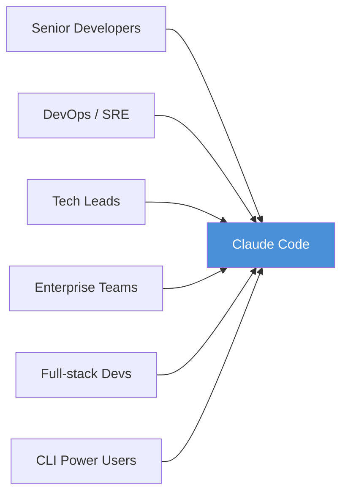
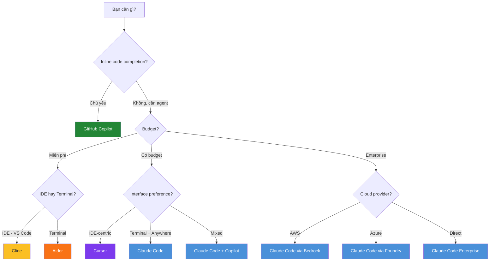

# How Claude Code Works — Decision Guide

## So sánh với Alternatives

### Bảng so sánh tổng quan

| Tiêu chí | Claude Code | GitHub Copilot | Cursor | Aider | Cline (OpenRouter) |
|:---|:---|:---|:---|:---|:---|
| **Nhà phát triển** | Anthropic | GitHub/Microsoft | Anysphere | Open-source | Open-source |
| **Model chính** | Claude 3.7 Sonnet | GPT-4o / Copilot models | GPT-4o + Claude | Tùy chọn (BYOK) | Tùy chọn (BYOK) |
| **Primary interface** | Terminal CLI | IDE extension | Dedicated IDE | Terminal CLI | VS Code extension |
| **Agentic execution** | ✅ Full multi-step loop | ⚠️ Limited (Workspace mode) | ✅ Composer agent | ⚠️ CLI commands | ✅ Autonomous mode |
| **File editing** | ✅ Multi-file, auto | ✅ Inline + multi-file | ✅ Composer multi-file | ✅ Multi-file | ✅ Multi-file |
| **Terminal access** | ✅ Native | ⚠️ Limited | ✅ Trong IDE | ✅ Native CLI | ✅ Via VS Code |
| **Git integration** | ✅ Deep (checkpoint, branch) | ✅ Copilot Chat | ⚠️ Basic | ✅ Auto-commit | ⚠️ Basic |
| **Memory system** | ✅ CLAUDE.md + Auto Memory | ❌ | ⚠️ Rules file | ⚠️ .aider conventions | ⚠️ Custom instructions |
| **Permission system** | ✅ 3 modes + fine-grained | N/A (suggestion only) | ❌ | ⚠️ Yes/No per edit | ⚠️ Auto-approve toggle |
| **Safety (undo)** | ✅ Git checkpoints auto | N/A | ⚠️ File history | ✅ Git commits | ⚠️ Manual undo |
| **Extensibility** | ✅ MCP + Skills + Hooks + Subagents | ⚠️ Extensions ecosystem | ⚠️ @-mentions | ❌ | ✅ MCP support |
| **Multi-platform** | ✅ Terminal + IDE + Web + Mobile + Slack | ✅ IDE only | IDE only | Terminal only | VS Code only |
| **CI/CD integration** | ✅ GH Actions + GitLab | ✅ Copilot Autofix | ❌ | ⚠️ Script-based | ❌ |
| **Enterprise controls** | ✅ Managed settings, SSO | ✅ Copilot Business/Enterprise | ⚠️ Team plan | ❌ | ❌ |
| **Open-source** | ❌ | ❌ | ❌ | ✅ Apache 2.0 | ✅ Apache 2.0 |

### So sánh chi tiết từng đối thủ

#### Claude Code vs GitHub Copilot

| Khía cạnh | Claude Code 🟦 | GitHub Copilot 🟩 |
|:---|:---|:---|
| **Thế mạnh** | Agentic full-loop, terminal-native, multi-platform, deep git safety | Ecosystem integration (GitHub), inline completion mượt, Copilot Workspace |
| **Điểm yếu** | Không có inline code completion, learning curve | Agentic capability hạn chế, không có memory system |
| **Best for** | Multi-step tasks, automation, CI/CD, advanced users | Quick completions, simple edits, GitHub-heavy workflows |
| **Pricing model** | Pay-per-token / Max subscription | $10/mo Individual, $19/mo Business |

#### Claude Code vs Cursor

| Khía cạnh | Claude Code 🟦 | Cursor 🟪 |
|:---|:---|:---|
| **Thế mạnh** | Terminal-native, safety system, cross-platform, subagents, hooks | Visual IDE experience, code context via codebase indexing, Composer UI |
| **Điểm yếu** | Cần terminal familiarity | Chỉ trên Cursor IDE, limited safety/undo |
| **Best for** | Power users, DevOps, CI/CD, multi-repo | Developers thích IDE-centric, visual workflows |
| **Pricing model** | Pay-per-token / Max subscription | $20/mo Pro, $40/mo Business |

#### Claude Code vs Aider

| Khía cạnh | Claude Code 🟦 | Aider 🟧 |
|:---|:---|:---|
| **Thế mạnh** | Managed infrastructure, safety, extensibility, multi-platform | Free, BYOK, open-source, lightweight, multi-model |
| **Điểm yếu** | Vendor lock-in (Anthropic), chi phí token | Không có safety system, không extensible, UX thô |
| **Best for** | Professional/team use, complex projects | Personal projects, budget-conscious, model experimentation |
| **Pricing model** | Pay-per-token / Max subscription | Free (bring your own API key) |

#### Claude Code vs Cline

| Khía cạnh | Claude Code 🟦 | Cline 🟨 |
|:---|:---|:---|
| **Thế mạnh** | Terminal-native, memory, subagents, CI/CD, enterprise | Open-source, VS Code native, MCP support, BYOK |
| **Điểm yếu** | Không inline completion | Chỉ VS Code, không có memory system, no CI/CD |
| **Best for** | Full workflow automation, enterprise | VS Code users, quick autonomous tasks |
| **Pricing model** | Pay-per-token / Max subscription | Free (bring your own API key) |

---

## Khi nào NÊN dùng Claude Code

### ✅ Use cases lý tưởng

| Scenario | Tại sao Claude Code phù hợp |
|:---|:---|
| **Multi-step bug fixing** | Agentic loop tự động: trace → analyze → fix → test → verify |
| **Large-scale refactoring** | Multi-file editing với git checkpoints đảm bảo an toàn |
| **CI/CD automation** | GitHub Actions + GitLab CI/CD native integration |
| **Codebase exploration** | Agent tự search, read, trace — hiểu repo mới nhanh |
| **Test creation** | Viết tests, chạy, fix failures — all automated |
| **PR automation** | Tạo PR, commit messages, code review tự động |
| **DevOps tasks** | Terminal-native, chạy bất kỳ CLI tool nào |
| **Team/Enterprise** | Managed settings, shared CLAUDE.md, permission policies |
| **Cross-platform work** | Terminal → Web → Mobile → Slack — tiếp tục bất kỳ đâu |
| **Complex multi-agent workflows** | Subagents cho parallel tasks, delegation |

### 🎯 Đối tượng phù hợp nhất

---

## Khi nào KHÔNG nên dùng Claude Code

### ❌ Limitations & Anti-use-cases

| Scenario | Tại sao không phù hợp | Alternative tốt hơn |
|:---|:---|:---|
| **Chỉ cần inline code completion** | Claude Code không có inline suggestions | GitHub Copilot, Cursor |
| **Budget cực kỳ hạn chế** | Pay-per-token có thể tốn kém | Aider (BYOK), Cline (free) |
| **Chỉ làm việc trong IDE** | Claude Code mạnh nhất ở terminal | Cursor, Copilot |
| **Không quen terminal** | Learning curve cho CLI workflows | Cursor, GitHub Copilot |
| **Cần chạy hoàn toàn offline** | Yêu cầu API connection | Local models + Aider |
| **Project rất nhỏ / simple scripts** | Overkill cho tasks đơn giản | Copilot inline, ChatGPT |
| **Không muốn vendor lock-in** | Gắn chặt Anthropic ecosystem | Aider (multi-model), Cline |
| **Mobile-first development** | Terminal trên mobile hạn chế | Web IDE solutions |

### ⚠️ Cân nhắc kỹ

| Tình huống | Lưu ý |
|:---|:---|
| **Kết hợp với Copilot** | Hoàn toàn tương thích — Copilot cho completions, Claude Code cho agentic tasks |
| **Teams < 3 người** | Max subscription + CLAUDE.md sharing có thể đủ, không cần Enterprise |
| **Ngôn ngữ ít phổ biến** | Claude vẫn hỗ trợ nhưng quality có thể thấp hơn với mainstream languages |
| **Regulated industries** | Kiểm tra data policies — code có gửi lên Anthropic API |
| **Air-gapped environments** | Cần API connectivity — xem Amazon Bedrock hoặc Microsoft Foundry options |

---

## Chi phí & Tài nguyên

### Mô hình giá

| Plan | Chi phí | Đặc điểm | Phù hợp cho |
|:---|:---|:---|:---|
| **API (Pay-per-token)** | ~$3/M input, ~$15/M output tokens (Claude 3.7 Sonnet) | Trả theo sử dụng, linh hoạt | Developers cần kiểm soát chi phí, CI/CD |
| **Claude Max (5x)** | $100/tháng | Premium tier, 5x usage | Individual power users |
| **Claude Max (20x)** | $200/tháng | Maximum tier, 20x usage | Heavy daily use, cả ngày |
| **Enterprise (API Console)** | Custom pricing | Team management, SSO, audit logs | Organizations |
| **Amazon Bedrock** | AWS pricing | VPC, compliance, no data leaving AWS | Enterprise AWS users |
| **Microsoft Foundry** | Azure pricing | Azure integration | Enterprise Azure users |

### Chi phí ước tính theo use case

| Use case | Token usage/session | Chi phí ước tính (API) | Chi phí Max |
|:---|:---|:---|:---|
| **Quick bug fix** | ~10K-50K tokens | $0.05 - $0.50 | Included |
| **Feature implementation** | ~100K-500K tokens | $0.50 - $5.00 | Included |
| **Large refactoring** | ~500K-2M tokens | $5.00 - $20.00 | Included |
| **Full-day development** | ~2M-10M tokens | $20.00 - $100.00 | Included (Max 20x) |
| **CI/CD review** | ~50K-200K per run | $0.25 - $2.00/run | API only |

### Chiến lược tối ưu chi phí

| Chiến lược | Tiết kiệm ước tính | Cách thực hiện |
|:---|:---|:---|
| **`/compact` thường xuyên** | 20-40% | Nén context giữa các tasks |
| **`/clear` giữa tasks** | 30-50% | Reset context khi chuyển topic |
| **Dùng Haiku cho simple tasks** | 60-70% | `ANTHROPIC_SMALL_FAST_MODEL` cho background |
| **Specific prompts** | 15-25% | Giảm iteration, đúng ngay lần đầu |
| **Skills thay CLAUDE.md dài** | 10-20% | Load instructions on-demand, không load mỗi session |
| **Hooks filter output** | 20-30% | Lọc test output, chỉ giữ failures |
| **Subagents cho verbose ops** | 15-25% | Cô lập context nặng khỏi main session |
| **Plan mode trước implement** | 20-40% | Tránh re-work tốn kém |
| **Code intelligence plugins** | 10-20% | Claude biết types, ít cần đọc lại code |
| **CLI tools thay MCP** | 10-15% | Ít overhead hơn MCP server definitions |

### So sánh chi phí với alternatives

| Tool | Chi phí/tháng (typical) | Pricing model | Bao gồm |
|:---|:---|:---|:---|
| **Claude Code (API)** | $20 - $200+ | Pay-per-token | Chỉ dùng bao nhiêu trả bấy nhiêu |
| **Claude Max 5x** | $100 | Subscription | Claude Code + claude.ai + Projects |
| **Claude Max 20x** | $200 | Subscription | Maximum usage allocation |
| **GitHub Copilot Individual** | $10 | Subscription | Inline completion + Chat |
| **GitHub Copilot Business** | $19/user | Subscription | + Policies, audit, IP indemnity |
| **Cursor Pro** | $20 | Subscription | AI-powered IDE |
| **Cursor Business** | $40/user | Subscription | + Admin, centralized billing |
| **Aider** | $0 + API costs | BYOK | Free tool, pay for API |
| **Cline** | $0 + API costs | BYOK | Free tool, pay for API |

> **Lưu ý quan trọng:** So sánh chi phí trực tiếp rất khó vì mô hình pricing khác nhau. Claude Code API pay-per-token có thể rẻ hơn subscriptions cho light use, nhưng đắt hơn cho heavy use — Max plans cung cấp predictable cost.

---

## Migration Path

### Đang dùng GitHub Copilot → Claude Code

| Bước | Hành động | Lưu ý |
|:---|:---|:---|
| 1 | Cài Claude Code song song — `npm install -g @anthropic-ai/claude-code` | Không conflict với Copilot |
| 2 | Chạy `/init` trong project | Tạo CLAUDE.md từ codebase |
| 3 | Dùng Copilot cho inline completion, Claude Code cho agentic tasks | Complementary, không exclusive |
| 4 | Migrate conventions từ `.github/copilot-instructions.md` → `CLAUDE.md` | Format tương tự |
| 5 | Thử CI/CD integration với Claude Code GitHub Actions | Thay hoặc bổ sung Copilot Autofix |
| 6 | Đánh giá sau 2-4 tuần — quyết định keep both hay migrate hoàn toàn | Track productivity + cost |

### Đang dùng Cursor → Claude Code

| Bước | Hành động | Lưu ý |
|:---|:---|:---|
| 1 | Cài Claude Code — terminal-based, IDE-independent | Vẫn dùng Cursor cho visual work |
| 2 | Migrate `.cursorrules` → `CLAUDE.md` | Format khác, cần rewrite |
| 3 | Dùng Claude Code VS Code extension thay Cursor cho agentic tasks | Hoặc dùng terminal ngoài Cursor |
| 4 | Học terminal workflow — `/init`, `--continue`, `--fork-session` | Đường cong học tập vừa |
| 5 | Thiết lập permissions trong `.claude/settings.json` | Cursor không có tương đương |
| 6 | Tận dụng subagents, MCP — không có trong Cursor | Game changer cho complex projects |

### Đang dùng Aider → Claude Code

| Bước | Hành động | Lưu ý |
|:---|:---|:---|
| 1 | Cài Claude Code — cùng terminal-based | Interface quen thuộc |
| 2 | `.aider` file → `CLAUDE.md` | Migrate conventions |
| 3 | Aider auto-commit → Claude Code git checkpoints | Safety tốt hơn |
| 4 | BYOK flexibility mất → lock vào Anthropic | Trade-off chính |
| 5 | Gain: Memory system, subagents, MCP, CI/CD, multi-platform | Đáng kể |
| 6 | Có thể keep Aider cho quick tasks + Claude Code cho complex work | Hybrid approach |

### ⚠️ Breaking changes / Gotchas

| Vấn đề | Mô tả | Giải pháp |
|:---|:---|:---|
| **Config format khác** | Mỗi tool có format riêng | Manual migration, không auto-convert |
| **API key khác** | Cần Anthropic API key riêng | Đăng ký tại console.anthropic.com |
| **Workflow habits** | Terminal-first vs IDE-first mindset | Dành thời gian adapt — 1-2 tuần |
| **Cost model change** | Subscription → pay-per-token (hoặc ngược lại) | So sánh bill 1 tháng trước commit |
| **Team coordination** | Shared config format khác | Update team docs + onboarding |

---

## Roadmap & Tương lai

### Hướng phát triển

| Hướng | Status | Ý nghĩa |
|:---|:---|:---|
| **Agent Teams** | Experimental (`CLAUDE_CODE_EXPERIMENTAL_AGENT_TEAMS`) | Multiple agents cộng tác |
| **Scheduled Tasks** | Available | Cron-like automation |
| **Fast Mode** | Available | Tăng tốc cho simple tasks |
| **Plugin Marketplace** | Available | Ecosystem mở rộng |
| **More IDE integrations** | VS Code + JetBrains done | Phủ rộng hơn |
| **Cloud Execution** | Available | Offload tasks lên cloud VMs |
| **Web/Mobile** | Available | Cross-device workflow |
| **Agent SDK** | Available | Build custom agents trên nền Claude Code |

### Community Health

| Metric | Đánh giá |
|:---|:---|
| **Maintainer** | Anthropic — $1B+ funding, 500+ employees |
| **Update frequency** | Very active — updates hàng tuần |
| **Documentation** | Excellent — comprehensive official docs |
| **Community** | Growing — Discord, GitHub Discussions |
| **Enterprise adoption** | Strong — nhiều enterprise customers |
| **Stability** | Good — semver, changelog, deprecation notices |
| **Long-term viability** | High — Anthropic là major AI company |

---

## Ma trận Ra quyết định

### Quick Decision Matrix

| Scenario | Recommendation | Lý do |
|:---|:---|:---|
| Terminal power user, complex projects | 🟦 **Claude Code** | Terminal-native, agentic loop, safety, extensibility |
| Chỉ cần inline completions | 🟩 **GitHub Copilot** | Best-in-class inline suggestions, rẻ |
| IDE-centric, visual workflow | 🟪 **Cursor** | Best IDE experience, Composer UI |
| Budget-conscious, BYOK | 🟧 **Aider** | Free, open-source, multi-model |
| VS Code autonomous agent | 🟨 **Cline** | Free, MCP support, VS Code native |
| Enterprise team deployment | 🟦 **Claude Code** | Managed settings, SSO, audit, policies |
| CI/CD automated workflows | 🟦 **Claude Code** | Native GH Actions + GitLab integration |
| Mixed: completions + agentic | 🟦🟩 **Claude Code + Copilot** | Best of both worlds |
| Fullstack + design review | 🟪 **Cursor** | Visual diffs, design-to-code |
| Multi-model experimentation | 🟧 **Aider** | BYOK, supports dozens of models |
| Mobile / remote work | 🟦 **Claude Code** | Web, iOS, Remote Control, Slack |
| Air-gapped / offline | 🟧 **Aider** (local models) | Ollama + Aider = fully offline |
| Pair programming style | 🟦 **Claude Code** | Conversational, interrupt, steer |
| Quick scripts / one-offs | 🟩 **GitHub Copilot** | Inline, fast, low friction |

### Decision Flowchart

### Scoring Matrix (1-5, cao = tốt hơn)

| Tiêu chí | Weight | Claude Code | Copilot | Cursor | Aider | Cline |
|:---|:---|:---|:---|:---|:---|:---|
| **Agentic capability** | 25% | ⭐⭐⭐⭐⭐ | ⭐⭐ | ⭐⭐⭐⭐ | ⭐⭐⭐ | ⭐⭐⭐⭐ |
| **Ease of use** | 15% | ⭐⭐⭐ | ⭐⭐⭐⭐⭐ | ⭐⭐⭐⭐⭐ | ⭐⭐⭐ | ⭐⭐⭐⭐ |
| **Safety / Control** | 15% | ⭐⭐⭐⭐⭐ | ⭐⭐⭐ | ⭐⭐ | ⭐⭐⭐ | ⭐⭐⭐ |
| **Extensibility** | 15% | ⭐⭐⭐⭐⭐ | ⭐⭐⭐ | ⭐⭐ | ⭐⭐ | ⭐⭐⭐ |
| **Cost efficiency** | 10% | ⭐⭐⭐ | ⭐⭐⭐⭐ | ⭐⭐⭐ | ⭐⭐⭐⭐⭐ | ⭐⭐⭐⭐⭐ |
| **Multi-platform** | 10% | ⭐⭐⭐⭐⭐ | ⭐⭐⭐ | ⭐⭐ | ⭐⭐ | ⭐⭐ |
| **Enterprise** | 10% | ⭐⭐⭐⭐⭐ | ⭐⭐⭐⭐ | ⭐⭐⭐ | ⭐ | ⭐ |
| **Weighted Total** | | **4.40** | **3.30** | **3.30** | **2.90** | **3.10** |

> **Disclaimer:** Scoring dựa trên đánh giá chủ quan từ tài liệu chính thức và community feedback. Kết quả thực tế phụ thuộc vào use case cụ thể.

---

## Xem thêm

- [0. Overview](./0. Overview.md) — Tổng quan, so sánh nhanh, tính năng nổi bật
- [1. Architecture and Logic](./1. Architecture and Logic.md) — Data flow, modules, cơ chế hoạt động nội bộ
- [2. Playbook](./2. Playbook.md) — Hướng dẫn cài đặt, vận hành, cheat sheet, troubleshooting
