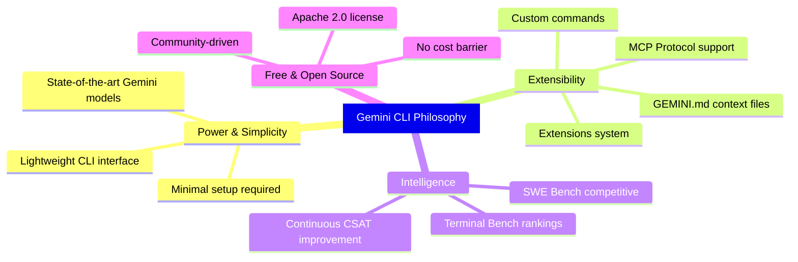
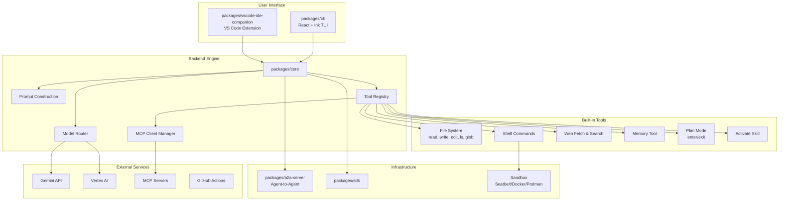
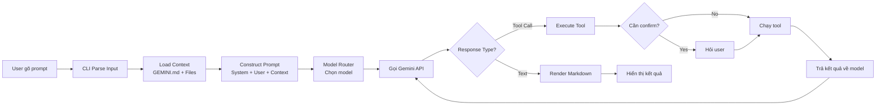

# Gemini CLI

## Gemini CLI là gì?

**Gemini CLI** là một **AI agent mã nguồn mở** do Google phát triển, đưa sức mạnh của các mô hình Gemini trực tiếp vào terminal. Được thiết kế theo triết lý **terminal-first**, nó cung cấp con đường ngắn nhất từ prompt của bạn tới model Gemini, cho phép developer tương tác với AI ngay trong môi trường làm việc quen thuộc.

| Thông tin | Chi tiết |
|---|---|
| **Tên package** | `@google/gemini-cli` |
| **Ngôn ngữ** | TypeScript |
| **Runtime** | Node.js ≥20.0.0 |
| **License** | Apache 2.0 |
| **Stars** | ~98,000 ⭐ |
| **Forks** | ~12,300 |
| **Contributors** | 587+ |
| **Website** | [geminicli.com](https://geminicli.com) |

## Vấn đề giải quyết

| Vấn đề | Mô tả | Cách Gemini CLI giải quyết |
|---|---|---|
| **Chi phí AI coding** | Các công cụ AI coding thường yêu cầu subscription đắt đỏ | Free tier: 60 req/phút, 1,000 req/ngày với tài khoản Google cá nhân |
| **Context window hạn chế** | Nhiều tool chỉ hỗ trợ vài chục ngàn tokens | Gemini 3 với 1M token context window |
| **Vendor lock-in** | Closed-source, không tùy biến được | Apache 2.0 hoàn toàn mã nguồn mở |
| **Mở rộng khó** | Khó thêm tool hoặc tích hợp bên ngoài | MCP (Model Context Protocol) cho custom integrations |
| **Thiếu tích hợp terminal** | Phải chuyển đổi giữa IDE/browser/terminal | Terminal-first design, chạy ngay trong command line |
| **Thiếu sandboxing** | Rủi ro bảo mật khi AI chạy shell commands | Built-in sandboxing (macOS Seatbelt, Docker, Podman) |

## Triết lý thiết kế

## Ai nên dùng?

| Đối tượng | Kịch bản sử dụng |
|---|---|
| **Developer cá nhân** | Coding hàng ngày, debug, generate code — miễn phí |
| **Team phát triển** | Code review, automation, CI/CD integration via GitHub Actions |
| **Enterprise** | Vertex AI backend, enterprise security, compliance |
| **Open-source contributor** | Tham gia đóng góp cho hệ sinh thái Gemini |
| **AI/ML researcher** | Thử nghiệm với agentic coding, MCP tools |
| **DevOps engineer** | Tự động hóa operational tasks, scripting |

## Kiến trúc tổng quan

| Package | Vai trò |
|---|---|
| `packages/cli` | UI terminal, input processing, React/Ink rendering |
| `packages/core` | Backend logic, API orchestration, prompt construction, tool execution |
| `packages/a2a-server` | Agent-to-Agent server (experimental) |
| `packages/sdk` | SDK cho tích hợp bên ngoài |
| `packages/vscode-ide-companion` | VS Code extension đi kèm CLI |
| `packages/devtools` | React DevTools cho phát triển |
| `packages/test-utils` | Utilities cho testing |

## Vòng đời tương tác chính

## Tính năng nổi bật

### Code Understanding & Generation
- Query và edit codebase lớn nhờ 1M token context
- Generate apps từ PDF, images, sketches (multimodal)
- Debug và troubleshoot bằng ngôn ngữ tự nhiên

### Automation & Integration
- Tự động hóa tasks: query PR, complex rebases
- MCP servers: kết nối Imagen, Veo, Lyria, custom tools
- Headless mode: chạy non-interactive trong scripts
- Structured output: `--output-format json` hoặc `stream-json`

### Advanced Capabilities
- **Google Search grounding**: real-time information
- **Conversation checkpointing**: save/resume sessions
- **GEMINI.md context files**: customize behavior per project
- **Custom commands**: tạo slash commands riêng
- **Token caching**: tối ưu token usage
- **Plan mode**: lập kế hoạch trước khi thực thi

### GitHub Integration
- **Gemini CLI GitHub Action**: tích hợp trực tiếp vào workflows
- Automated PR reviews, issue triage
- `@gemini-cli` mention trong issues/PRs

### Security & Sandboxing
- **macOS Seatbelt**: native sandboxing
- **Docker/Podman**: container-based isolation
- **Trusted Folders**: kiểm soát execution policies
- **Confirmation policies**: người dùng approve trước khi tool chạy

## Xác thực — 3 phương thức

| Phương thức | Đối tượng | Free tier |
|---|---|---|
| **Google OAuth** | Developer cá nhân | 60 req/phút, 1,000 req/ngày |
| **Gemini API Key** | Cần chọn model cụ thể | 1,000 req/ngày |
| **Vertex AI** | Enterprise, production | Theo billing account |

## So sánh với alternatives

| Tính năng | Gemini CLI | Claude Code | GitHub Copilot CLI | Aider |
|---|---|---|---|---|
| **Mã nguồn mở** | ✅ Apache 2.0 | ❌ Closed | ❌ Closed | ✅ Apache 2.0 |
| **Free tier** | ✅ 1,000 req/ngày | ❌ Trả phí | ❌ Subscription | ✅ BYOK |
| **Context window** | 1M tokens | 200K tokens | N/A | Tùy model |
| **MCP support** | ✅ Built-in | ✅ Built-in | ❌ | ❌ |
| **Sandboxing** | ✅ Multi-provider | ✅ | ❌ | ❌ |
| **GitHub Actions** | ✅ Official | ❌ | ✅ | ❌ |
| **Multimodal** | ✅ Image/PDF/Sketch | ✅ Image | ❌ | ❌ |
| **IDE companion** | ✅ VS Code | ❌ | ✅ | ❌ |
| **Headless/Script** | ✅ | ✅ | ⚠️ Hạn chế | ✅ |

## Release cadence

| Channel | Tần suất | Mô tả |
|---|---|---|
| **Stable** (`latest`) | Thứ 3 hàng tuần (UTC 20:00) | Promotion từ preview + bug fixes |
| **Preview** (`preview`) | Thứ 3 hàng tuần (UTC 23:59) | Chưa fully vetted |
| **Nightly** (`nightly`) | Hàng ngày (UTC 00:00) | Từ main branch, có thể có issues |

## Roadmap — Focus Areas

| Lĩnh vực | Mô tả |
|---|---|
| **Authentication** | API keys, Gemini Code Assist login |
| **Model** | Gemini mới, multi-modality, local execution |
| **User Experience** | Usability, performance, interactive features |
| **Tooling** | Built-in tools, MCP ecosystem |
| **Extensibility** | GitHub Actions, new surfaces |
| **Background Agents** | Long-running autonomous tasks |
| **Security & Privacy** | Sandboxing, data protection |
| **Quality** | Testing, reliability, benchmarks |

## Xem thêm

- [1. Architecture and Logic](./1. Architecture and Logic.md) — Data flow chi tiết, core modules, cơ chế nội bộ
- [2. Playbook](./2. Playbook.md) — Cài đặt, Day 1, cheat sheet, troubleshooting
