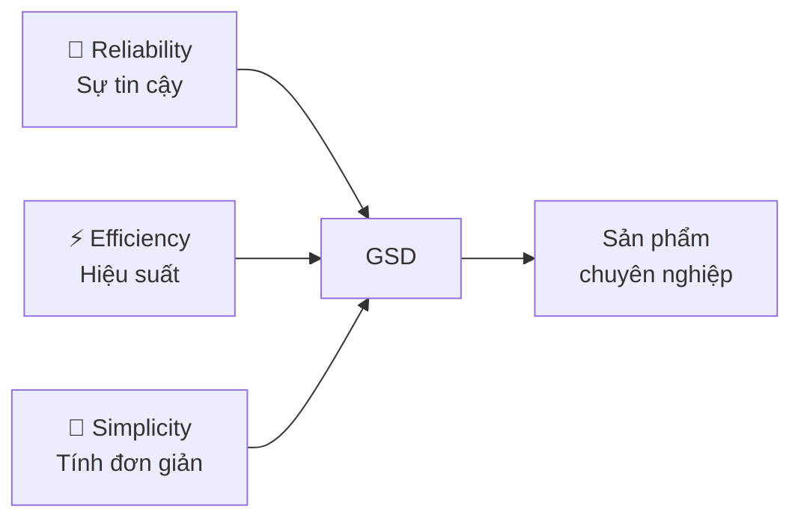
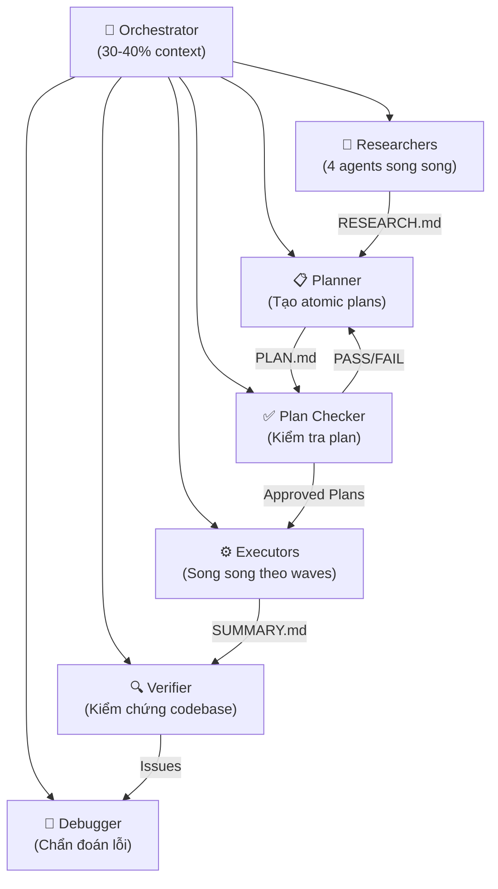
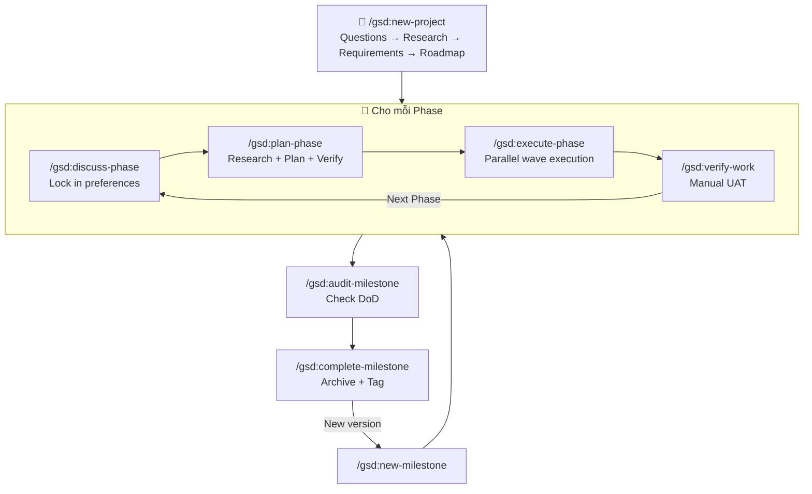

# Tổng quan Hệ thống GSD (Get Shit Done) — v1.22

> [!NOTE]
> **Repository:** [gsd-build/get-shit-done](https://github.com/gsd-build/get-shit-done)
> **Phiên bản hiện tại:** v1.22.4 (2026-03-03)
> **Giấy phép:** MIT
> **Cài đặt:** `npx get-shit-done-cc@latest`

---

## 1. GSD là gì?

**GSD (Get Shit Done)** là một hệ thống **meta-prompting**, **context engineering** và **spec-driven development** nhẹ nhưng mạnh mẽ, được thiết kế chuyên dụng cho **Claude Code** và mở rộng hỗ trợ **Gemini CLI**, **OpenCode**, và **Codex**.

Nói đơn giản: GSD là một **lớp điều phối thông minh** nằm giữa bạn và AI, biến Claude Code từ một chatbot viết code thành một **hệ thống kỹ thuật phần mềm** có cấu trúc, có trí nhớ, và có khả năng tự kiểm chứng.

### Vấn đề cốt lõi mà GSD giải quyết

| Vấn đề | Mô tả | Cách GSD giải quyết |
|---|---|---|
| **Context Rot** | Chất lượng phản hồi suy giảm khi context window bị lấp đầy thông tin rác | Mỗi task chạy trong subagent với **200K tokens sạch**; orchestrator chỉ dùng 30-40% context |
| **Vibe-coding** | Lập trình theo cảm hứng → code không nhất quán, vỡ khi mở rộng | Spec-driven development với requirements có traceability |
| **Mất ngữ cảnh** | AI quên quyết định cũ khi đổi phiên làm việc | Hệ thống file trạng thái (`STATE.md`, `PROJECT.md`) đóng vai trò "bộ nhớ dài hạn" |
| **Quản lý phức tạp** | Các công cụ quản lý dự án cồng kềnh (Jira, story points...) | "Complexity is in the system, not in your workflow" — người dùng chỉ cần vài lệnh |

---

## 2. Triết lý Thiết kế

GSD được xây dựng bởi **TÂCHES** — một lập trình viên solo không viết code trực tiếp mà để Claude Code thực hiện. Triết lý cốt lõi:

> *"Tôi không phải một công ty phần mềm 50 người. Tôi không muốn chơi trò 'enterprise theater'. Tôi chỉ là một người sáng tạo muốn xây dựng những thứ tuyệt vời và hoạt động ổn định."*

### 3 Giá trị Cốt lõi



1. **Sự tin cậy (Reliability):** Quy trình nghiên cứu domain, plan verification loop (lặp tối đa 3 lần), và automated UAT đảm bảo code đúng ngay từ đầu.
2. **Hiệu suất (Efficiency):** Sub-agents chuyên biệt chạy song song, mỗi agent có 200K tokens riêng biệt cho từng nhiệm vụ nguyên tử.
3. **Tính đơn giản (Simplicity):** Sự phức tạp được đóng gói bên trong hệ thống. Người dùng chỉ cần tập trung vào tầm nhìn sản phẩm.

---

## 3. Ai nên dùng GSD?

- **Solo developers** muốn xây dựng sản phẩm chất lượng chuyên nghiệp mà không cần team lớn.
- **Startup founders** cần prototype nhanh nhưng vẫn giữ cấu trúc engineering.
- **Kỹ sư phần mềm** muốn tối ưu workflow AI-assisted development.
- Bất kỳ ai muốn **mô tả ý tưởng** và để hệ thống xây dựng chính xác — không cần giả vờ đang điều hành một tổ chức engineering 50 người.

> **Được tin dùng bởi kỹ sư tại:** Amazon, Google, Shopify, Webflow.

---

## 4. Kiến trúc Tổng quan

### 4.1. Multi-Runtime Support

GSD không chỉ dành cho Claude Code mà hỗ trợ **4 runtime environments**:

| Runtime | Lệnh xác minh | Cơ chế cài đặt | Đặc thù |
|---|---|---|---|
| **Claude Code** | `/gsd:help` | Custom slash commands (`.claude/commands/gsd/`) | Tối ưu sâu, runtime chính |
| **Gemini CLI** | `/gsd:help` | Custom commands (`.gemini/commands/gsd/`) | Hỗ trợ Google Gemini models |
| **OpenCode** | `/gsd-help` | Config-based (`.config/opencode/`) | Mã nguồn mở, free models |
| **Codex** | Skills-based | Skills files (`skills/gsd-*/SKILL.md`) | Vận hành qua skill system |

### 4.2. Multi-Agent Orchestration

GSD sử dụng mô hình **Orchestrator-Agent**: một orchestrator mỏng (thin orchestrator) sinh ra các agents chuyên biệt, thu thập kết quả, và chuyển tiếp sang bước tiếp theo.



### 4.3. Hệ thống 11 Agents Chuyên biệt

| Agent | Vai trò | Model (Balanced) |
|---|---|---|
| `gsd-planner` | Tạo atomic plans từ context + research | **Opus** |
| `gsd-roadmapper` | Tạo roadmap và phases từ requirements | Sonnet |
| `gsd-executor` | Thực thi plans trong context sạch | Sonnet |
| `gsd-phase-researcher` | Nghiên cứu domain cho từng phase | Sonnet |
| `gsd-project-researcher` | Nghiên cứu domain cho dự án mới | Sonnet |
| `gsd-research-synthesizer` | Tổng hợp kết quả nghiên cứu | Sonnet |
| `gsd-plan-checker` | Kiểm tra tính khả thi của plans (8 dimensions) | Sonnet |
| `gsd-verifier` | Kiểm chứng codebase sau execution | Sonnet |
| `gsd-debugger` | Chẩn đoán root cause khi có lỗi | Sonnet |
| `gsd-codebase-mapper` | Phân tích codebase hiện có (brownfield) | Haiku |
| `gsd-integration-checker` | Kiểm tra tích hợp giữa các plans | Sonnet |
| `gsd-nyquist-auditor` | Kiểm tra test coverage mapping | Sonnet |

---

## 5. Context Engineering — Trái tim của GSD

### 5.1. Hệ thống File Trạng thái

GSD sử dụng một bộ tệp Markdown có cấu trúc để duy trì "trí nhớ" xuyên suốt dự án:

| File | Vai trò | Tại sao quan trọng? |
|---|---|---|
| `PROJECT.md` | Tầm nhìn, mục tiêu, quyết định kiến trúc | **Nguồn sự thật duy nhất** — luôn được load |
| `REQUIREMENTS.md` | Yêu cầu v1/v2 với ID truy vết | Tránh scope creep, đảm bảo traceability |
| `ROADMAP.md` | Lộ trình phases + trạng thái | Bản đồ tiến độ toàn cục |
| `STATE.md` | Quyết định đã chốt, blockers, vị trí hiện tại | **Project Memory** — bộ nhớ xuyên phiên |
| `config.json` | Cấu hình workflow, model profile, git strategy | Trung tâm điều khiển |
| `MILESTONES.md` | Lịch sử các milestone đã hoàn thành | Archive và reference |
| `research/` | Kiến thức domain từ giai đoạn nghiên cứu | Nền tảng cho planning chính xác |
| `todos/` | Ý tưởng và tasks phát sinh | Captured ideas for later |

### 5.2. Cấu trúc Thư mục `.planning/`

```
.planning/
├── PROJECT.md
├── REQUIREMENTS.md
├── ROADMAP.md
├── STATE.md
├── config.json
├── MILESTONES.md
├── research/
├── todos/
│   ├── pending/
│   └── done/
├── debug/
│   └── resolved/
├── codebase/               # Brownfield mapping
└── phases/
    └── XX-phase-name/
        ├── XX-YY-PLAN.md        # Atomic plans (XML)
        ├── XX-YY-SUMMARY.md     # Execution outcomes
        ├── CONTEXT.md           # Implementation preferences
        ├── RESEARCH.md          # Phase research findings
        ├── VALIDATION.md        # Nyquist test coverage mapping
        └── VERIFICATION.md     # Post-execution verification
```

### 5.3. XML Prompt Formatting

Mỗi plan sử dụng cấu trúc XML tối ưu cho Claude:

```xml
<task type="auto">
  <name>Create login endpoint</name>
  <files>src/app/api/auth/login/route.ts</files>
  <action>
    Use jose for JWT (not jsonwebtoken - CommonJS issues).
    Validate credentials against users table.
    Return httpOnly cookie on success.
  </action>
  <verify>curl -X POST localhost:3000/api/auth/login returns 200 + Set-Cookie</verify>
  <done>Valid credentials return cookie, invalid return 401</done>
</task>
```

Mỗi task có: **chỉ dẫn chính xác** → **lệnh kiểm chứng** → **điều kiện hoàn thành**. Không đoán. Không mơ hồ.

---

## 6. Vòng đời Dự án (Project Lifecycle)



### 6 Giai đoạn Chi tiết

| # | Giai đoạn | Lệnh | Input | Output |
|---|---|---|---|---|
| 0 | **Map** (Brownfield) | `/gsd:map-codebase` | Codebase hiện có | `codebase/STACK.md`, `ARCHITECTURE.md`, `CONVENTIONS.md`, `CONCERNS.md` |
| 1 | **Initialize** | `/gsd:new-project` | Ý tưởng + Q&A | `PROJECT.md`, `REQUIREMENTS.md`, `ROADMAP.md`, `STATE.md` |
| 2 | **Discuss** | `/gsd:discuss-phase [N]` | Preferences của bạn | `{N}-CONTEXT.md` |
| 3 | **Plan** | `/gsd:plan-phase [N]` | Context + Research | `{N}-RESEARCH.md`, `{N}-{Y}-PLAN.md`, `{N}-VALIDATION.md` |
| 4 | **Execute** | `/gsd:execute-phase <N>` | Atomic plans | `{N}-{Y}-SUMMARY.md`, `{N}-VERIFICATION.md` + atomic commits |
| 5 | **Verify** | `/gsd:verify-work [N]` | Kết quả thực thi | `{N}-UAT.md` + fix plans (nếu có lỗi) |

---

## 7. Tính năng Nổi bật

### 7.1. Wave Execution (Thực thi theo Làn sóng)

Plans được nhóm thành "waves" dựa trên dependencies:
- **Wave 1:** Các plans độc lập → chạy **song song**
- **Wave 2:** Plans phụ thuộc Wave 1 → chạy sau khi Wave 1 xong
- **Vertical Slices** được ưu tiên hơn Horizontal Layers → song song hóa tốt hơn

### 7.2. Atomic Git Commits

Mỗi task nhỏ = 1 commit riêng biệt. Cho phép `git bisect` tìm chính xác task gây lỗi.

### 7.3. Nyquist Validation (v1.21+)

Hệ thống mới ánh xạ test coverage tới requirements **trước khi viết code**:
- Researcher phát hiện test infrastructure hiện có
- Plan checker enforce 8th verification dimension: mỗi task phải có `verify` command
- Retroactive audit qua `/gsd:validate-phase`

### 7.4. Quick Mode

`/gsd:quick` cho các tác vụ ad-hoc (bug fix, config changes) với GSD guarantees nhưng bỏ qua research/verify steps.

### 7.5. Git Branching Strategies (v1.22+)

| Strategy | Mô tả | Best For |
|---|---|---|
| `none` | Commit trực tiếp branch hiện tại | Solo, simple |
| `phase` | Branch per phase, merge khi hoàn thành | Code review per phase |
| `milestone` | Branch per milestone, merge khi hoàn thành | Release branches |

---

## 8. So sánh: Vibe-coding vs GSD Engineering

| Đặc điểm | Vibe-coding | GSD Engineering |
|---|---|---|
| **Context** | Tích tụ → suy giảm chất lượng | Fresh 200K per task |
| **Thực thi** | Chat-and-fix rời rạc | Atomic plans → parallel waves |
| **Git** | 1 commit lớn | Atomic commits per task |
| **Kiểm chứng** | "Chạy thử xem" | Automated + Manual UAT |
| **Trí nhớ** | Mất khi đổi phiên | STATE.md + resume-work |
| **Mở rộng** | Vỡ khi phức tạp | Multi-agent orchestration |

---

## 9. Điểm mới trong v1.22 (2026-03)

- **Git Branching:** Phase/milestone branching strategies
- **Nyquist Validation:** Test coverage mapping trước khi code
- **`/gsd:validate-phase`:** Retroactive coverage audit
- **Quick Mode `--discuss`:** Pre-planning discussion cho ad-hoc tasks
- **`/gsd:debug`:** Systematic debugging với persistent state
- **`/gsd:list-phase-assumptions`:** Xem Claude dự định làm gì trước khi commit plan
- **`/gsd:research-phase`:** Deep ecosystem research riêng biệt
- **Windows/Docker** compatibility cải thiện mạnh

---

## Xem thêm

- [[3-Research/Github/Get Shit Done/1. Architecture and Logic]] — Kiến trúc nội bộ, data flow, và cơ chế hoạt động chi tiết
- [[3-Research/Github/Get Shit Done/2. Playbook]] — Sổ tay vận hành thực chiến cho lập trình viên
- [[3-Research/Github/Get Shit Done/3. Decision Guide]] — So sánh, use cases, chi phí, và hướng dẫn ra quyết định
- [User Guide chính thức](https://github.com/gsd-build/get-shit-done/blob/main/docs/USER-GUIDE.md)
- [Discord Community](https://discord.gg/gsd)