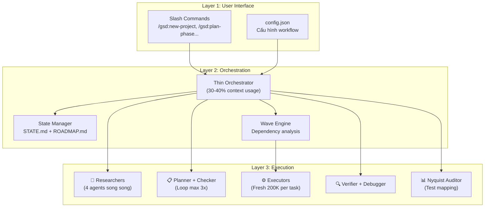
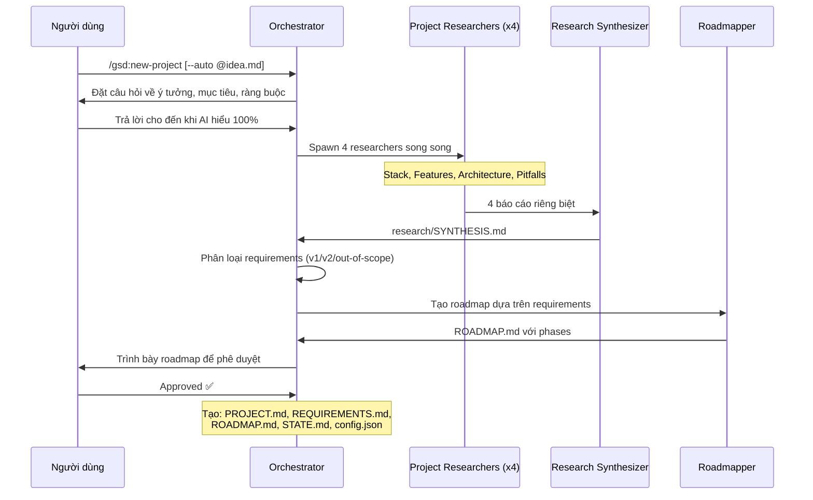
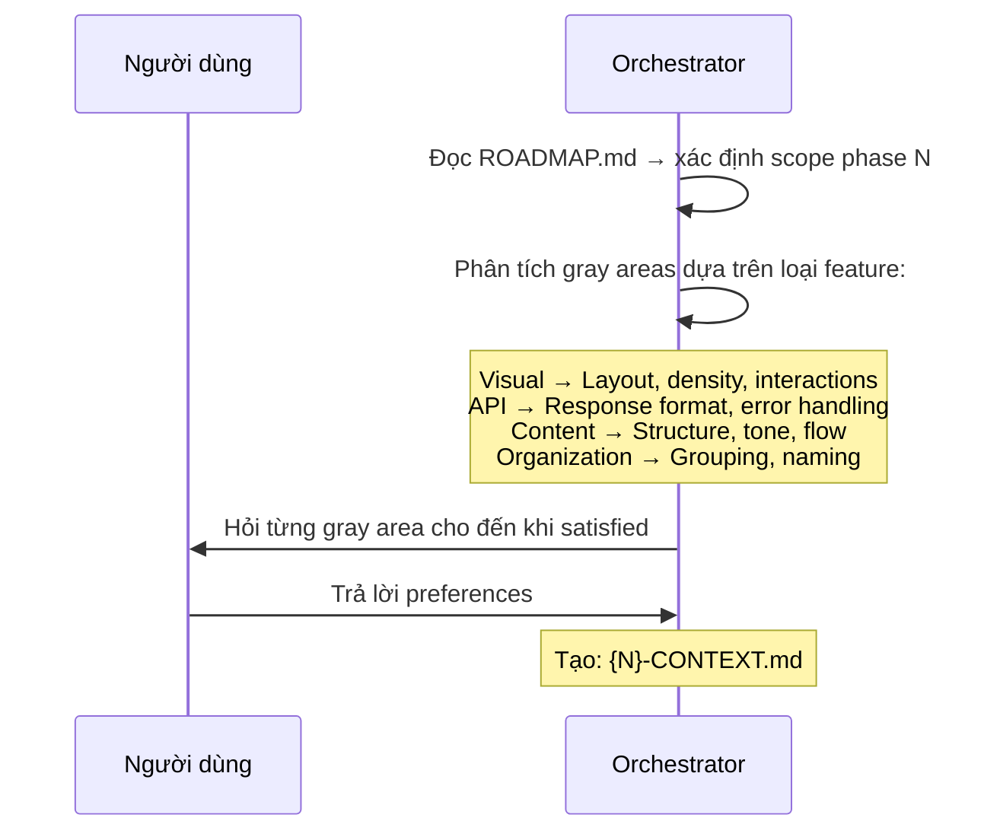
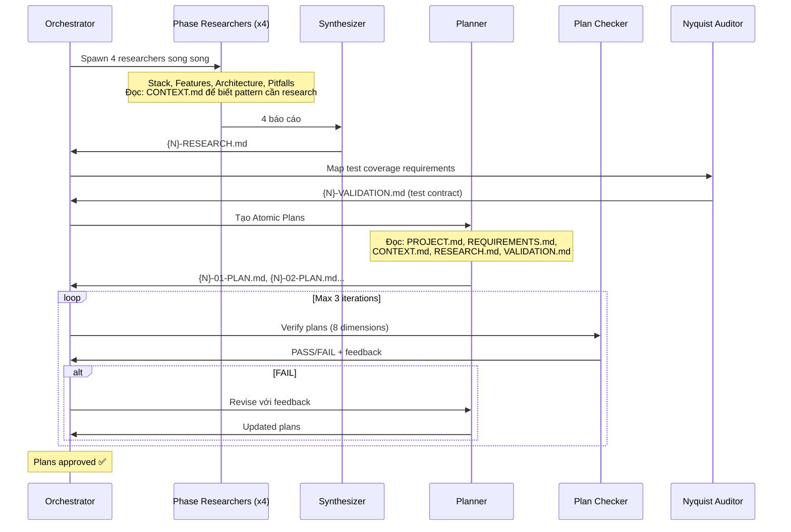
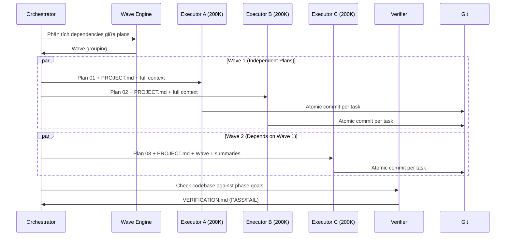
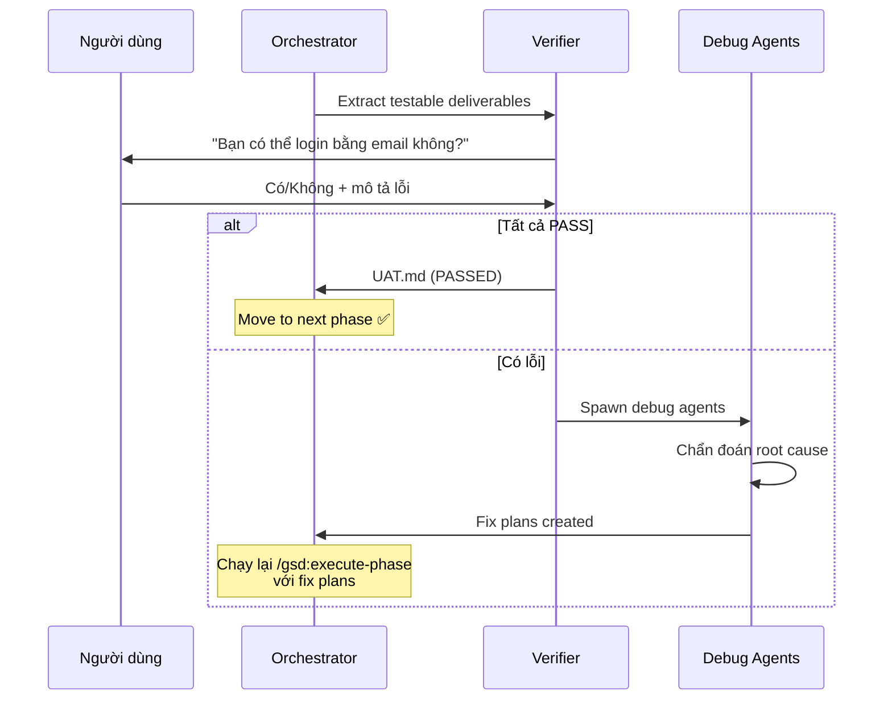
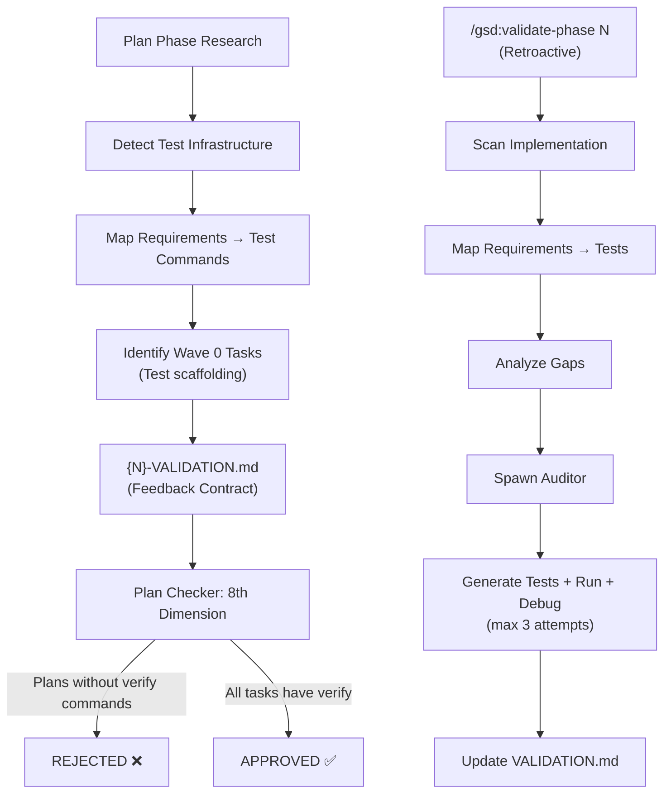
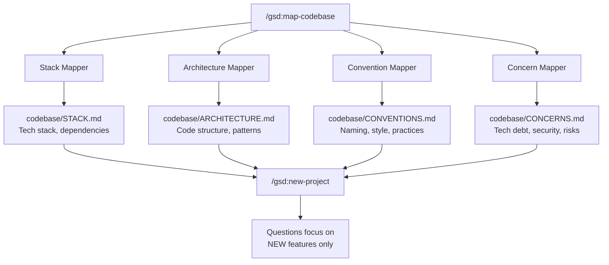
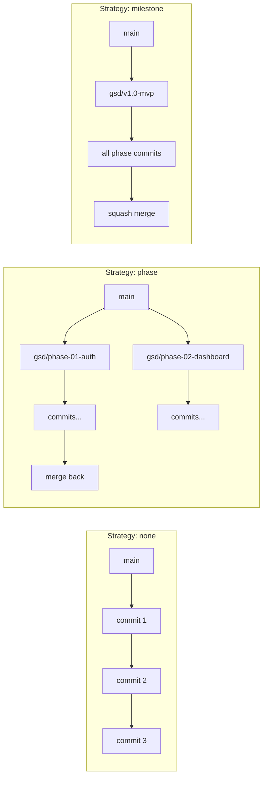
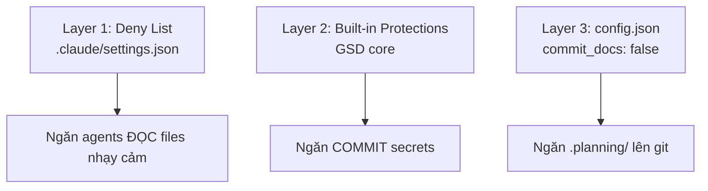

# Kiến trúc & Logic Hệ thống GSD — Deep Dive

> [!NOTE]
> Tài liệu này đi sâu vào **cơ chế hoạt động nội bộ** của GSD. Đọc [[3-Research/Github/Get Shit Done/0. Overview]] trước để nắm bức tranh tổng thể.

---

## 1. Mô hình Kiến trúc Tổng thể

GSD hoạt động theo mô hình **3-Layer Architecture**:



### Nguyên tắc Kiến trúc Cốt lõi

1. **Thin Orchestrator Pattern:** Orchestrator KHÔNG bao giờ làm việc nặng. Nó chỉ: spawn agents → chờ kết quả → tổng hợp → chuyển tiếp.
2. **Context Isolation:** Mỗi agent nhận context riêng (200K tokens sạch). Không có "rác dữ liệu" từ bước trước ảnh hưởng.
3. **State-Driven Flow:** Mọi bước đều đọc/ghi state files. Khi mở phiên mới, `/gsd:resume-work` khôi phục toàn bộ ngữ cảnh từ files.
4. **Fail-Safe Loops:** Plan checker loop tối đa 3 lần. Debug agents tự spawn khi verify thất bại.

---

## 2. Data Flow Chi tiết theo Giai đoạn

### 2.1. Initialize (`/gsd:new-project`)



**Input → Output:**
- **Input:** Ý tưởng của bạn (text hoặc file `@idea.md`)
- **Process:** Q&A → Parallel Research (4 agents) → Requirements Extraction → Roadmap Creation
- **Output:**

| File | Nội dung |
|---|---|
| `PROJECT.md` | Tầm nhìn, mục tiêu, quyết định kiến trúc cốt lõi |
| `REQUIREMENTS.md` | Danh sách tính năng: v1 (MVP), v2, out-of-scope, với ID truy vết (REQ-001, REQ-002...) |
| `ROADMAP.md` | Phases phân chia theo requirements, status tracking |
| `STATE.md` | Trạng thái dự án, quyết định đã chốt, blockers |
| `config.json` | Workflow settings (mode, granularity, model_profile...) |
| `research/` | Nghiên cứu domain: stack analysis, feature patterns, architecture pitfalls |

### 2.2. Discuss (`/gsd:discuss-phase [N]`)



**Tại sao bước này quan trọng?**

CONTEXT.md là **cầu nối** giữa tầm nhìn của bạn và plan execution:

```
Researcher đọc CONTEXT.md → Biết pattern nào cần nghiên cứu
    "User wants card layout" → Research card component libraries

Planner đọc CONTEXT.md → Biết quyết định nào đã lock
    "Infinite scroll decided" → Plan includes scroll handling
```

> [!IMPORTANT]
> **Nếu bỏ qua Discuss:** AI dùng "reasonable defaults" → bạn nhận được sản phẩm generic.
> **Nếu dùng Discuss:** AI hiểu *tầm nhìn cá nhân* → bạn nhận được *chính xác* điều bạn muốn.

### 2.3. Plan (`/gsd:plan-phase [N]`)

Đây là giai đoạn phức tạp nhất với **3-step pipeline + validation loop**:



**Plan Checker — 8 Verification Dimensions:**

| # | Dimension | Kiểm tra gì? |
|---|---|---|
| 1 | **Requirements Coverage** | Mỗi requirement trong phase có được address? |
| 2 | **Task Atomicity** | Task đủ nhỏ cho 1 context window? (2-3 tasks/plan) |
| 3 | **Dependency Clarity** | Dependencies giữa plans có rõ ràng? |
| 4 | **File Conflict** | Nhiều plans có sửa cùng file không? |
| 5 | **Verification Steps** | Mỗi task có `<verify>` command? |
| 6 | **Done Criteria** | Mỗi task có `<done>` conditions? |
| 7 | **Context Completeness** | Plan có đủ context để executor thực thi mà không cần hỏi? |
| 8 | **Nyquist Compliance** | Mỗi task có automated test verification? *(v1.21+)* |

**Atomic Plan Structure (XML):**

```xml
<plan>
  <phase>01</phase>
  <name>User Authentication</name>
  <wave>1</wave>
  <depends_on></depends_on>
  
  <task type="auto">
    <name>Create user model and migrations</name>
    <files>src/models/user.ts, prisma/schema.prisma</files>
    <action>
      Define User model with fields: id, email, password_hash, created_at.
      Use bcrypt for password hashing.
      Generate Prisma migration.
    </action>
    <verify>npx prisma migrate status shows applied</verify>
    <done>User table exists with correct columns</done>
  </task>
  
  <task type="auto">
    <name>Create login endpoint</name>
    <files>src/app/api/auth/login/route.ts</files>
    <action>
      Use jose for JWT (not jsonwebtoken - CommonJS issues).
      Validate credentials, return httpOnly cookie.
    </action>
    <verify>curl -X POST localhost:3000/api/auth/login returns 200</verify>
    <done>Valid credentials return cookie, invalid return 401</done>
  </task>
</plan>
```

### 2.4. Execute (`/gsd:execute-phase <N>`)



**Wave Execution Logic:**

```
┌─────────────────────────────────────────────────────────┐
│  PHASE EXECUTION                                        │
├─────────────────────────────────────────────────────────┤
│                                                          │
│  WAVE 1 (parallel)     WAVE 2 (parallel)     WAVE 3     │
│  ┌────────┐ ┌────────┐ ┌────────┐ ┌────────┐ ┌────────┐ │
│  │Plan 01 │ │Plan 02 │ │Plan 03 │ │Plan 04 │ │Plan 05 │ │
│  │        │ │        │ │        │ │        │ │        │ │
│  │ User   │ │Product │ │Orders  │ │ Cart   │ │Checkout│ │
│  │ Model  │ │ Model  │ │  API   │ │  API   │ │  UI    │ │
│  └────────┘ └────────┘ └────────┘ └────────┘ └────────┘ │
│      │          │           ↑          ↑          ↑      │
│      └──────────┴───────────┴──────────┘          │      │
│                 Dependencies flow                  │      │
│                                                          │
└─────────────────────────────────────────────────────────┘
```

**Quy tắc phân nhóm Wave:**
1. **Independent plans → Same wave → Parallel**
2. **Dependent plans → Later wave → Sequential**
3. **File conflicts → Same plan** (để tránh merge conflicts)

**Vertical Slicing vs Horizontal Layering:**

| Chiến lược | Ví dụ | Song song hóa |
|---|---|---|
| **Vertical Slices** ✅ | Plan 01: User feature end-to-end (DB → API → UI) | Tối ưu — plans độc lập |
| **Horizontal Layers** ❌ | Plan 01: All models, Plan 02: All APIs | Kém — plan 02 phụ thuộc plan 01 |

### 2.5. Verify (`/gsd:verify-work [N]`)



**Vòng lặp sửa lỗi tự động:**
1. Verify thất bại → hệ thống **KHÔNG** thử lại một cách mù quáng
2. Debug agents **chẩn đoán root cause** tự động
3. Tạo **fix plans** cụ thể
4. Người dùng chạy `/gsd:execute-phase` lại → fix plans được áp dụng

---

## 3. Nyquist Validation Architecture (v1.21+)

Đây là tính năng mới quan trọng nhất - đảm bảo **feedback loop tự động** cho mỗi requirement:



**Quy tắc quan trọng:**
- Auditor **KHÔNG bao giờ sửa implementation code** — chỉ tạo/sửa test files
- Nếu test phát hiện bug trong implementation → **escalation** cho người dùng
- Disable bằng `workflow.nyquist_validation: false` trong `/gsd:settings` cho prototyping phases

---

## 4. Brownfield Architecture (Dự án Hiện có)

Khi áp dụng GSD cho codebase đã tồn tại, `/gsd:map-codebase` kích hoạt **4 mapper agents song song**:



**Tại sao Brownfield mapping quan trọng?**
- AI hiểu code hiện tại → **không tạo "broken windows"** trong kiến trúc cũ
- `/gsd:new-project` **không hỏi lại** những gì đã rõ trong code → tiết kiệm thời gian
- Plans tự động tuân thủ conventions đã phát hiện

---

## 5. Configuration Logic

### 5.1. Model Profiles — Per-Agent Breakdown

GSD phân bổ sức mạnh AI theo **vai trò** chứ không theo giai đoạn:

| Agent | Quality | Balanced | Budget |
|---|---|---|---|
| `gsd-planner` | **Opus** | **Opus** | Sonnet |
| `gsd-roadmapper` | Opus | Sonnet | Sonnet |
| `gsd-executor` | **Opus** | Sonnet | Sonnet |
| `gsd-phase-researcher` | Opus | Sonnet | **Haiku** |
| `gsd-project-researcher` | Opus | Sonnet | **Haiku** |
| `gsd-research-synthesizer` | Sonnet | Sonnet | Haiku |
| `gsd-debugger` | **Opus** | Sonnet | Sonnet |
| `gsd-codebase-mapper` | Sonnet | **Haiku** | Haiku |
| `gsd-verifier` | Sonnet | Sonnet | Haiku |
| `gsd-plan-checker` | Sonnet | Sonnet | Haiku |
| `gsd-integration-checker` | Sonnet | Sonnet | Haiku |

**Triết lý phân bổ:**
- **Quality:** Opus cho mọi agent ra quyết định. Dùng khi quota dồi dào và công việc quan trọng.
- **Balanced:** Opus chỉ cho planning (nơi quyết định kiến trúc xảy ra), Sonnet cho phần còn lại. **Mặc định** — cân bằng tốt nhất.
- **Budget:** Sonnet cho coding, Haiku cho research/verification. Dùng cho high-volume hoặc ít quan trọng.

### 5.2. Workflow Toggles

| Toggle | Default | Tác dụng | Khi nào tắt? |
|---|---|---|---|
| `workflow.research` | `true` | Domain research trước planning | Domain quen thuộc |
| `workflow.plan_check` | `true` | Verify plans vs requirements (loop 3x) | Quick prototyping |
| `workflow.verifier` | `true` | Post-execution verification | Quick tasks |
| `workflow.nyquist_validation` | `true` | Test coverage mapping | Rapid prototyping |
| `workflow.auto_advance` | `false` | Auto-chain Discuss → Plan → Execute | Khi muốn fully automated |

### 5.3. Speed vs Quality Presets

| Scenario | Mode | Granularity | Profile | Research | Plan Check | Verifier |
|---|---|---|---|---|---|---|
| **Prototyping** | `yolo` | `coarse` | `budget` | off | off | off |
| **Normal dev** | `interactive` | `standard` | `balanced` | on | on | on |
| **Production** | `interactive` | `fine` | `quality` | on | on | on |

### 5.4. Granularity Control

| Level | Phases per Milestone | Plans per Phase | Use Case |
|---|---|---|---|
| `coarse` | 3-5 | Ít, plans lớn | Small changes, familiar domain |
| `standard` | 5-8 | Vừa phải | Hầu hết dự án |
| `fine` | 8-12 | Nhiều, plans nhỏ | Complex systems, cần kiểm soát lỗi tuyệt đối |

---

## 6. Git Integration Logic

### 6.1. Atomic Commits

Mỗi task hoàn thành = 1 commit:

```bash
abc123f docs(08-02): complete user registration plan
def456g feat(08-02): add email confirmation flow
hij789k feat(08-02): implement password hashing
lmn012o feat(08-02): create registration endpoint
```

**Format:** `{type}({phase}-{plan}): {description}`

### 6.2. Branching Strategies



---

## 7. Error Handling & Recovery Logic

### 7.1. Subagent Failure Detection

GSD's orchestrators **spot-check actual output** trước khi báo failure:
- Nếu subagent báo fail nhưng commits đã được tạo → hệ thống nhận diện success
- Đây là workaround cho Claude Code classification bug

### 7.2. Context Degradation Recovery

```
Symptom: AI quality dropping in main session
→ /clear (clear context window)
→ /gsd:resume-work hoặc /gsd:progress
→ State files restore full context
```

### 7.3. Recovery Quick Reference

| Vấn đề | Giải pháp |
|---|---|
| Mất context / phiên mới | `/gsd:resume-work` hoặc `/gsd:progress` |
| Phase đi sai hướng | `git revert` → re-plan |
| Scope thay đổi | `/gsd:add-phase`, `/gsd:insert-phase`, `/gsd:remove-phase` |
| Audit phát hiện gaps | `/gsd:plan-milestone-gaps` |
| Bug cần debug | `/gsd:debug "description"` |
| Fix nhanh | `/gsd:quick` |
| Plan sai vs vision | `/gsd:discuss-phase [N]` → re-plan |
| Chi phí quá cao | `/gsd:set-profile budget` + tắt agents |
| Update phá local changes | `/gsd:reapply-patches` |

---

## 8. Security Architecture

### 8.1. Defense-in-Depth



### 8.2. Deny List Configuration

```json
{
  "permissions": {
    "deny": [
      "Read(.env)",
      "Read(.env.*)",
      "Read(**/secrets/*)",
      "Read(**/*credential*)",
      "Read(**/*.pem)",
      "Read(**/*.key)"
    ]
  }
}
```

### 8.3. Private Project Settings

- `planning.commit_docs: false` → `.planning/` không commit lên git
- Thêm `.planning/` vào `.gitignore` → planning artifacts 100% local

---

## Xem thêm

- [[3-Research/Github/Get Shit Done/0. Overview]] — Tổng quan hệ thống GSD
- [[3-Research/Github/Get Shit Done/2. Playbook]] — Sổ tay vận hành thực chiến
- [[3-Research/Github/Get Shit Done/3. Decision Guide]] — So sánh, use cases, chi phí, và hướng dẫn ra quyết định
