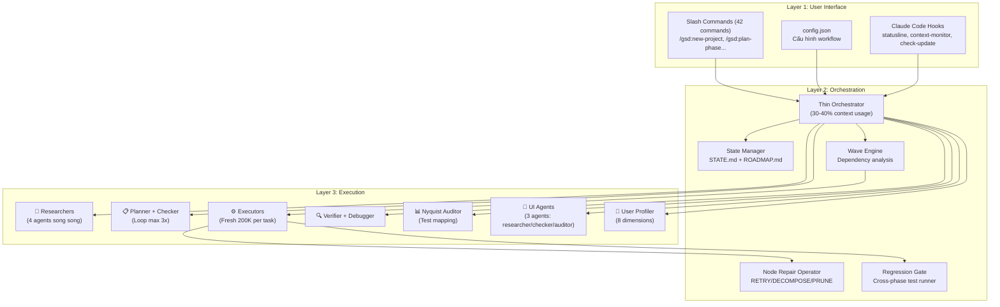
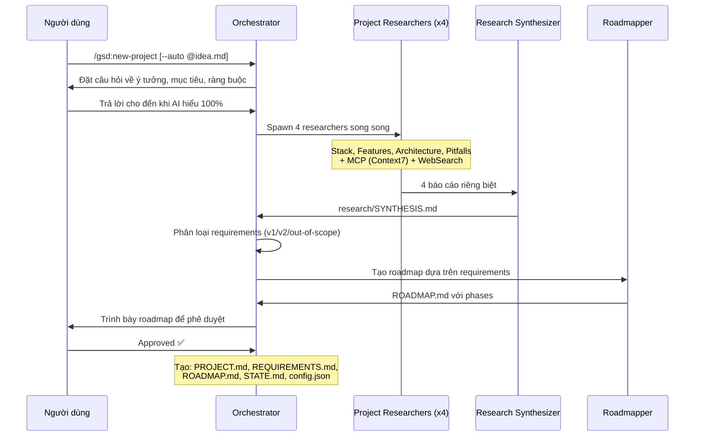
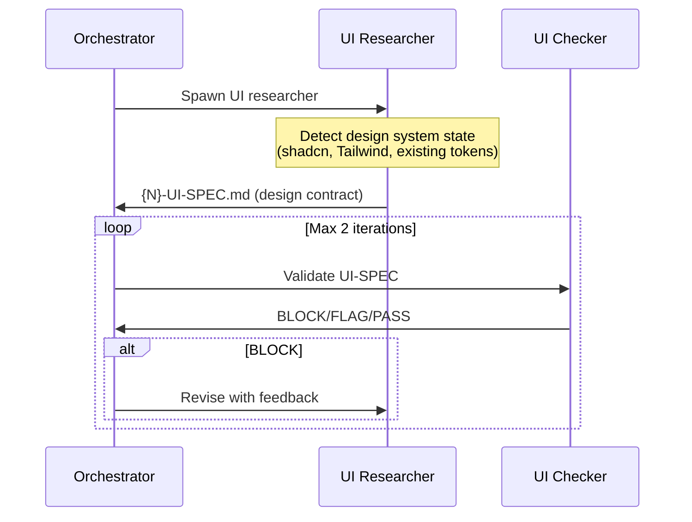
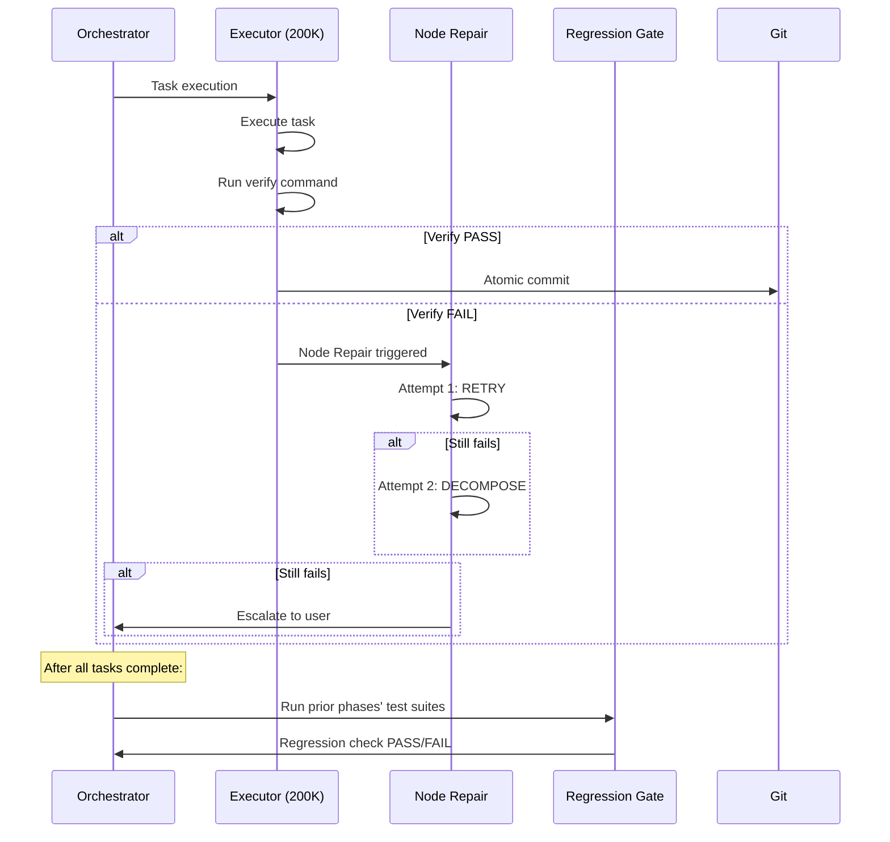
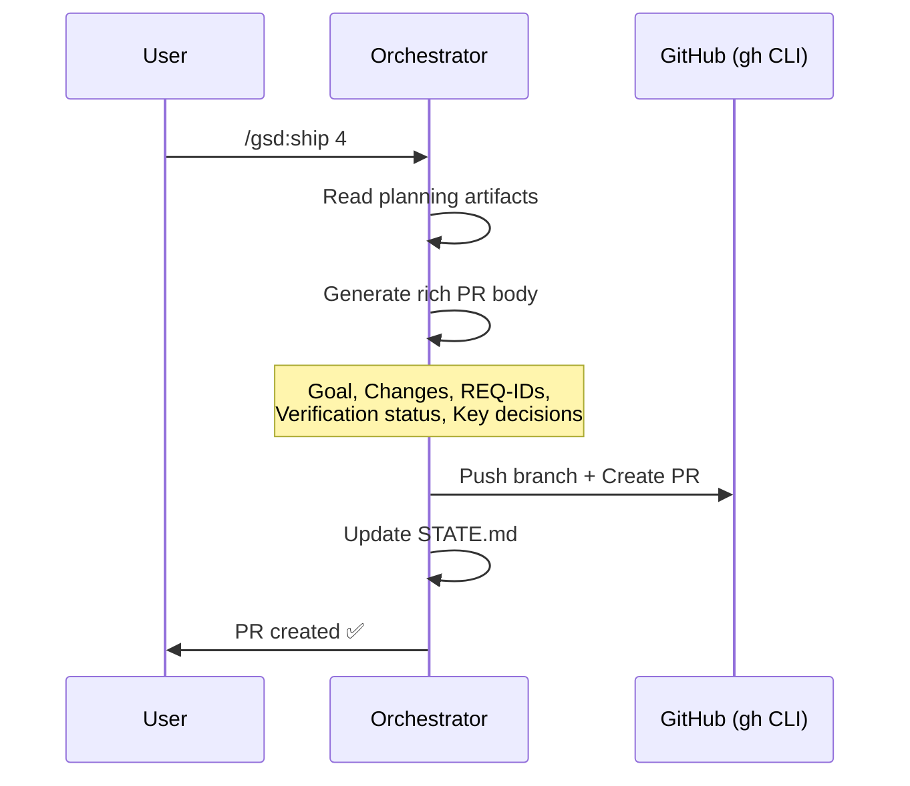
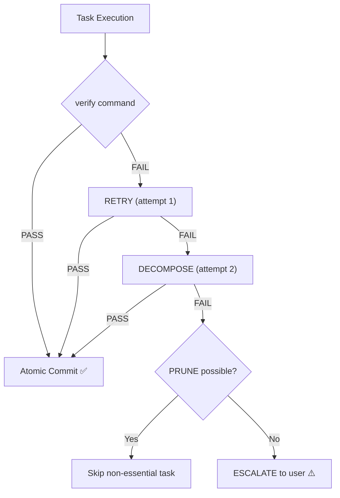
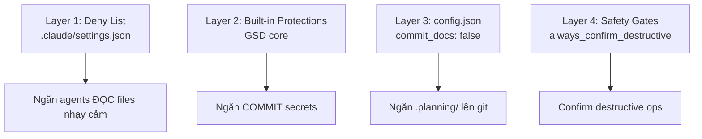

# Kiến trúc & Logic Hệ thống GSD — Deep Dive

> [!NOTE]
> Tài liệu này đi sâu vào **cơ chế hoạt động nội bộ** của GSD. Đọc [0. Overview](./0. Overview.md) trước để nắm bức tranh tổng thể.

---

## 1. Mô hình Kiến trúc Tổng thể

GSD hoạt động theo mô hình **3-Layer Architecture**:



### Nguyên tắc Kiến trúc Cốt lõi

1. **Thin Orchestrator Pattern:** Orchestrator KHÔNG bao giờ làm việc nặng. Nó chỉ: spawn agents → chờ kết quả → tổng hợp → chuyển tiếp.
2. **Context Isolation:** Mỗi agent nhận context riêng (200K tokens sạch). Không có "rác dữ liệu" từ bước trước ảnh hưởng.
3. **State-Driven Flow:** Mọi bước đều đọc/ghi state files. Khi mở phiên mới, `/gsd:resume-work` khôi phục toàn bộ ngữ cảnh từ files.
4. **Fail-Safe Loops:** Plan checker loop tối đa 3 lần. Node repair tự RETRY/DECOMPOSE/PRUNE trước escalation.
5. **Regression Prevention:** Cross-phase test suites chạy sau execution, bắt regressions sớm (v1.26).

---

## 2. Repository Structure (v1.26)

```
get-shit-done/
├── agents/                     # 16 agent definitions (.md files)
│   ├── gsd-planner.md         # Opus-grade planning (43KB!)
│   ├── gsd-debugger.md        # Persistent debug with knowledge base (40KB!)
│   ├── gsd-executor.md        # Atomic task execution
│   ├── gsd-phase-researcher.md
│   ├── gsd-project-researcher.md
│   ├── gsd-research-synthesizer.md
│   ├── gsd-plan-checker.md
│   ├── gsd-verifier.md
│   ├── gsd-roadmapper.md
│   ├── gsd-codebase-mapper.md
│   ├── gsd-integration-checker.md
│   ├── gsd-nyquist-auditor.md
│   ├── gsd-ui-researcher.md    # v1.23+
│   ├── gsd-ui-checker.md       # v1.23+
│   ├── gsd-ui-auditor.md       # v1.23+
│   └── gsd-user-profiler.md    # v1.26
├── commands/gsd/               # 42 slash command files (.md)
│   ├── new-project.md
│   ├── discuss-phase.md
│   ├── plan-phase.md
│   ├── execute-phase.md
│   ├── verify-work.md
│   ├── ship.md                 # v1.26
│   ├── next.md                 # v1.26
│   ├── do.md                   # v1.25
│   ├── note.md                 # v1.25
│   ├── profile-user.md         # v1.26
│   ├── ui-phase.md             # v1.23
│   ├── ui-review.md            # v1.23
│   ├── stats.md                # v1.23
│   ├── autonomous.md
│   ├── quick.md
│   ├── debug.md
│   └── ... (28 more)
├── hooks/                      # Claude Code hooks (JS)
│   ├── gsd-statusline.js       # Notification event — model/task/context bar
│   ├── gsd-context-monitor.js  # PostToolUse — inject context warnings
│   └── gsd-check-update.js     # SessionStart — auto update check
├── get-shit-done/bin/lib/      # Core runtime library (.cjs)
├── scripts/                    # Build and test scripts
├── tests/                      # 428+ tests, 13 test files
├── docs/                       # 9 documentation files
│   ├── AGENTS.md, ARCHITECTURE.md, CLI-TOOLS.md
│   ├── COMMANDS.md, CONFIGURATION.md, FEATURES.md
│   ├── USER-GUIDE.md, README.md, context-monitor.md
├── package.json                # v1.26.0, Node ≥ 16.7
└── README.md + README.zh-CN.md
```

---

## 3. Data Flow Chi tiết theo Giai đoạn

### 3.1. Initialize (`/gsd:new-project`)



### 3.2. Discuss (`/gsd:discuss-phase [N]`)

**Thay đổi v1.22+:** Discuss giờ loads prior context (PROJECT.md, REQUIREMENTS.md, STATE.md, và tất cả prior CONTEXT.md files) **trước khi** identify gray areas → không re-ask questions đã trả lời ở phases trước.

**Thay đổi v1.25:** `/gsd:discuss-phase` shows remaining discussion areas khi hỏi continue/move on.

**Thay đổi v1.22:** Code-aware discuss phase — `/gsd:discuss-phase` analyze relevant source files trước khi hỏi (codebase scouting).

### 3.3. UI Design (`/gsd:ui-phase [N]`) — NEW v1.23



### 3.4. Execute with Node Repair (`/gsd:execute-phase <N>`)



### 3.5. Ship (`/gsd:ship [N]`) — NEW v1.26



---

## 4. Agent Architecture

### 4.1. Agent Categories (16 total)

| Category | Count | Agents | Tools |
|---|---|---|---|
| **Researchers** | 3 | project-researcher, phase-researcher, ui-researcher | Read, Write, Bash, Grep, Glob, WebSearch, WebFetch, MCP |
| **Synthesizers** | 1 | research-synthesizer | Read, Write, Bash |
| **Planners** | 1 | planner | Read, Write, Bash, Glob, Grep, WebFetch, MCP |
| **Roadmappers** | 1 | roadmapper | Read, Write, Bash, Glob, Grep |
| **Executors** | 1 | executor | Read, Write, Edit, Bash, Grep, Glob |
| **Checkers** | 3 | plan-checker, integration-checker, ui-checker | Read, Bash, Glob, Grep (read-only) |
| **Verifiers** | 1 | verifier | Read, Write, Bash, Grep, Glob |
| **Auditors** | 2 | nyquist-auditor, ui-auditor | Read, Write[, Edit], Bash, Grep, Glob |
| **Mappers** | 1 | codebase-mapper | Read, Write, Bash, Grep, Glob |
| **Debuggers** | 1 | debugger | Read, Write, Edit, Bash, Grep, Glob, WebSearch |
| **Profilers** | 1 | user-profiler | Read only |

### 4.2. Principle of Least Privilege

- **Checkers** are read-only — they evaluate, never modify
- **Researchers** have web access — they need current ecosystem information
- **Executors** have Edit — they modify code but NOT web access
- **Mappers** have Write — they write analysis documents but NOT Edit (no code changes)
- **Profiler** is Read-only — analyzes session data, no side effects

### 4.3. Model Profiles — Per-Agent Breakdown

| Agent | Quality | Balanced | Budget | Inherit |
|---|---|---|---|---|
| `gsd-planner` | **Opus** | **Opus** | Sonnet | Inherit |
| `gsd-roadmapper` | Opus | Sonnet | Sonnet | Inherit |
| `gsd-executor` | **Opus** | Sonnet | Sonnet | Inherit |
| `gsd-phase-researcher` | Opus | Sonnet | **Haiku** | Inherit |
| `gsd-project-researcher` | Opus | Sonnet | **Haiku** | Inherit |
| `gsd-research-synthesizer` | Sonnet | Sonnet | Haiku | Inherit |
| `gsd-debugger` | **Opus** | Sonnet | Sonnet | Inherit |
| `gsd-codebase-mapper` | Sonnet | **Haiku** | Haiku | Inherit |
| `gsd-verifier` | Sonnet | Sonnet | Haiku | Inherit |
| `gsd-plan-checker` | Sonnet | Sonnet | Haiku | Inherit |
| `gsd-integration-checker` | Sonnet | Sonnet | Haiku | Inherit |
| `gsd-nyquist-auditor` | Sonnet | Sonnet | Haiku | Inherit |

**`inherit` profile (v1.24):** Tất cả agents sử dụng model hiện tại của runtime (hữu ích cho OpenCode `/model` switching).

---

## 5. Configuration Logic

### 5.1. Full Config Schema (v1.26)

| Category | Settings | Mô tả |
|---|---|---|
| **Core** | `mode` (interactive/yolo), `granularity` (coarse/standard/fine), `model_profile`, `model_overrides` | Workflow behavior |
| **Planning** | `commit_docs`, `search_gitignored` | Git integration for .planning/ |
| **Workflow** | `research`, `plan_check`, `verifier`, `auto_advance`, `nyquist_validation`, `ui_phase`, `ui_safety_gate`, `node_repair`, `node_repair_budget` | Toggle features on/off |
| **Parallelization** | `enabled`, `plan_level`, `task_level`, `skip_checkpoints`, `max_concurrent_agents`, `min_plans_for_parallel` | Parallel execution control |
| **Git** | `branching_strategy` (none/phase/milestone), templates | Branch management |
| **Gates** | `confirm_project/phases/roadmap/breakdown/plan`, `execute_next_plan`, `issues_review`, `confirm_transition` | Confirmation prompts |
| **Safety** | `always_confirm_destructive`, `always_confirm_external_services` | Destructive ops guard |
| **Hooks** | `context_warnings` | Hook behavior (v1.25) |

### 5.2. Speed vs Quality Presets

| Scenario | Mode | Granularity | Profile | Research | Plan Check | Verifier |
|---|---|---|---|---|---|---|
| **Prototyping** | `yolo` | `coarse` | `budget` | off | off | off |
| **Normal dev** | `interactive` | `standard` | `balanced` | on | on | on |
| **Production** | `interactive` | `fine` | `quality` | on | on | on |

### 5.3. Global Defaults

`~/.gsd/defaults.json` — Save settings as global defaults. `/gsd:new-project` reads and merges as starting config.

---

## 6. Hooks Architecture

GSD sử dụng **3 native Claude Code hooks**:

| Hook | Event | Chức năng |
|---|---|---|
| `gsd-statusline.js` | `Notification` | Model name, current task, context usage progress bar (████░░ 40%). Bridge file cho context-monitor |
| `gsd-context-monitor.js` | `PostToolUse` | Inject `additionalContext` warning khi context thấp. WARNING @ 35%, CRITICAL @ 25%. Debounce 5 calls. GSD-aware messages (đề xuất `/gsd:pause-work`) |
| `gsd-check-update.js` | `SessionStart` | Background check npm registry. Cache results. Statusline hiển thị `⬆ /gsd:update` |

**Cross-runtime support:**
- Claude Code: `PostToolUse` event
- Gemini CLI: `AfterTool` event
- Codex: `SessionStart` hook (v1.26)
- Respects `CLAUDE_CONFIG_DIR` for custom config directories

---

## 7. Error Handling & Recovery Logic

### 7.1. Node Repair Operator (v1.23+)



### 7.2. Recovery Quick Reference

| Vấn đề | Giải pháp |
|---|---|
| Mất context / phiên mới | `/gsd:resume-work` hoặc `/gsd:progress` |
| Phase đi sai hướng | `git revert` → re-plan |
| Scope thay đổi | `/gsd:add-phase`, `/gsd:insert-phase`, `/gsd:remove-phase` |
| Audit phát hiện gaps | `/gsd:plan-milestone-gaps` |
| Bug cần debug | `/gsd:debug "description"` (persistent knowledge base) |
| Fix nhanh | `/gsd:quick [--discuss] [--research] [--full]` |
| Plan sai vs vision | `/gsd:discuss-phase [N]` → re-plan |
| Chi phí quá cao | `/gsd:set-profile budget` + tắt agents |
| Update phá local changes | `/gsd:reapply-patches` |
| Recurring bug | Check `.planning/debug/knowledge-base.md` |
| Không biết next step | `/gsd:next` (auto-advance) |
| Session handoff | `/gsd:pause-work` → HANDOFF.json |

---

## 8. Security Architecture

### 8.1. Defense-in-Depth



### 8.2. Deny List Configuration

```json
{
  "permissions": {
    "deny": [
      "Read(.env)", "Read(.env.*)",
      "Read(**/secrets/*)", "Read(**/*credential*)",
      "Read(**/*.pem)", "Read(**/*.key)"
    ]
  }
}
```

---

## 9. Testing & CI

GSD có test suite nghiêm ngặt (v1.21+):

| Metric | Value |
|---|---|
| **Tests** | 428+ across 13 test files |
| **CI Matrix** | 9-matrix (3 OS × 3 Node versions) |
| **Coverage** | c8 enforcement at 70% line threshold |
| **Modules tested** | core, commands, config, dispatcher, frontmatter, init, milestone, phase, roadmap, state, verify, model-profiles, templates |
| **Cross-platform** | `scripts/run-tests.cjs` for Windows compatibility |

---

## Xem thêm

- [0. Overview](./0. Overview.md) — Tổng quan hệ thống GSD
- [2. Playbook](./2. Playbook.md) — Sổ tay vận hành thực chiến
- [3. Decision Guide](./3. Decision Guide.md) — So sánh, use cases, chi phí, và hướng dẫn ra quyết định
