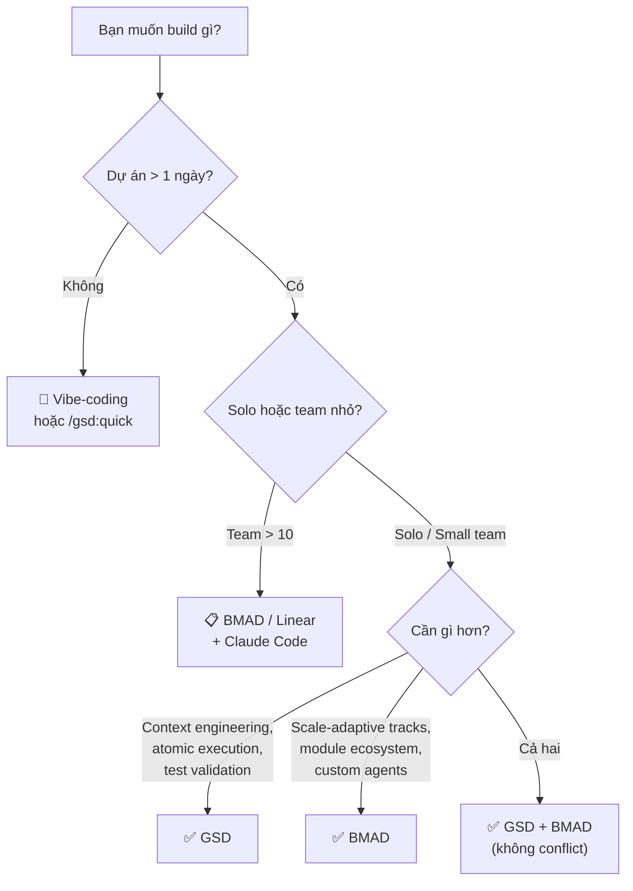

# Hướng dẫn Ra quyết định — GSD (Get Shit Done) v1.26

> [!NOTE]
> Đọc tài liệu này TRƯỚC khi quyết định áp dụng GSD. Đọc [0. Overview](./0. Overview.md) nếu bạn chưa biết GSD là gì.

---

## 1. So sánh với Alternatives

### 1.1. Bảng So sánh Tổng quan

| Feature | **GSD v1.26** | **BMAD v6.2** | **SpecKit/OpenSpec** | **TaskMaster** | **Vibe-coding thuần** |
|---|---|---|---|---|---|
| **Triết lý** | Solo builders, no enterprise theater | Enterprise workflow simulation | Spec-first | Task management | Chat-and-fix |
| **Context Engineering** | ✅ Fresh 200K per task | ❌ | Partial | ❌ | ❌ |
| **Multi-Agent** | ✅ 16 agents chuyên biệt | ✅ 9 agents (skills-based) | ❌ | ❌ | ❌ |
| **Commands/Skills** | 42 slash commands | 44 SKILL.md files | Limited | Limited | ❌ |
| **Wave Execution (song song)** | ✅ Dependency-aware | ❌ | ❌ | ❌ | ❌ |
| **Atomic Git Commits** | ✅ Per task | ❌ | ❌ | ❌ | ❌ |
| **Plan Verification** | ✅ 8 dimensions, max 3 loops | ❌ | Partial | ❌ | ❌ |
| **UAT** | ✅ Guided + auto-diagnosis | ❌ | ❌ | ❌ | Manual |
| **Brownfield** | ✅ `/gsd:map-codebase` | ✅ `/bmad-help` | Limited | ❌ | ❌ |
| **Multi-Runtime** | ✅ 7 runtimes | ✅ 20+ platforms | Claude only | Claude only | Any |
| **Nyquist Validation** | ✅ Test coverage mapping | ❌ | ❌ | ❌ | ❌ |
| **Node Repair** | ✅ Auto-recover tasks | ❌ | ❌ | ❌ | ❌ |
| **UI Design System** | ✅ 6-pillar audit | ❌ | ❌ | ❌ | ❌ |
| **PR Automation** | ✅ `/gsd:ship` | ❌ | ❌ | ❌ | ❌ |
| **Developer Profiling** | ✅ 8 behavioral dims | ❌ | ❌ | ❌ | ❌ |
| **Hooks (native)** | ✅ 3 Claude Code hooks | ❌ | ❌ | ❌ | ❌ |
| **MCP Awareness** | ✅ Subagents discover MCP tools | ❌ | ❌ | ❌ | ❌ |
| **CI/Tests** | ✅ 428 tests, 70% coverage | ❌ | ❌ | ❌ | ❌ |
| **Setup** | 🟢 1 lệnh npx | 🟢 1 lệnh npx | 🟡 Medium | 🟡 Medium | 🟢 Zero |
| **Learning Curve** | 🟡 Medium | 🔴 Cao | 🟡 Medium | 🟢 Dễ | 🟢 Zero |
| **Giấy phép** | MIT (Free) | MIT (Free) | Varies | Varies | N/A |

### 1.2. GSD vs BMAD — So sánh Chi tiết

| Khía cạnh | GSD v1.26 | BMAD v6.2 |
|---|---|---|
| **Quy trình** | 6 bước: Discuss → UI → Plan → Execute → Verify → Ship | 4 phases: Analysis → Planning → Solutioning → Implementation |
| **Agents** | 16 agents với model routing (Opus/Sonnet/Haiku) | 9 agents với persona names |
| **Planning** | Atomic XML plans + 8-dimension verification loop | Skills-based workflow với step-files |
| **Execution** | Wave-based parallel + node repair + regression gate | Step-by-step sequential |
| **Memory** | `.planning/` files + HANDOFF.json | Planning artifacts + project-context.md |
| **Scale** | Single track with config presets | 3 tracks: Quick/BMad/Enterprise |
| **IDE support** | 7 runtimes (depth > breadth) | 20+ platforms (breadth > depth) |
| **Test strategy** | ✅ Nyquist Validation built-in | Via TEA module (separate) |
| **PR workflow** | ✅ `/gsd:ship` built-in | ❌ Manual |
| **Hooks** | ✅ 3 native CC hooks | ❌ |
| **Dev profiling** | ✅ `/gsd:profile-user` | ❌ |
| **Module ecosystem** | Monolithic (everything built-in) | 6 installable modules |
| **Custom agents** | ❌ Pre-defined agents only | ✅ BMad Builder module |
| **Party Mode** | ❌ | ✅ Multi-agent debate |
| **Đối tượng** | Solo devs, small teams | Bất kỳ size team |
| **Khi nào chọn GSD** | Muốn context engineering, atomic execution, automated verification | Muốn scale-adaptive tracks, module ecosystem, custom agents |

### 1.3. GSD vs Vibe-coding

| Khía cạnh | GSD | Vibe-coding |
|---|---|---|
| **Thời gian setup** | ~5 phút | 0 phút |
| **Chất lượng code ban đầu** | 🟡 Chậm hơn do Q&A/Research | 🟢 Nhanh |
| **Chất lượng code sau 1 tuần** | 🟢 Nhất quán, bền vững | 🔴 Suy giảm nghiêm trọng (context rot) |
| **Scale** | ✅ Xử lý được dự án lớn | ❌ Vỡ khi phức tạp tăng |
| **Debug** | Atomic commits → `git bisect` + persistent knowledge base | 1 commit lớn → debug thủ công |
| **UI Quality** | 6-pillar quantitative audit | Subjective |
| **Task failure** | Auto-recover (node repair) | Manual fix |

---

## 2. Khi nào NÊN dùng GSD

### ✅ Use Cases Lý tưởng

| Scenario | Tại sao GSD phù hợp |
|---|---|
| **Solo developer** xây SaaS/product | 16 agents = team ảo, plan verification = code review ảo |
| **Startup founder** cần MVP chất lượng | Spec-driven + Nyquist validation, atomic commits cho rollback |
| **Dự án > 1 tuần phát triển** | Context engineering giữ chất lượng dài hạn |
| **Codebase phức tạp (brownfield)** | `/gsd:map-codebase` phân tích conventions |
| **Frontend-heavy project** | `/gsd:ui-phase` + `/gsd:ui-review` — design contracts + 6-pillar audit |
| **Cần traceability** | Requirements → Plans → Commits → Verification — audit trail |
| **Nhiều phiên làm việc** | HANDOFF.json + STATE.md + resume-work |
| **Cần PR automation** | `/gsd:ship` tạo rich PR body từ planning artifacts |
| **Muốn profile dev style** | `/gsd:profile-user` → personalized AI experience |

---

## 3. Khi nào KHÔNG nên dùng GSD

### ❌ Anti-Use-Cases

| Scenario | Tại sao không phù hợp | Nên dùng gì? |
|---|---|---|
| **Prototype < 1 ngày** | Overhead Q&A + research quá lớn | Vibe-coding hoặc `/gsd:quick` |
| **Throwaway/demo code** | Không cần traceability | Chat trực tiếp |
| **Team > 10 người cần Jira** | GSD không có sprint tracking | BMAD hoặc Linear + Claude |
| **Script/one-liner** | Quá nhỏ cho GSD workflow | Claude Code trực tiếp |
| **Learning/tutorial code** | GSD abstract quá nhiều | Viết tay + Claude hỗ trợ |
| **Budget cực kỳ hạn chế** | Multi-agent = nhiều API calls | Budget profile hoặc vibe-coding |
| **Cần custom AI agents** | GSD agents là pre-defined | BMAD + BMad Builder |
| **Cần 20+ IDE support** | GSD hỗ trợ 7 runtimes | BMAD (20+ platforms) |

### ⚠️ Limitations cần biết

| Limitation | Mô tả | Workaround |
|---|---|---|
| **Claude-centric** | Tối ưu cho Claude Code; others secondary | Dùng CC cho best experience |
| **Learning curve** | 42 commands + 16 agents | `/gsd:help`, `/gsd:do` (natural language router) |
| **Token consumption** | Multi-agent = nhiều API calls | `budget` profile, tắt research/plan_check |
| **No GUI** | CLI-based, không dashboard | `/gsd:progress`, `/gsd:stats` |
| **No team collaboration** | Không multi-user features | Git PR workflow |
| **Pre-defined agents** | Không tạo custom agents | Dùng hiện có, combine với `/gsd:quick` |

---

## 4. Community & Traction

### 4.1. Testimonials

> *"If you know clearly what you want, this WILL build it for you. No bs."*

> *"I've done SpecKit, OpenSpec and Taskmaster — this has produced the best results for me."*

> *"By far the most powerful addition to my Claude Code. Nothing over-engineered. Literally just gets shit done."*

**Được tin dùng bởi kỹ sư tại:** Amazon, Google, Shopify, Webflow.

### 4.2. Community Health

| Metric | Giá trị (2026-03-19) |
|---|---|
| **Releases** | 200+ (v1.0.0 → v1.26.0) |
| **Latest Release** | v1.26.0 (2026-03-18) |
| **Update frequency** | Multiple releases per week |
| **Maintainer** | TÂCHES (very active, responsive) |
| **Discord** | Active community (discord.gg/gsd) |
| **License** | MIT — safe for commercial |
| **CI** | 428+ tests, 9-matrix, 70% coverage |
| **Chinese docs** | README.zh-CN.md available |
| **Agent files** | 16 agents (some 40KB+ each!) |
| **npm package** | `get-shit-done-cc`, Node ≥ 16.7 |

---

## 5. Chi phí & Tài nguyên

### 5.1. Chi phí Trực tiếp

| Mục | Free? | Chi tiết |
|---|---|---|
| **GSD (software)** | ✅ MIT License, miễn phí | npm package |
| **Claude Code** | ❌ Trả phí | Subscription required |
| **API costs** | ❌ Phụ thuộc profile | Xem bảng bên dưới |

### 5.2. API Token Costs theo Profile

| Profile | Chi phí / phase | Khi nào dùng |
|---|---|---|
| **Quality** (Opus heavy) | $$$ — Cao nhất | Production code, critical features |
| **Balanced** (Opus planning only) | $$ — Vừa phải | Development bình thường (default) |
| **Budget** (Sonnet/Haiku) | $ — Thấp nhất | Prototyping, familiar domain |
| **Inherit** | Tuỳ runtime model | OpenCode dynamic switching |

> [!TIP]
> **Tiết kiệm token:** Tắt `workflow.research` và `workflow.plan_check` cho domain quen thuộc. Giảm 40-60% token usage. Dùng `/gsd:quick` thay full workflow cho small tasks.

---

## 6. Migration Path

### 6.1. Từ Vibe-coding đến GSD

| Bước | Hành động |
|---|---|
| 1 | Cài đặt: `npx get-shit-done-cc@latest` |
| 2 | Map codebase hiện có: `/gsd:map-codebase` |
| 3 | Khởi tạo project: `/gsd:new-project` |
| 4 | Bắt đầu workflow: Discuss → Plan → Execute → Verify |
| 5 | Dùng `/gsd:profile-user` để personalize experience |

**Rủi ro:** Thấp — GSD chỉ thêm `.planning/` folder.

### 6.2. Từ BMAD đến GSD (và ngược lại)

| Khía cạnh | BMAD | GSD | Migration |
|---|---|---|---|
| Planning artifacts | `_bmad-output/` | `.planning/` | Export → import via `--auto @file.md` |
| Agent system | Skills-based (SKILL.md) | Pre-defined agents | Không tương đương trực tiếp |
| Commands | `/bmad-*` | `/gsd:*` | Manual mapping |
| Modules | 6 installable modules | Built-in monolithic | Không có equivalents cho BMB, GDS |

> **Ghi chú:** GSD và BMAD có triết lý khác nhau. Không có direct migration tool.

### 6.3. GSD không lock-in

- Tất cả artifacts là **Markdown/JSON** files trong `.planning/`
- Git history là **standard commits** — không có GSD-specific metadata
- Xóa `.planning/` → dự án trở về trạng thái bình thường

---

## 7. Roadmap & Tương lai

### 7.1. Tính năng Gần đây (v1.22 → v1.26)

| Version | Feature nổi bật |
|---|---|
| **v1.26** | Developer profiling, `/gsd:ship`, `/gsd:next`, Cross-phase regression gate, HANDOFF.json, WAITING.json, Interactive executor, MCP awareness, Codex hooks, Execution hardening |
| **v1.25** | Antigravity runtime, `/gsd:do`, `/gsd:note`, Comprehensive `docs/` directory |
| **v1.24** | Quick `--research`, `inherit` profile, Persistent debug knowledge base, Programmatic set-profile |
| **v1.23** | UI design system (`/gsd:ui-phase` + `/gsd:ui-review`), `/gsd:stats`, Copilot CLI, `gsd-autonomous` for Codex, Node repair operator |
| **v1.22** | Git branching strategies, Nyquist validation, Quick `--discuss`, Codex multi-agent |

---

## 8. Ma trận Ra quyết định

| Scenario | Recommendation | Lý do |
|---|---|---|
| Solo dev, dự án > 1 tuần | **✅ GSD** | Context engineering + 16 agents = team ảo |
| Prototype nhanh < 1 ngày | **💬 Vibe-coding** | Overhead GSD quá lớn cho scope nhỏ |
| Small fix / bug | **⚡ `/gsd:quick`** | GSD guarantees nhưng fast path |
| Team 5-10 người | **✅ GSD + Git PR** | GSD build, PR workflow cho review |
| Team > 10, cần sprint management | **📋 BMAD/Linear** | GSD thiếu team management |
| Dự án critical, production | **✅ GSD (quality profile)** | Plan verification + Nyquist + regression gate |
| Frontend-heavy | **✅ GSD** | UI design system + 6-pillar audit |
| Cần custom agents | **✅ BMAD + BMB** | GSD agents pre-defined |
| Cần 20+ IDE support | **✅ BMAD** | GSD supports 7 runtimes |
| Budget rất hạn chế | **✅ GSD (budget/inherit)** | Model routing giúp giảm 60-70% cost |
| Codebase lớn, brownfield | **✅ GSD** | `/gsd:map-codebase` phân tích toàn diện |
| Learning / tutorial | **💬 Vibe-coding** | GSD abstract quá nhiều cho mục đích học |
| Muốn cả hai | **✅ Cả GSD + BMAD** | Không conflict — install cạnh nhau |

### Flowchart

---

## Xem thêm

- [0. Overview](./0. Overview.md) — Tổng quan hệ thống GSD
- [1. Architecture and Logic](./1. Architecture and Logic.md) — Kiến trúc nội bộ và cơ chế hoạt động
- [2. Playbook](./2. Playbook.md) — Sổ tay vận hành thực chiến
