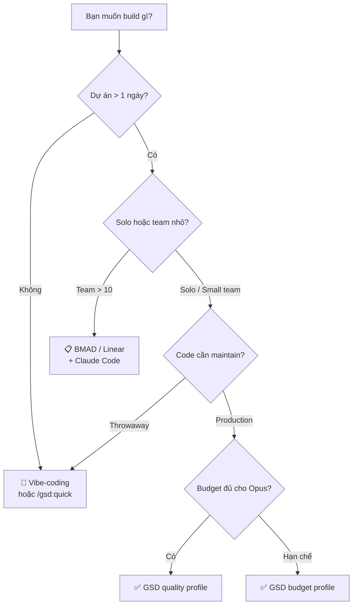

# Hướng dẫn Ra quyết định — GSD (Get Shit Done) v1.22

> [!NOTE]
> Đọc tài liệu này TRƯỚC khi quyết định áp dụng GSD. Đọc [[3-Research/Github/Get Shit Done/0. Overview]] nếu bạn chưa biết GSD là gì.

---

## 1. So sánh với Alternatives

### 1.1. Bảng So sánh Tổng quan

| Feature | **GSD** | **BMAD** | **SpecKit/OpenSpec** | **TaskMaster** | **Vibe-coding thuần** |
|---|---|---|---|---|---|
| **Triết lý** | Solo builders, no enterprise theater | Enterprise workflow simulation | Spec-first | Task management | Chat-and-fix |
| **Context Engineering** | ✅ Fresh 200K per task | ❌ | Partial | ❌ | ❌ |
| **Multi-Agent Orchestration** | ✅ 11+ agents chuyên biệt | ❌ | ❌ | ❌ | ❌ |
| **Wave Execution (song song)** | ✅ Dependency-aware | ❌ | ❌ | ❌ | ❌ |
| **Atomic Git Commits** | ✅ Per task | ❌ | ❌ | ❌ Thường 1 commit lớn | ❌ |
| **Plan Verification Loop** | ✅ 8 dimensions, max 3 iterations | ❌ | Partial | ❌ | ❌ |
| **UAT (User Acceptance Testing)** | ✅ Guided + auto-diagnosis | ❌ | ❌ | ❌ | ❌ Manual |
| **Brownfield Support** | ✅ `/gsd:map-codebase` | ❌ | Limited | ❌ | ❌ |
| **Multi-Runtime** | ✅ Claude Code, Gemini, OpenCode, Codex | Claude Code only | Claude Code | Claude Code | Bất kỳ |
| **Nyquist Validation** | ✅ Test coverage mapping | ❌ | ❌ | ❌ | ❌ |
| **Độ phức tạp setup** | 🟢 1 lệnh npx | 🔴 Nhiều bước | 🟡 Medium | 🟡 Medium | 🟢 Zero |
| **Learning Curve** | 🟡 Medium (học workflow) | 🔴 Cao (enterprise concepts) | 🟡 Medium | 🟢 Dễ | 🟢 Zero |
| **Giấy phép** | MIT (Free) | Varies | Varies | Varies | N/A |

### 1.2. So sánh Chi tiết

#### GSD vs BMAD

| Khía cạnh | GSD | BMAD |
|---|---|---|
| **Quy trình** | 4 bước lặp lại (Discuss → Plan → Execute → Verify) | Sprint ceremonies, story points, retrospectives |
| **Đối tượng** | Solo devs, small teams | Teams muốn mô phỏng enterprise |
| **Overhead** | Thấp — vài slash commands | Cao — nhiều nghi thức quản lý |
| **Khi nào chọn BMAD** | Khi team cần PR reviews, sprint tracking, stakeholder reporting |
| **Khi nào chọn GSD** | Khi muốn build nhanh, focus vào product, không cần enterprise theater |

#### GSD vs Vibe-coding (Chat-and-Fix)

| Khía cạnh | GSD | Vibe-coding |
|---|---|---|
| **Thời gian setup** | ~5 phút | 0 phút |
| **Chất lượng code ban đầu** | 🟡 Chậm hơn do Q&A/Research | 🟢 Nhanh |
| **Chất lượng code sau 1 tuần** | 🟢 Nhất quán, bền vững | 🔴 Suy giảm nghiêm trọng (context rot) |
| **Scale** | ✅ Xử lý được dự án lớn | ❌ Vỡ khi phức tạp tăng |
| **Debug** | Atomic commits → `git bisect` chính xác | 1 commit lớn → debug thủ công |
| **Khi nào vibe-code** | Prototype nhanh, throwaway code, experiment |
| **Khi nào dùng GSD** | Bất kỳ code nào bạn muốn maintain > 1 tuần |

---

## 2. Khi nào NÊN dùng GSD

### ✅ Use Cases Lý tưởng

| Scenario | Tại sao GSD phù hợp |
|---|---|
| **Solo developer** xây SaaS/product | Multi-agent = team ảo, plan verification = code review ảo |
| **Startup founder** cần MVP chất lượng | Spec-driven đảm bảo không scope creep, atomic commits cho rollback |
| **Dự án > 1 tuần phát triển** | Context engineering giữ chất lượng dài hạn |
| **Codebase phức tạp (brownfield)** | `/gsd:map-codebase` phân tích conventions trước khi thêm code mới |
| **Cần onboard AI vào workflow** | GSD đóng gói best practices cho AI-assisted development |
| **Dự án cần traceability** | Requirements → Plans → Commits → Verification — mọi thứ có audit trail |
| **Nhiều phiên làm việc** | STATE.md + resume-work giữ context xuyên sessions |

### ✅ Tín hiệu bạn NÊN dùng GSD

- [ ] AI bắt đầu "ngây ngô" sau 30-60 phút chat liên tục
- [ ] Code AI sinh ra ngày càng kém chất lượng theo thời gian
- [ ] Bạn phải nhắc lại context nhiều lần
- [ ] Dự án có > 5 files cần sửa đồng bộ
- [ ] Bạn muốn `git bisect` hoạt động hiệu quả

---

## 3. Khi nào KHÔNG nên dùng GSD

### ❌ Anti-Use-Cases

| Scenario | Tại sao GSD KHÔNG phù hợp | Nên dùng gì? |
|---|---|---|
| **Prototype/experiment dưới 1 ngày** | Overhead Q&A + research quá lớn so với benefit | Vibe-coding hoặc `/gsd:quick` |
| **Throwaway/demo code** | Không cần traceability, atomic commits | Chat trực tiếp với Claude |
| **Team > 10 người cần Jira integration** | GSD không có sprint tracking, board view | BMAD hoặc Linear + Claude |
| **Không dùng Claude Code** | GSD tối ưu cho Claude, các runtime khác là secondary | Workflow tool riêng cho tool đó |
| **Script/one-liner** | Quá nhỏ cho GSD workflow | Claude Code trực tiếp |
| **Learning/tutorial code** | GSD abstract quá nhiều — bạn không học được gì | Viết tay + Claude hỗ trợ |
| **Budget cực kỳ hạn chế** | Multi-agent = nhiều API calls = chi phí cao | Budget profile hoặc vibe-coding |

### ⚠️ Limitations cần biết

| Limitation | Mô tả | Workaround |
|---|---|---|
| **Claude-centric** | Tối ưu chủ yếu cho Claude Code; Gemini/OpenCode/Codex là secondary support | Dùng Claude Code cho best experience |
| **Learning curve** | Cần hiểu workflow 4 bước + slash commands | Đọc [[3-Research/Github/Get Shit Done/2. Playbook]] trước khi bắt đầu |
| **Token consumption** | Multi-agent = nhiều API calls, đặc biệt ở profile "quality" | Dùng `budget` profile, tắt research/plan_check |
| **No GUI** | Hoàn toàn CLI-based, không có dashboard | Dùng `/gsd:progress` thay dashboard |
| **No team collaboration** | Không có sharing, permissions, multi-user | Combine với Git PR workflow |
| **Phụ thuộc Anthropic ecosystem** | Claude models, Claude Code tool | Community ports cho OpenCode, Gemini |

---

## 4. Case Studies & Testimonials

### 4.1. Từ Community

> *"If you know clearly what you want, this WILL build it for you. No bs."*

> *"I've done SpecKit, OpenSpec and Taskmaster — this has produced the best results for me."*

> *"By far the most powerful addition to my Claude Code. Nothing over-engineered. Literally just gets shit done."*

### 4.2. Tổ chức Sử dụng

**Được tin dùng bởi kỹ sư tại:** Amazon, Google, Shopify, Webflow.

### 4.3. Metrics (từ community reports)

| Metric | Vibe-coding | GSD |
|---|---|---|
| Thời gian đến MVP | 🟢 Nhanh hơn ~30% | 🟡 Chậm hơn do setup |
| Code consistency sau 1 milestone | 🔴 Suy giảm 50-70% | 🟢 Duy trì >90% |
| Debug time khi có lỗi | 🔴 Cao (1 commit lớn) | 🟢 Thấp (git bisect per task) |
| Context window utilization | 🔴 100% → suy giảm | 🟢 30-40% (stable) |

---

## 5. Chi phí & Tài nguyên

### 5.1. Chi phí Trực tiếp

| Mục | Free? | Chi tiết |
|---|---|---|
| **GSD (software)** | ✅ MIT License, miễn phí | npm package |
| **Claude Code** | ❌ Trả phí | Claude Pro/Teams/Enterprise subscription |
| **API costs** | ❌ Phụ thuộc profile | Xem bảng bên dưới |

### 5.2. API Token Costs theo Profile

| Profile | Chi phí ước tính / phase | Khi nào dùng |
|---|---|---|
| **Quality** (Opus heavy) | $$$ — Cao nhất | Production code, critical features |
| **Balanced** (Opus planning only) | $$ — Vừa phải | Development bình thường (default) |
| **Budget** (Sonnet/Haiku) | $ — Thấp nhất | Prototyping, familiar domain |

> [!TIP]
> **Tiết kiệm token:** Tắt `workflow.research` và `workflow.plan_check` trong `/gsd:settings` cho domain quen thuộc. Giảm 40-60% token usage.

### 5.3. Hardware Requirements

| Yêu cầu | Mô tả |
|---|---|
| **OS** | Mac, Windows, Linux |
| **Node.js** | Để chạy `npx` installer |
| **Terminal** | Bất kỳ terminal app nào |
| **RAM/CPU** | Không đặc biệt — xử lý trên cloud |
| **Storage** | `.planning/` folder (~1-5MB per milestone) |

---

## 6. Migration Path

### 6.1. Từ Vibe-coding đến GSD

| Bước | Hành động |
|---|---|
| 1 | Cài đặt: `npx get-shit-done-cc@latest` |
| 2 | Map codebase hiện có: `/gsd:map-codebase` |
| 3 | Khởi tạo project: `/gsd:new-project` (focus on NEW features) |
| 4 | Bắt đầu workflow: Discuss → Plan → Execute → Verify |
| 5 | Dần dần apply GSD cho tất cả new features |

**Rủi ro migration:** Thấp — GSD không thay đổi code hiện tại, chỉ thêm `.planning/` folder.

### 6.2. Từ BMAD/SpecKit đến GSD

| Bước | Hành động |
|---|---|
| 1 | Export requirements hiện tại thành markdown |
| 2 | Cài GSD, chạy `/gsd:new-project --auto @requirements.md` |
| 3 | GSD sẽ tạo roadmap từ requirements đã export |
| 4 | Tiếp tục workflow GSD bình thường |

### 6.3. Từ GSD sang tool khác

GSD **không lock-in**:
- Tất cả artifacts là **Markdown** files trong `.planning/`
- Git history là **standard commits** — không có GSD-specific metadata
- Xóa `.planning/` → dự án trở về trạng thái bình thường

---

## 7. Roadmap & Tương lai

### 7.1. Community Health

| Metric | Giá trị (2026-03) |
|---|---|
| **GitHub Stars** | Đang tăng nhanh |
| **npm Downloads** | Hàng ngàn/tháng |
| **Releases** | 170+ releases (rất active) |
| **Latest Release** | v1.22.4 (2026-03-03) — 3 ngày trước |
| **Maintainer** | TÂCHES (active, responsive) |
| **Discord** | Community active, hỗ trợ nhanh |
| **License** | MIT — an toàn cho commercial use |

### 7.2. Tính năng Gần đây (v1.20 → v1.22)

| Version | Feature nổi bật |
|---|---|
| v1.20 | Research-phase standalone, phase assumptions preview |
| v1.21 | **Nyquist Validation** — test coverage mapping trước khi code |
| v1.22 | **Git Branching** strategies, Quick `--discuss`, retroactive validation |

### 7.3. Hướng Phát triển Dự kiến

- Mở rộng multi-runtime support (Gemini, Codex deeper integration)
- Sub-agent orchestration improvements
- Community-driven command extensions
- Potential GUI/dashboard companion

---

## 8. Ma trận Ra quyết định

### 8.1. Bạn nên dùng gì?

| Scenario | Recommendation | Lý do |
|---|---|---|
| Solo dev, dự án > 1 tuần | **✅ GSD** | Context engineering + multi-agent = team ảo |
| Prototype nhanh < 1 ngày | **💬 Vibe-coding** | Overhead GSD quá lớn cho scope nhỏ |
| Small fix / bug | **⚡ `/gsd:quick`** | GSD guarantees nhưng fast path |
| Team 5-10 người | **✅ GSD + Git PR** | GSD build, PR workflow cho review |
| Team > 10, cần sprint management | **📋 BMAD/Linear** | GSD thiếu team management features |
| Dự án critical, production | **✅ GSD (quality profile)** | Plan verification + Nyquist validation |
| Budget rất hạn chế | **✅ GSD (budget profile)** hoặc **💬 Vibe-coding** | Budget profile giảm 60-70% cost |
| Codebase lớn, brownfield | **✅ GSD** | `/gsd:map-codebase` phân tích toàn diện |
| Learning / tutorial | **💬 Vibe-coding** | GSD abstract quá nhiều cho mục đích học |

### 8.2. Flowchart Ra quyết định

---

## Xem thêm

- [[3-Research/Github/Get Shit Done/0. Overview]] — Tổng quan hệ thống GSD
- [[3-Research/Github/Get Shit Done/1. Architecture and Logic]] — Kiến trúc nội bộ và cơ chế hoạt động
- [[3-Research/Github/Get Shit Done/2. Playbook]] — Sổ tay vận hành thực chiến
