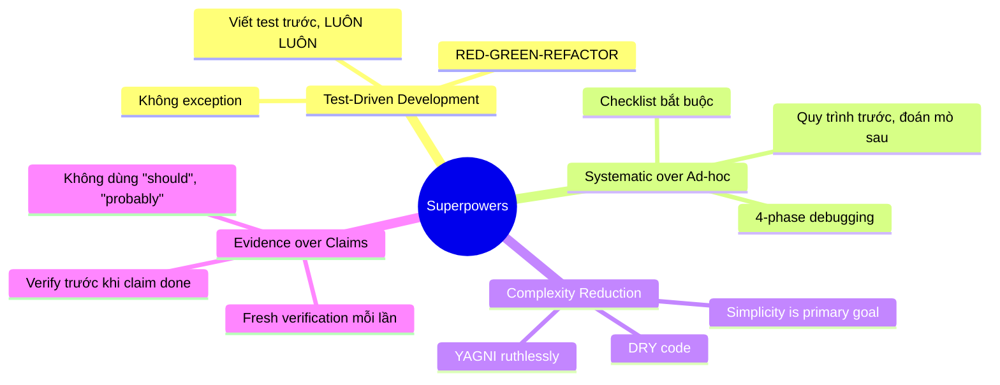
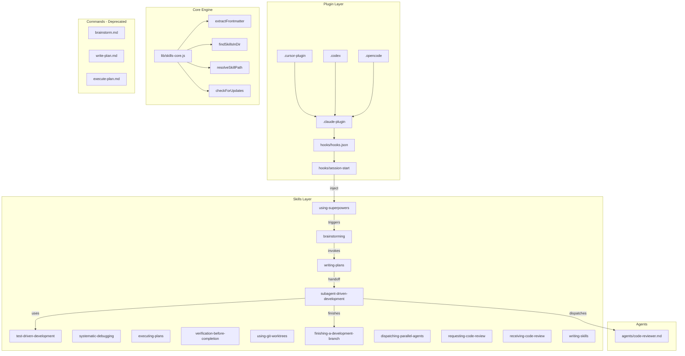
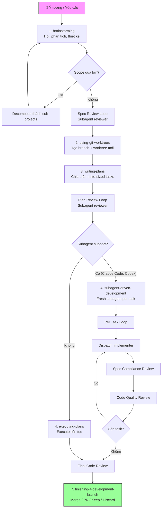

# Superpowers

## Repo là gì?

**Superpowers** là một **agentic skills framework** — bộ kỹ năng composable và phương pháp phát triển phần mềm hoàn chỉnh cho coding agents. Được tạo bởi **Jesse Vincent (obra)**, repo này cung cấp workflow từ brainstorming → planning → implementation → review → merge, tất cả tự động hóa thông qua hệ thống skills.

| Thông tin | Chi tiết |
|-----------|----------|
| **Tên** | Superpowers |
| **Tác giả** | Jesse Vincent ([@obra](https://github.com/obra)) |
| **Ngôn ngữ** | Shell, JavaScript, Markdown |
| **License** | MIT |
| **Stars** | ~76,280 ⭐ |
| **Phiên bản** | v5.0.0 (2026-03-09) |
| **Platforms** | Claude Code, Cursor, Codex, OpenCode |

## Vấn đề giải quyết

| Vấn đề | Mô tả | Cách Superpowers giải quyết |
|---------|--------|------------------------------|
| **Agent nhảy vào code ngay** | AI coding agents thường viết code ngay khi nhận yêu cầu, bỏ qua thiết kế | Skill `brainstorming` buộc phải hỏi, phân tích, thiết kế trước khi code |
| **Không có quy trình TDD** | Agent viết code trước, test sau (hoặc không test) | Skill `test-driven-development` enforce RED-GREEN-REFACTOR nghiêm ngặt |
| **Context pollution** | Agent càng làm lâu, context càng bẩn, output kém dần | `subagent-driven-development` — fresh subagent per task |
| **Thiếu code review** | Code được merge mà không ai review | Two-stage review: spec compliance → code quality |
| **Plan mơ hồ** | Implementation plan quá chung chung, thiếu file paths, thiếu code | Skill `writing-plans` yêu cầu exact paths, complete code, verification steps |
| **Debugging random** | Agent thử fix random thay vì tìm root cause | Skill `systematic-debugging` enforce 4-phase investigation |
| **Không verify trước khi claim** | Agent nói "done" mà chưa thực sự chạy test | Skill `verification-before-completion` — evidence before claims |

## Triết lý thiết kế



**4 nguyên tắc cốt lõi:**

1. **Test-Driven Development** — Viết test trước, luôn luôn. Không có exception.
2. **Systematic over Ad-hoc** — Quy trình over đoán mò. Process trước guessing.
3. **Complexity Reduction** — Đơn giản là mục tiêu chính. YAGNI triệt để.
4. **Evidence over Claims** — Verify trước khi tuyên bố thành công. Không "should work".

## Ai nên dùng?

| Đối tượng | Lý do |
|-----------|-------|
| **Developers dùng Claude Code** | Plugin marketplace chính thức, tích hợp liền mạch |
| **Developers dùng Cursor** | Hỗ trợ qua plugin marketplace |
| **Teams muốn AI coding có kỷ luật** | Enforce TDD, review, brainstorming tự động |
| **Solo developers** | Agent tự chạy hàng giờ mà không lệch plan |
| **Ai muốn viết custom skills** | Framework mở, có hướng dẫn `writing-skills` |

## Kiến trúc tổng quan



| Component | Vai trò |
|-----------|---------|
| `hooks/` | Session start hook — inject `using-superpowers` vào context |
| `lib/skills-core.js` | Core engine: parse frontmatter, resolve skills, check updates |
| `skills/` | 14 skills — brainstorming, TDD, debugging, planning, v.v. |
| `agents/` | Agent definitions (code-reviewer) |
| `commands/` | Slash commands (deprecated trong v5.0.0) |
| `docs/` | Documentation bổ sung, plans |
| `tests/` | Integration tests cho skills |
| `lib/brainstorm-server/` | WebSocket server cho visual brainstorming companion |

## Vòng đời / Workflow chính

Đây là workflow hoàn chỉnh từ ý tưởng đến merge code:



**Skills kích hoạt tự động** — agent tự check skill phù hợp trước MỌI task. Đây là mandatory workflows, không phải suggestions.

## Tính năng nổi bật

### 1. Subagent-Driven Development (SDD)
Fresh subagent cho mỗi task + two-stage review (spec compliance → code quality). Agent có thể tự chạy **hàng giờ** mà không lệch plan.

### 2. Skills tự kích hoạt
Quy tắc 1%: nếu có dù chỉ 1% khả năng skill áp dụng → **BẮT BUỘC** invoke skill. Không negotiable.

### 3. Brainstorming bắt buộc
Mọi project đều phải qua brainstorming — dù "simple". Anti-pattern: "This is too simple to need a design" bị chặn triệt để.

### 4. Visual Brainstorming Companion (v5.0.0)
Browser-based companion cho brainstorming sessions — hiển thị mockups, diagrams, comparisons bên cạnh conversation terminal.

### 5. Document Review System (v5.0.0)
Automated review loops cho spec và plan documents bằng subagent dispatch. Repeat đến khi approved hoặc escalate sau 5 iterations.

### 6. Implementer Status Protocol
Subagents báo cáo: `DONE`, `DONE_WITH_CONCERNS`, `BLOCKED`, `NEEDS_CONTEXT`. Controller xử lý phù hợp mỗi status.

### 7. Model Selection
Hướng dẫn chọn model theo task:
- **Cheap model** — mechanical tasks, 1-2 files
- **Standard model** — integration, multi-file
- **Most capable** — architecture, design, review

### 8. Instruction Priority Hierarchy
```
1. User instructions (CLAUDE.md, AGENTS.md) — cao nhất
2. Superpowers skills
3. Default system prompt — thấp nhất
```

## So sánh

| Feature | Superpowers | BMAD Method | Custom CLAUDE.md |
|---------|-------------|-------------|------------------|
| **Skills composable** | ✅ 14 skills | ✅ 9+ agents | ❌ Static rules |
| **TDD enforcement** | ✅ Strict, Iron Law | ⚠️ Optional | ❌ Manual |
| **Subagent workflow** | ✅ SDD + review | ✅ Multi-agent | ❌ Single context |
| **Auto-trigger** | ✅ 1% rule | ⚠️ Phase-based | ❌ Explicit only |
| **Multi-platform** | ✅ CC, Cursor, Codex, OpenCode | ⚠️ CC, Cursor | ⚠️ CC only |
| **Document review** | ✅ Automated loops | ⚠️ Manual | ❌ None |
| **Brainstorm + Design** | ✅ Mandatory | ✅ Analysis phase | ❌ Optional |

## Điểm mới v5.0.0 (2026-03-09)

| Loại | Thay đổi |
|------|----------|
| **Breaking** | Specs → `docs/superpowers/specs/`, Plans → `docs/superpowers/plans/` |
| **Breaking** | SDD bắt buộc trên platform hỗ trợ subagent |
| **Breaking** | `executing-plans` không còn batch, chạy liên tục |
| **Breaking** | Slash commands deprecated (`/brainstorm`, `/write-plan`, `/execute-plan`) |
| **New** | Visual brainstorming companion (browser-based, WebSocket) |
| **New** | Document review system (spec + plan reviewers với subagent) |
| **New** | Architecture guidance xuyên suốt pipeline |
| **New** | Model selection guidance cho SDD |
| **New** | Implementer status protocol (DONE, BLOCKED, NEEDS_CONTEXT, DONE_WITH_CONCERNS) |
| **Improved** | Instruction priority hierarchy (User > Skills > System) |
| **Improved** | SUBAGENT-STOP gate cho subagents |
| **Improved** | Multi-platform improvements (Codex, OpenCode) |

## Xem thêm

- [[3-Research/Github/superpowers/1. Architecture and Logic]] — Data flow chi tiết, core modules, cơ chế skills
- [[3-Research/Github/superpowers/2. Playbook]] — Cài đặt, Day 1 workflow, cheat sheet, troubleshooting
