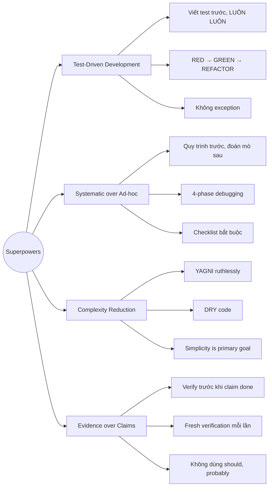
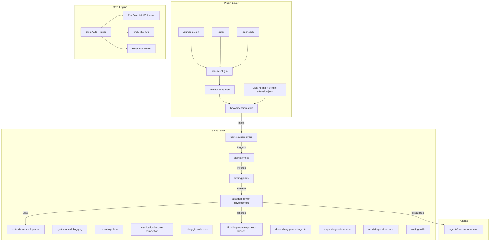
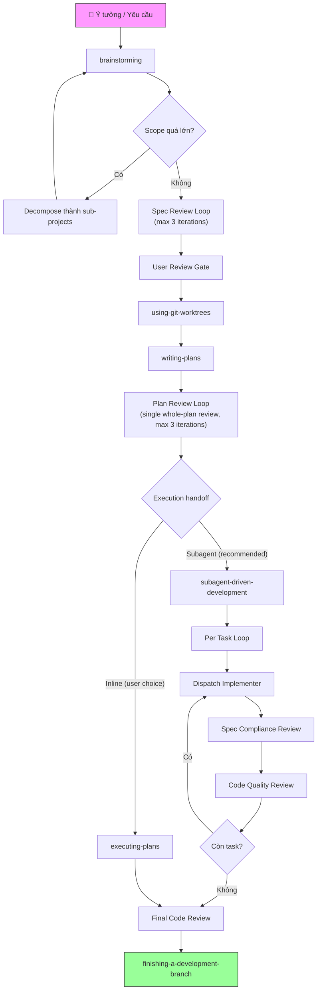

# Superpowers

## Repo là gì?

**Superpowers** là một **agentic skills framework** — bộ kỹ năng composable và phương pháp phát triển phần mềm hoàn chỉnh cho coding agents. Được tạo bởi **Jesse Vincent (obra)**, repo này cung cấp workflow từ brainstorming → planning → implementation → review → merge, tất cả tự động hóa thông qua hệ thống skills.

| Thông tin | Chi tiết |
|-----------|----------|
| **Tên** | Superpowers |
| **Tác giả** | Jesse Vincent ([@obra](https://github.com/obra)) |
| **Ngôn ngữ** | Shell, JavaScript, Markdown |
| **License** | MIT |
| **Stars** | ~76,280 ⭐ |
| **Phiên bản** | v5.0.5 (2026-03-17) |
| **Platforms** | Claude Code, Cursor, Codex, OpenCode, Gemini CLI |

## Vấn đề giải quyết

| Vấn đề | Mô tả | Cách Superpowers giải quyết |
|---------|--------|------------------------------|
| **Agent nhảy vào code ngay** | AI coding agents thường viết code ngay khi nhận yêu cầu, bỏ qua thiết kế | Skill `brainstorming` buộc phải hỏi, phân tích, thiết kế trước khi code |
| **Không có quy trình TDD** | Agent viết code trước, test sau (hoặc không test) | Skill `test-driven-development` enforce RED-GREEN-REFACTOR nghiêm ngặt |
| **Context pollution** | Agent càng làm lâu, context càng bẩn, output kém dần | `subagent-driven-development` — fresh subagent per task |
| **Thiếu code review** | Code được merge mà không ai review | Two-stage review: spec compliance → code quality |
| **Plan mơ hồ** | Implementation plan quá chung chung, thiếu file paths, thiếu code | Skill `writing-plans` yêu cầu exact paths, complete code, verification steps |
| **Debugging random** | Agent thử fix random thay vì tìm root cause | Skill `systematic-debugging` enforce 4-phase investigation |
| **Không verify trước khi claim** | Agent nói "done" mà chưa thực sự chạy test | Skill `verification-before-completion` — evidence before claims |

## Triết lý thiết kế



**4 nguyên tắc cốt lõi:**

1. **Test-Driven Development** — Viết test trước, luôn luôn. Không có exception.
2. **Systematic over Ad-hoc** — Quy trình over đoán mò. Process trước guessing.
3. **Complexity Reduction** — Đơn giản là mục tiêu chính. YAGNI triệt để.
4. **Evidence over Claims** — Verify trước khi tuyên bố thành công. Không "should work".

## Ai nên dùng?

| Đối tượng | Lý do |
|-----------|-------|
| **Developers dùng Claude Code** | Plugin marketplace chính thức, tích hợp liền mạch |
| **Developers dùng Cursor** | Hỗ trợ qua plugin marketplace |
| **Developers dùng Gemini CLI** | Native extension support (v5.0.1+) |
| **Teams muốn AI coding có kỷ luật** | Enforce TDD, review, brainstorming tự động |
| **Solo developers** | Agent tự chạy hàng giờ mà không lệch plan |
| **Ai muốn viết custom skills** | Framework mở, có hướng dẫn `writing-skills` |

## Kiến trúc tổng quan



| Component | Vai trò |
|-----------|---------|
| `hooks/` | Session start hook — inject `using-superpowers` vào context |
| `skills/` | 14 skills — brainstorming, TDD, debugging, planning, v.v. |
| `agents/` | Agent definitions (code-reviewer) |
| `commands/` | Slash commands (deprecated trong v5.0.0) |
| `docs/` | Documentation bổ sung, plans |
| `tests/` | Integration tests cho skills |
| `skills/brainstorming/scripts/` | Zero-dependency brainstorm server (v5.0.2) |
| `GEMINI.md` + `gemini-extension.json` | Gemini CLI native extension (v5.0.1) |

## Vòng đời / Workflow chính

Đây là workflow hoàn chỉnh từ ý tưởng đến merge code:



**Skills kích hoạt tự động** — agent tự check skill phù hợp trước MỌI task. Đây là mandatory workflows, không phải suggestions.

## Tính năng nổi bật

### 1. Subagent-Driven Development (SDD)
Fresh subagent cho mỗi task + two-stage review (spec compliance → code quality). Agent có thể tự chạy **hàng giờ** mà không lệch plan.

**v5.0.5:** SDD không còn bắt buộc — user được chọn giữa SDD (recommended) và inline execution.

### 2. Skills tự kích hoạt
Quy tắc 1%: nếu có dù chỉ 1% khả năng skill áp dụng → **BẮT BUỘC** invoke skill. Không negotiable.

### 3. Brainstorming bắt buộc
Mọi project đều phải qua brainstorming — dù "simple". Anti-pattern: "This is too simple to need a design" bị chặn triệt để.

### 4. Visual Brainstorming Companion (v5.0.0)
Browser-based companion cho brainstorming sessions — hiển thị mockups, diagrams, comparisons bên cạnh conversation terminal.

**v5.0.2:** Server viết lại từ zero — không cần Express/Chokidar/WebSocket dependencies, hoàn toàn self-contained bằng built-in Node.js modules.

### 5. Document Review System (v5.0.0, refined v5.0.4)
Automated review loops cho spec và plan documents bằng subagent dispatch.

**v5.0.4 refinements:**
- Single whole-plan review thay vì chunk-by-chunk
- Max iterations giảm 5 → 3
- Reviewer checklists streamlined (spec: 7→5, plan: 7→4 categories)
- "Calibration" section: chỉ flag issues gây real problems, không blocking vì formatting/stylistic preferences

### 6. Implementer Status Protocol
Subagents báo cáo: `DONE`, `DONE_WITH_CONCERNS`, `BLOCKED`, `NEEDS_CONTEXT`. Controller xử lý phù hợp mỗi status.

### 7. Model Selection
Hướng dẫn chọn model theo task:
- **Cheap model** — mechanical tasks, 1-2 files
- **Standard model** — integration, multi-file
- **Most capable** — architecture, design, review

### 8. Instruction Priority Hierarchy
```
1. User instructions (CLAUDE.md, AGENTS.md) — cao nhất
2. Superpowers skills
3. Default system prompt — thấp nhất
```

### 9. Gemini CLI Native Extension (NEW v5.0.1)
- `gemini-extension.json` + `GEMINI.md` at repo root
- Tool mapping table: Claude Code → Gemini CLI equivalents
- Documents Gemini CLI limitations: no subagent support → falls back to `executing-plans`

### 10. Subagent Context Isolation (NEW v5.0.2)
Tất cả 5 delegation skills (brainstorming, dispatching-parallel-agents, requesting-code-review, SDD, writing-plans) include context isolation principle — subagents receive ONLY context they need.

## So sánh

| Feature | Superpowers v5.0.5 | BMAD Method v6.2 | GSD v1.26 | Custom CLAUDE.md |
|---------|-------------|-------------|-----------|------------------|
| **Skills composable** | ✅ 14 skills | ✅ 44 skills | ✅ 42 commands | ❌ Static rules |
| **TDD enforcement** | ✅ Strict, Iron Law | ⚠️ Optional (TEA) | ❌ | ❌ Manual |
| **Subagent workflow** | ✅ SDD + review | ✅ Multi-agent | ✅ 16 agents | ❌ Single context |
| **Auto-trigger** | ✅ 1% rule | ⚠️ Phase-based | ⚠️ Command-based | ❌ Explicit only |
| **Multi-platform** | ✅ CC, Cursor, Codex, OpenCode, Gemini | ✅ 20+ platforms | ✅ 7 runtimes | ⚠️ CC only |
| **Document review** | ✅ Automated loops (refined v5.0.4) | ❌ | ✅ 8-dim verification | ❌ |
| **Visual brainstorming** | ✅ Browser companion (zero-dep v5.0.2) | ❌ | ❌ | ❌ |
| **Debugging framework** | ✅ 4-phase systematic | ❌ | ✅ Persistent debug KB | ❌ |
| **Context engineering** | ✅ Fresh subagent per task | Partial | ✅ Fresh 200K per task | ❌ |

## Điểm mới v5.0.1 – v5.0.5 (2026-03)

| Version | Date | Highlights |
|---------|------|------------|
| **v5.0.5** | 2026-03-17 | 🐛 Brainstorm server ESM fix (server.js→server.cjs for Node 22+), Windows PID fix, stop-server reliability. 🔄 Execution handoff restored: user chooses SDD vs inline (SDD no longer mandatory) |
| **v5.0.4** | 2026-03-16 | ⚡ Review loop refinements: single whole-plan review, max iterations 5→3, streamlined checklists (spec 7→5, plan 7→4), "Calibration" section. OpenCode one-line plugin install + npm package |
| **v5.0.3** | 2026-03-15 | 🎮 Cursor hooks support (hooks-cursor.json, camelCase). SessionStart no longer fires on `--resume`. Multiple cross-platform fixes (Bash 5.3+, POSIX, portable shebangs, Windows brainstorm) |
| **v5.0.2** | 2026-03-11 | 🏗️ Zero-dependency brainstorm server (~1200 lines vendored deps removed, pure Node.js). Server reliability (30min idle exit, owner PID tracking, liveness check). Subagent context isolation across 5 skills |
| **v5.0.1** | 2026-03-10 | 🆕 **Gemini CLI extension** (gemini-extension.json + GEMINI.md + tool mapping). Brainstorm server moved to agentskills.io spec (lib/ → skills/brainstorming/scripts/). Multi-platform brainstorm launch. Windows/Linux hooks fixes. User review gate added. `lib/skills-core.js` removed |

## Xem thêm

- [1. Architecture and Logic](./1. Architecture and Logic.md) — Data flow chi tiết, core modules, cơ chế skills
- [2. Playbook](./2. Playbook.md) — Cài đặt, Day 1 workflow, cheat sheet, troubleshooting
- [3. Decision Guide](./3. Decision Guide.md) — So sánh, use cases, chi phí, và hướng dẫn ra quyết định
