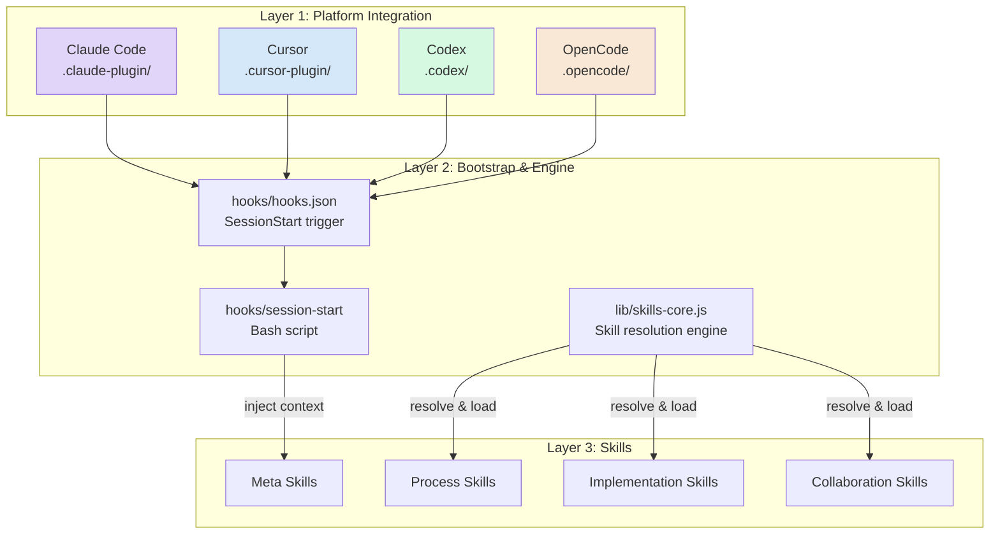
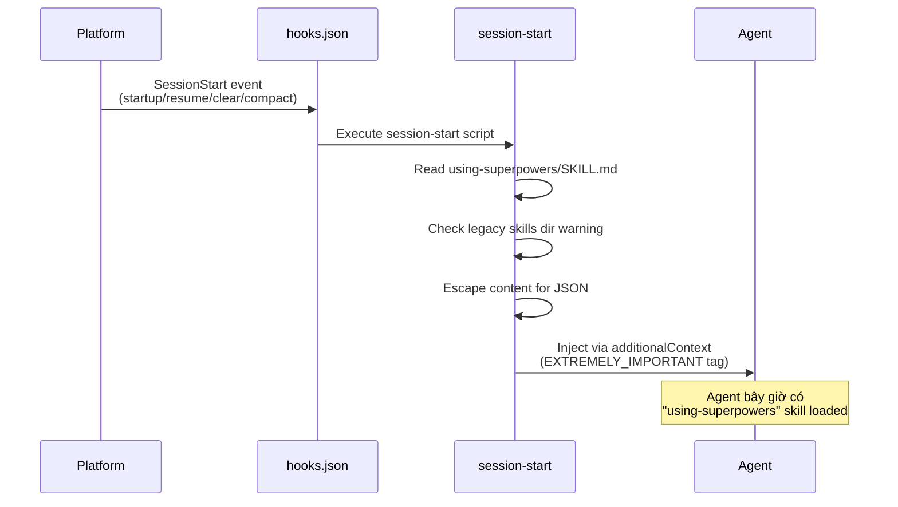
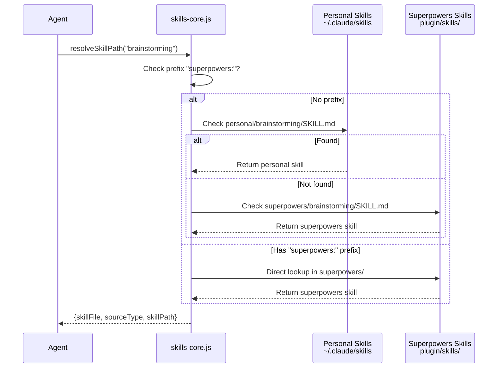
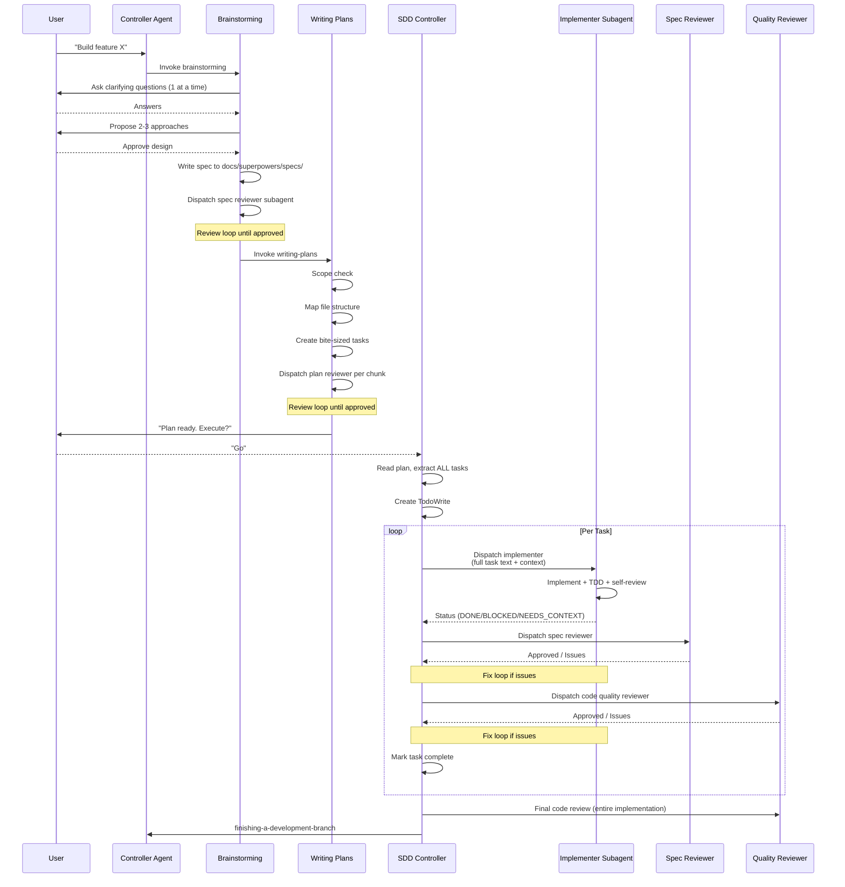
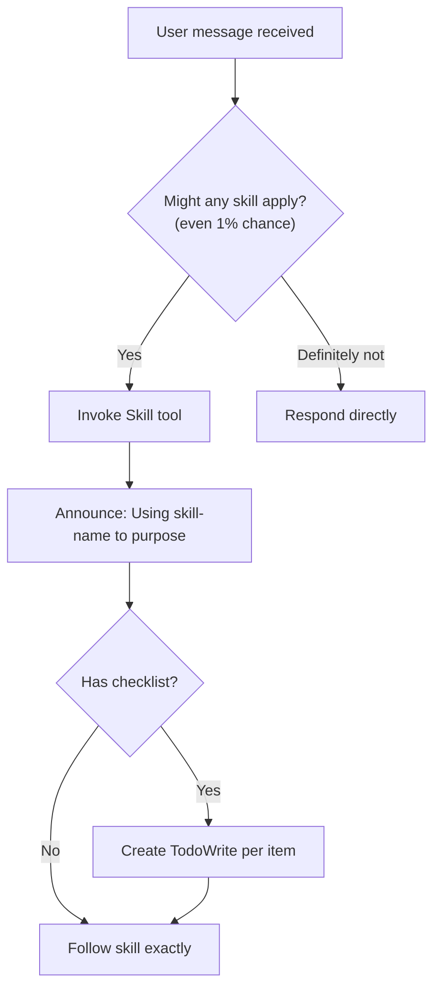
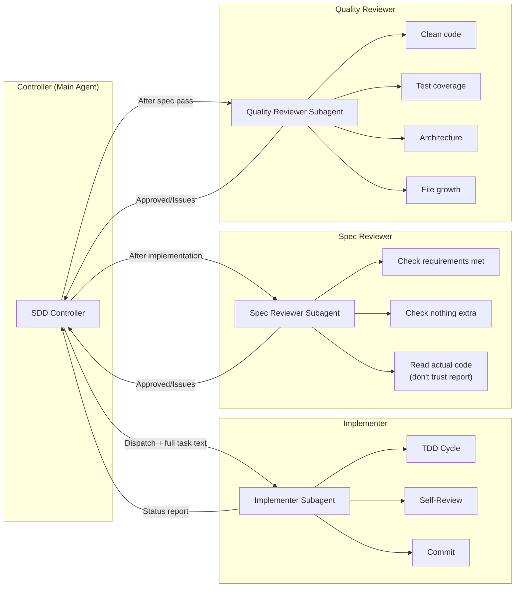
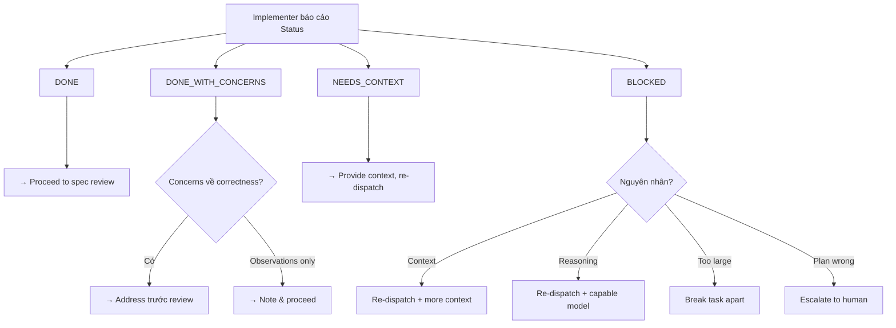
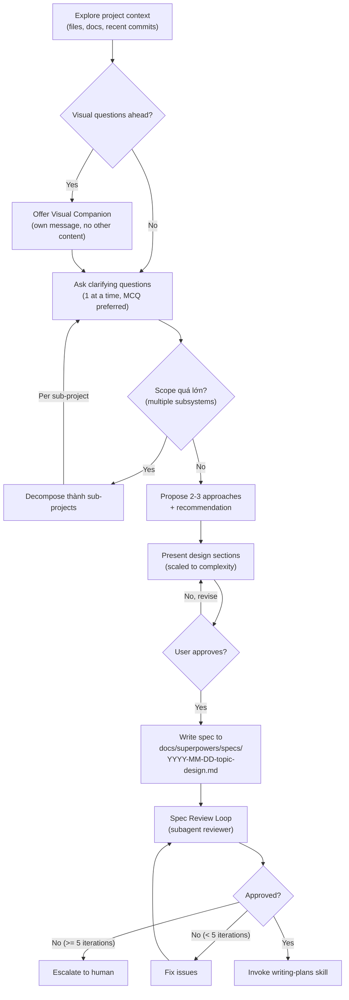
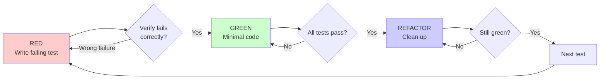

# Superpowers — Architecture and Logic

## Mô hình kiến trúc tổng thể

Superpowers hoạt động theo kiến trúc **3-layer**: Plugin Layer → Core Engine → Skills Layer. Mỗi layer có trách nhiệm rõ ràng.



### Layer 1: Platform Integration

Mỗi platform có folder riêng với cấu hình tương thích:

| Platform | Folder | Cách cài đặt |
|----------|--------|---------------|
| Claude Code | `.claude-plugin/` | `/plugin install superpowers` |
| Cursor | `.cursor-plugin/` | `/plugin-add superpowers` |
| Codex | `.codex/` | Fetch INSTALL.md instructions |
| OpenCode | `.opencode/` | Fetch INSTALL.md instructions |

### Layer 2: Bootstrap & Engine

**Session Start Hook:**
```
SessionStart event → hooks.json matcher → session-start bash script
→ Đọc using-superpowers/SKILL.md → Inject vào agent context
```

**Skills Core Engine** (`lib/skills-core.js`):

| Function | Vai trò |
|----------|---------|
| `extractFrontmatter()` | Parse YAML frontmatter từ SKILL.md (name, description) |
| `findSkillsInDir()` | Tìm tất cả SKILL.md recursively (max depth 3) |
| `resolveSkillPath()` | Resolve skill name → file path, hỗ trợ namespacing & shadowing |
| `checkForUpdates()` | Git fetch + check nếu behind remote (3s timeout) |
| `stripFrontmatter()` | Bỏ YAML frontmatter, trả về pure content |

### Layer 3: Skills

14 skills chia thành 4 nhóm:

| Nhóm | Skills | Vai trò |
|------|--------|---------|
| **Meta** | `using-superpowers`, `writing-skills` | Hệ thống skill, cách tạo skill mới |
| **Process** | `brainstorming`, `writing-plans`, `systematic-debugging` | Quy trình thiết kế, planning, debugging |
| **Implementation** | `subagent-driven-development`, `executing-plans`, `test-driven-development` | Thực thi code với TDD |
| **Collaboration** | `using-git-worktrees`, `finishing-a-development-branch`, `requesting-code-review`, `receiving-code-review`, `dispatching-parallel-agents`, `verification-before-completion` | Git, review, verify |

## Data Flow chi tiết

### Flow 1: Session Bootstrap



**Chi tiết session-start script:**

1. Xác định `PLUGIN_ROOT` từ script location
2. Check legacy `~/.config/superpowers/skills` → build warning nếu tồn tại
3. Đọc `skills/using-superpowers/SKILL.md`
4. Escape content cho JSON (backslash, quotes, newlines, tabs)
5. Output JSON với 2 shapes cho compatibility:
   - `additional_context` (Cursor hooks)
   - `hookSpecificOutput.additionalContext` (Claude hooks)

### Flow 2: Skill Resolution



**Shadowing mechanism:** Personal skills override superpowers skills (cùng tên). Prefix `superpowers:` để force dùng superpowers version.

### Flow 3: Complete Development Workflow



## Core Modules / Components

### Skill Anatomy

Mỗi skill là một folder với cấu trúc chuẩn:

```
skills/
  skill-name/
    SKILL.md              # Main reference (required)
    supporting-file.*     # Chỉ khi cần (heavy reference, reusable tools)
```

**SKILL.md Structure:**

```yaml
---
name: skill-name
description: "Use when [triggering conditions] - [context]"
---
```

| Phần | Nội dung | Bắt buộc |
|------|----------|----------|
| **Frontmatter** | `name` + `description` (max 1024 chars tổng) | ✅ |
| **Overview** | Core principle 1-2 câu | ✅ |
| **When to Use** | Flowchart + bullet points | ✅ |
| **Process / Core Pattern** | Steps, DOT flowcharts | ✅ |
| **Red Flags** | Dấu hiệu cần STOP | Recommended |
| **Common Mistakes** | Anti-patterns | Recommended |
| **Integration** | Link tới skills liên quan | Recommended |

### Skill Discovery & Triggering



**Priority khi nhiều skills áp dụng:**

1. **Process skills trước** — brainstorming, debugging (xác định HOW)
2. **Implementation skills sau** — frontend-design, mcp-builder (guide execution)

### Subagent Architecture

**SDD Controller** quản lý 3 loại subagent:



**Prompt templates trong `skills/subagent-driven-development/`:**

| Template | Vai trò |
|----------|---------|
| `implementer-prompt.md` | Self-review checklist, khuyến khích hỏi |
| `spec-reviewer-prompt.md` | Skeptical verification, đọc code thật |
| `code-quality-reviewer-prompt.md` | Clean code, test coverage, architecture |

### Implementer Status Protocol



### Model Selection Strategy

| Task Type | Model | Ví dụ |
|-----------|-------|-------|
| **Mechanical** | Cheap/Fast | Isolated functions, 1-2 files, clear spec |
| **Integration** | Standard | Multi-file coordination, pattern matching |
| **Architecture** | Most Capable | Design judgment, broad codebase understanding |

## Cơ chế hoạt động nội bộ

### Brainstorming Process



**HARD-GATE:** Không được code BẤT CỨ gì trước khi design approved. Áp dụng cho MỌI project bất kể "simple" đến đâu.

### Writing Plans Process

Mỗi task trong plan phải có:

| Yếu tố | Yêu cầu |
|---------|----------|
| **File paths** | Exact paths: `src/auth/validator.ts` |
| **Code** | Complete code trong plan, không generic |
| **Test** | Failing test trước, green test sau |
| **Commands** | Exact commands + expected output |
| **Granularity** | 2-5 phút per step |
| **Checkpoint syntax** | `- [ ] **Step N:**` cho progress tracking |

**Plan Review Loop:** Sau mỗi chunk → dispatch plan-document-reviewer → fix → re-review → approved/escalate.

### TDD Iron Law

```
NO PRODUCTION CODE WITHOUT A FAILING TEST FIRST
```



**Viết code trước test? → DELETE. Start over. Không exceptions:**
- Không giữ làm "reference"
- Không "adapt" khi viết test
- Không nhìn vào
- Delete là delete

### Systematic Debugging — 4 Phases

| Phase | Tên | Hoạt động |
|-------|-----|-----------|
| **1** | Root Cause Investigation | Đọc error messages, reproduce, check recent changes, trace data flow |
| **2** | Pattern Analysis | Tìm working examples, compare, identify differences |
| **3** | Hypothesis and Testing | Form single hypothesis, test minimally, one variable at a time |
| **4** | Implementation | Fix at root cause, not symptom |

**Iron Law:** `NO FIXES WITHOUT ROOT CAUSE INVESTIGATION FIRST`

**Supporting techniques (bundled):**

| File | Technique |
|------|-----------|
| `root-cause-tracing.md` | Trace bugs backward through call stack |
| `defense-in-depth.md` | Add validation at multiple layers |
| `condition-based-waiting.md` | Replace arbitrary timeouts with condition polling |
| `find-polluter.sh` | Bisection script tìm test gây pollution |

## Configuration / API

### hooks.json

```json
{
  "hooks": {
    "SessionStart": [
      {
        "matcher": "startup|resume|clear|compact",
        "hooks": [
          {
            "type": "command",
            "command": "'${CLAUDE_PLUGIN_ROOT}/hooks/run-hook.cmd' session-start",
            "async": false
          }
        ]
      }
    ]
  }
}
```

### Skill Frontmatter

| Field | Format | Max | Lưu ý |
|-------|--------|-----|-------|
| `name` | kebab-case | N/A | Letters, numbers, hyphens only |
| `description` | Free text | 500 chars recommended, 1024 max total | "Use when..." — chỉ triggering conditions, không summarize workflow |

### SKILL.md Description Rules — Claude Search Optimization (CSO)

| Rule | Lý do |
|------|-------|
| Start với "Use when..." | Focus triggering conditions |
| Không summarize workflow | "Description Trap" — Claude follow description thay vì đọc flowchart |
| Include symptoms & contexts | Giúp agent discover skill đúng lúc |
| Max ~500 chars | Token efficiency |

### File Locations (v5.0.0)

| Content | Path |
|---------|------|
| Specs (brainstorming output) | `docs/superpowers/specs/YYYY-MM-DD-<topic>-design.md` |
| Plans (writing-plans output) | `docs/superpowers/plans/YYYY-MM-DD-<feature-name>.md` |
| Personal skills (Claude Code) | `~/.claude/skills/` |
| Personal skills (Codex) | `~/.agents/skills/` |
| Worktrees | Project-local `.worktrees/` hoặc `~/.config/superpowers/worktrees` |

## Error Handling / Recovery

| Vấn đề | Giải pháp |
|---------|-----------|
| Implementer BLOCKED | Assess: context? → provide more. Reasoning? → upgrade model. Too large? → break apart. Plan wrong? → escalate |
| Spec reviewer finds issues | Implementer (same subagent) fixes → reviewer reviews again → loop |
| Review loop > 5 iterations | Escalate to human |
| Tests fail before finishing branch | STOP. Cannot proceed to merge/PR until tests pass |
| Agent claims done without evidence | `verification-before-completion` blocks — run command, read output, THEN claim |
| Code written before tests | DELETE code. Start over with TDD. No exceptions |
| Multiple subagents conflict | Never dispatch parallel implementation subagents (conflicts) |
| Legacy skills dir exists | Warning injected vào session start |
| Network down during update check | `checkForUpdates()` returns false (3s timeout, don't block) |

## Security

| Aspect | Implementation |
|--------|----------------|
| **Instruction Priority** | User instructions > Skills > System prompt. User luôn kiểm soát |
| **SUBAGENT-STOP** | Subagents dispatched cho specific tasks skip using-superpowers skill |
| **Worktree Isolation** | Code chạy trong git worktree riêng, không ảnh hưởng main branch |
| **Discard Confirmation** | Option 4 (discard work) yêu cầu gõ "discard" để confirm |
| **Git Safety** | Không start implementation trên main/master mà không có explicit consent |

## Xem thêm

- [[3-Research/Github/superpowers/0. Overview]] — Tổng quan, triết lý, so sánh
- [[3-Research/Github/superpowers/2. Playbook]] — Cài đặt, Day 1 workflow, cheat sheet, troubleshooting
