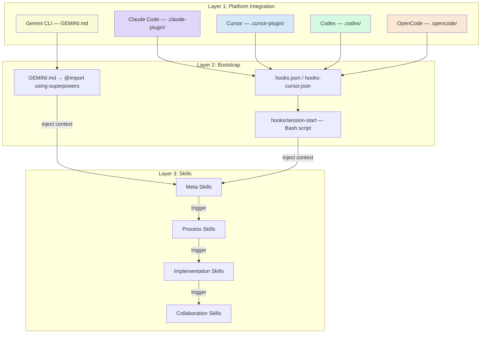
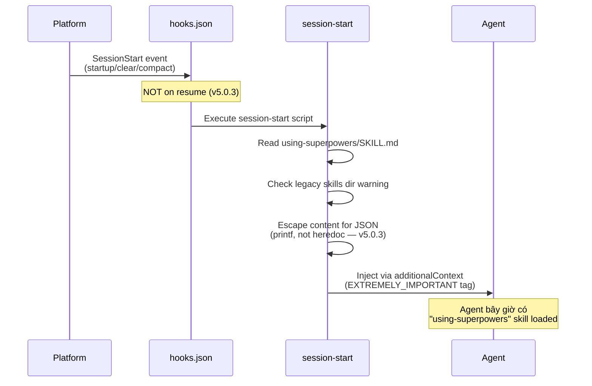
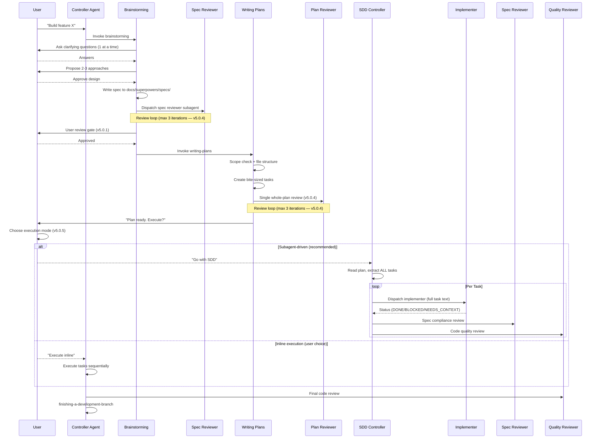
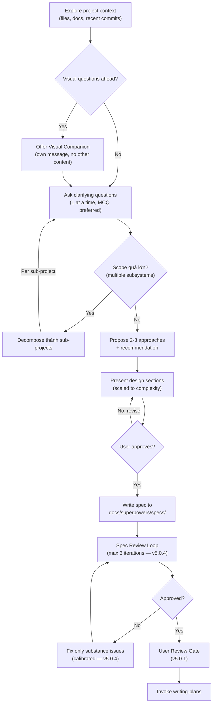
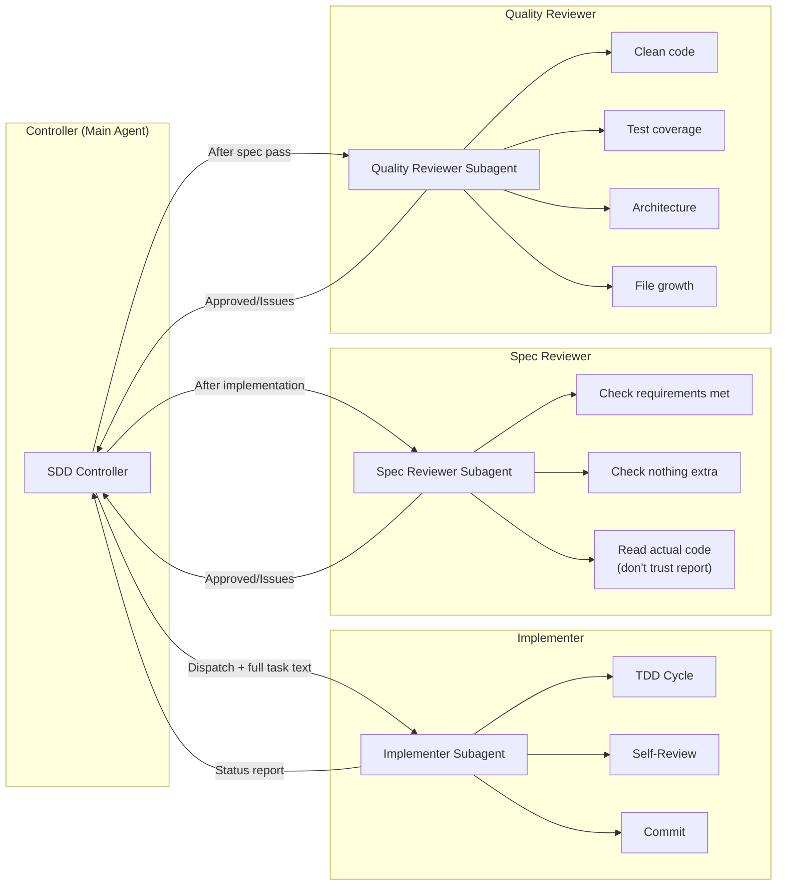
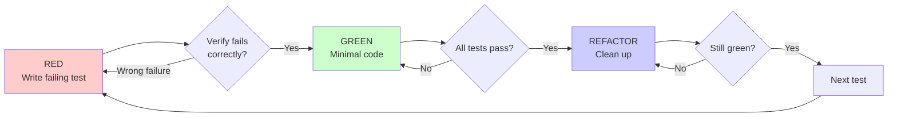
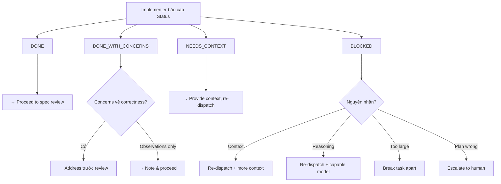

# Superpowers — Architecture and Logic

## Mô hình kiến trúc tổng thể

Superpowers hoạt động theo kiến trúc **3-layer**: Plugin Layer → Bootstrap → Skills Layer. Mỗi layer có trách nhiệm rõ ràng.



### Layer 1: Platform Integration

| Platform | Folder | Cách cài đặt | Ghi chú |
|----------|--------|---------------|---------|
| Claude Code | `.claude-plugin/` | `/plugin install superpowers` (marketplace) | Runtime chính |
| Cursor | `.cursor-plugin/` | `/add-plugin superpowers` | camelCase hooks format (v5.0.3) |
| Codex | `.codex/` | Fetch INSTALL.md instructions | `gsd-autonomous` skill |
| OpenCode | `.opencode/` | One-line `opencode.json` (v5.0.4) | npm package install |
| Gemini CLI | Root-level | `gemini-extension.json` + `GEMINI.md` | No subagent → `executing-plans` fallback (v5.0.1) |

### Layer 2: Bootstrap

**Session Start Hook:**
```
SessionStart event (startup|clear|compact) → hooks.json → session-start bash script
→ Read using-superpowers/SKILL.md → Inject via additionalContext
```

**v5.0.3:** Hook no longer fires on `--resume` (already has context in conversation history).

**v5.0.2:** `lib/skills-core.js` removed. Brainstorm server moved to `skills/brainstorming/scripts/` per agentskills.io spec.

**Hook output (dual-emit for compatibility):**
- `additional_context` (Cursor hooks)
- `hookSpecificOutput.additionalContext` (Claude Code hooks)

### Layer 3: Skills

14 skills chia thành 4 nhóm:

| Nhóm | Skills | Vai trò |
|------|--------|---------|
| **Meta** | `using-superpowers`, `writing-skills` | Hệ thống skill, cách tạo skill mới |
| **Process** | `brainstorming`, `writing-plans`, `systematic-debugging` | Quy trình thiết kế, planning, debugging |
| **Implementation** | `subagent-driven-development`, `executing-plans`, `test-driven-development` | Thực thi code với TDD |
| **Collaboration** | `using-git-worktrees`, `finishing-a-development-branch`, `requesting-code-review`, `receiving-code-review`, `dispatching-parallel-agents`, `verification-before-completion` | Git, review, verify |

## Data Flow chi tiết

### Flow 1: Session Bootstrap



### Flow 2: Complete Development Workflow (v5.0.5)



### Flow 3: Brainstorming with Visual Companion



## Core Modules / Components

### Repository Structure (v5.0.5)

```
superpowers/
├── .claude-plugin/              # Claude Code plugin manifest
├── .cursor-plugin/              # Cursor plugin + hooks-cursor.json (v5.0.3)
├── .codex/                      # Codex support
├── .opencode/                   # OpenCode plugin + npm package (v5.0.4)
│   ├── INSTALL.md
│   └── plugins/
├── GEMINI.md                    # Gemini CLI context (v5.0.1)
├── gemini-extension.json        # Gemini CLI extension manifest (v5.0.1)
├── hooks/
│   ├── hooks.json               # Claude Code hooks (SessionStart)
│   ├── hooks-cursor.json        # Cursor hooks (camelCase — v5.0.3)
│   └── session-start            # Bootstrap script (extensionless — portable)
├── skills/
│   ├── brainstorming/
│   │   ├── SKILL.md
│   │   ├── visual-companion.md
│   │   ├── spec-document-reviewer-prompt.md
│   │   └── scripts/             # Zero-dep brainstorm server (v5.0.2)
│   │       ├── server.cjs       # Was server.js (v5.0.5 ESM fix)
│   │       ├── start-server.sh
│   │       └── stop-server.sh
│   ├── subagent-driven-development/
│   │   ├── SKILL.md
│   │   ├── implementer-prompt.md
│   │   ├── spec-reviewer-prompt.md
│   │   └── code-quality-reviewer-prompt.md
│   ├── systematic-debugging/
│   │   ├── SKILL.md
│   │   ├── root-cause-tracing.md
│   │   ├── defense-in-depth.md
│   │   ├── condition-based-waiting.md
│   │   └── find-polluter.sh
│   ├── test-driven-development/
│   │   ├── SKILL.md
│   │   └── testing-anti-patterns.md
│   ├── writing-plans/
│   │   ├── SKILL.md
│   │   └── plan-document-reviewer-prompt.md
│   ├── using-superpowers/
│   │   ├── SKILL.md
│   │   └── references/
│   │       ├── codex-tools.md
│   │       └── gemini-tools.md   # Gemini tool mapping (v5.0.1)
│   └── ... (8 more skills)
├── agents/
│   └── code-reviewer.md
├── commands/                     # Deprecated (v5.0.0)
├── tests/
├── docs/
├── package.json                  # v5.0.4, type: module
└── RELEASE-NOTES.md              # 50KB+ comprehensive history
```

### Subagent Architecture

**SDD Controller** quản lý 3 loại subagent:



**v5.0.2:** Tất cả subagents nhận only context they need (context isolation principle).

### Review Loop Architecture (v5.0.4)

| Aspect | Before v5.0.4 | After v5.0.4 |
|--------|---------------|--------------|
| Plan review scope | Chunk-by-chunk (1000-line chunks) | Single whole-plan review |
| Max iterations | 5 | 3 |
| Spec reviewer categories | 7 | 5 |
| Plan reviewer categories | 7 | 4 |
| Blocking criteria | Any issue | Only issues causing real implementation problems |
| Calibration | None | "Calibration" section added |

### Model Selection Strategy

| Task Type | Model | Ví dụ |
|-----------|-------|-------|
| **Mechanical** | Cheap/Fast | Isolated functions, 1-2 files, clear spec |
| **Integration** | Standard | Multi-file coordination, pattern matching |
| **Architecture** | Most Capable | Design judgment, broad codebase understanding |

## Cơ chế hoạt động nội bộ

### TDD Iron Law

```
NO PRODUCTION CODE WITHOUT A FAILING TEST FIRST
```



### Systematic Debugging — 4 Phases

| Phase | Tên | Hoạt động |
|-------|-----|-----------|
| **1** | Root Cause Investigation | Đọc error messages, reproduce, check recent changes |
| **2** | Pattern Analysis | Tìm working examples, compare, identify differences |
| **3** | Hypothesis and Testing | Form single hypothesis, test minimally, one variable |
| **4** | Implementation | Fix at root cause, not symptom |

### Implementer Status Protocol



## Configuration / API

### hooks.json (Claude Code)

```json
{
  "hooks": {
    "SessionStart": [
      {
        "matcher": "startup|clear|compact",
        "hooks": [
          {
            "type": "command",
            "command": "'${CLAUDE_PLUGIN_ROOT}/hooks/session-start'",
            "async": false
          }
        ]
      }
    ]
  }
}
```

**Lưu ý v5.0.3:** Matcher không còn `resume` (tránh re-inject context). `async: false` (từ v4.3.0 — đảm bảo context loaded trước first turn).

### Gemini CLI Extension (v5.0.1)

```json
// gemini-extension.json
{
  "name": "superpowers",
  "description": "Core skills library: TDD, debugging, collaboration patterns",
  "version": "5.0.0",
  "contextFileName": "GEMINI.md"
}
```

`GEMINI.md` → `@import` using-superpowers + gemini-tools.md mapping table.

**Gemini limitations:** No subagent support → falls back to `executing-plans`.

### Skill Frontmatter

| Field | Format | Max | Lưu ý |
|-------|--------|-----|-------|
| `name` | kebab-case | N/A | Letters, numbers, hyphens only |
| `description` | Free text | 500 chars, 1024 total | "Use when..." — chỉ triggering conditions |

## Error Handling / Recovery

| Vấn đề | Giải pháp |
|---------|-----------|
| Implementer BLOCKED | Assess: context? → provide more. Reasoning? → upgrade model. Too large? → break apart. Plan wrong? → escalate |
| Spec reviewer finds issues | Implementer fixes → reviewer reviews again → loop (max 3) |
| Review loop > 3 iterations (v5.0.4) | Escalate to human |
| Tests fail before finishing branch | STOP. Cannot proceed to merge/PR |
| Code written before tests | DELETE code. Start over with TDD |
| Brainstorm server won't start (Node 22+) | server.cjs fix (v5.0.5) |
| Server self-terminates on Windows | PID monitoring skipped on Windows/MSYS2 (v5.0.5) |
| Bash 5.3+ hook hang | printf replaces heredoc (v5.0.3) |
| POSIX shell errors | `#!/usr/bin/env bash` + `$0` (v5.0.3) |

## Security

| Aspect | Implementation |
|--------|----------------|
| **Instruction Priority** | User > Skills > System prompt |
| **SUBAGENT-STOP** | Subagents dispatched cho specific tasks skip using-superpowers |
| **Worktree Isolation** | Code trong git worktree riêng |
| **Context Isolation** | Subagents receive only needed context (v5.0.2) |
| **Discard Confirmation** | Gõ "discard" để confirm |
| **Git Safety** | Không start implementation trên main/master mà không explicit consent |

## Xem thêm

- [0. Overview](./0. Overview.md) — Tổng quan, triết lý, so sánh
- [2. Playbook](./2. Playbook.md) — Cài đặt, Day 1 workflow, cheat sheet, troubleshooting
