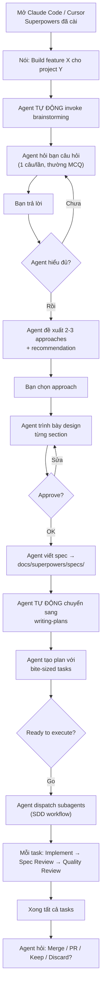

# Superpowers — Playbook

## Cài đặt & Thiết lập

### Claude Code — Official Marketplace

```bash
# Cài từ official Claude plugin marketplace
/plugin install superpowers@claude-plugins-official
```

### Claude Code — Community Marketplace

```bash
# Đăng ký marketplace
/plugin marketplace add obra/superpowers-marketplace

# Cài plugin
/plugin install superpowers@superpowers-marketplace
```

### Cursor

```text
# Trong Cursor Agent chat
/plugin-add superpowers
```

### Codex

Nói với Codex:
```
Fetch and follow instructions from https://raw.githubusercontent.com/obra/superpowers/refs/heads/main/.codex/INSTALL.md
```

### OpenCode

Nói với OpenCode:
```
Fetch and follow instructions from https://raw.githubusercontent.com/obra/superpowers/refs/heads/main/.opencode/INSTALL.md
```

### Verify Installation

Sau khi cài xong, bắt đầu session mới và thử:
- Nói: **"help me plan this feature"** → Superpowers tự trigger brainstorming skill
- Nói: **"let's debug this issue"** → Superpowers tự trigger systematic-debugging skill
- Nếu agent sử dụng skill tự động → ✅ cài đặt thành công

### Update

```bash
# Claude Code
/plugin update superpowers

# Skills cập nhật tự động theo plugin
```

## Day 1 Workflow

### Scenario: Bạn muốn build tính năng mới



### Các thao tác của bạn trong Day 1

| Bước | Bạn làm gì | Agent làm gì |
|------|-------------|---------------|
| 1 | Mô tả feature | Invoke brainstorming |
| 2 | Trả lời câu hỏi | Hỏi 1 câu/lần, MCQ preferred |
| 3 | Chọn approach | Đề xuất 2-3 options |
| 4 | Approve design sections | Trình bày từng section |
| 5 | Nói "Go" | Tạo plan + dispatch subagents |
| 6 | (Đợi) | SDD: implement → review → fix per task |
| 7 | Chọn Merge/PR/Keep/Discard | Thực thi lựa chọn + cleanup |

**Thời gian tự chạy:** Agent có thể tự chạy **hàng giờ** sau khi bạn nói "Go" mà không cần can thiệp (trừ khi BLOCKED).

## Vận hành hàng ngày

### Khi muốn build feature mới

```
"Build [mô tả feature]"
→ Agent tự trigger: brainstorming → writing-plans → SDD
```

### Khi muốn fix bug

```
"Fix [mô tả bug]"
→ Agent tự trigger: systematic-debugging → 4-phase investigation → TDD fix
```

### Khi muốn debug issue phức tạp

```
"Debug: [mô tả vấn đề]"
→ Agent PHẢI: Root Cause Investigation → Pattern Analysis → Hypothesis → Implementation
→ KHÔNG ĐƯỢC fix random
```

### Khi muốn review code

```
"Review the changes I made in [branch/file]"
→ Agent dispatch code-reviewer subagent
```

### Khi muốn tạo custom skill

```
"Help me create a skill for [mô tả technique]"
→ Agent trigger: writing-skills (TDD for documentation)
→ RED: Baseline test → GREEN: Write skill → REFACTOR: Close loopholes
```

### Khi muốn brainstorm riêng (không implement)

```
"Let's brainstorm about [topic]"
→ Agent follows full brainstorming process
→ Kết thúc bằng spec document, không tự chuyển sang implementation
```

## Configuration chiến lược

### Instruction Priority

```
User instructions (CLAUDE.md, AGENTS.md) > Superpowers skills > System prompt
```

**Ví dụ override:** Nếu `CLAUDE.md` nói "don't use TDD" → Superpowers TDD skill bị override.

### Personal Skills (Shadowing)

Personal skills override superpowers skills cùng tên:

```
~/.claude/skills/brainstorming/SKILL.md    ← Agent dùng cái này
plugin/skills/brainstorming/SKILL.md       ← Bị shadow
```

Force dùng superpowers version:
```
Invoke superpowers:brainstorming   ← Bỏ qua personal skill
```

### Skill Types

| Type | Behavior | Ví dụ |
|------|----------|-------|
| **Rigid** | Follow exactly, no adaptation | TDD, debugging, verification |
| **Flexible** | Adapt principles to context | Patterns, techniques |

### Model Selection cho SDD

| Task | Model recommendation | Signal |
|------|---------------------|--------|
| Mechanical implementation | Cheap/Fast | 1-2 files, clear spec |
| Integration tasks | Standard | Multi-file, pattern matching |
| Design/Architecture/Review | Most Capable | Judgment, broad understanding |

### Output Locations

| Content | Default Path | Override |
|---------|-------------|----------|
| Specs | `docs/superpowers/specs/YYYY-MM-DD-<topic>-design.md` | User preference |
| Plans | `docs/superpowers/plans/YYYY-MM-DD-<feature-name>.md` | User preference |
| Personal skills | `~/.claude/skills/` (CC) / `~/.agents/skills/` (Codex) | — |

## Cheat Sheet

### Skills Reference

| Skill | Kích hoạt khi | Iron Law |
|-------|---------------|----------|
| `brainstorming` | Bất kỳ creative work nào | NO code before design approved |
| `writing-plans` | Có spec/requirements cho multi-step task | Bite-sized tasks (2-5 min each) |
| `subagent-driven-development` | Có plan + platform hỗ trợ subagent | Fresh subagent per task + two-stage review |
| `executing-plans` | Có plan + platform KHÔNG có subagent | Execute liên tục, stop chỉ khi blocker |
| `test-driven-development` | Mọi implementation | NO production code without failing test first |
| `systematic-debugging` | Mọi technical issue | NO fixes without root cause investigation |
| `verification-before-completion` | Trước khi claim done/fixed/passing | NO claims without fresh verification evidence |
| `using-git-worktrees` | Trước khi bắt đầu implementation | Isolated workspace, verify clean baseline |
| `finishing-a-development-branch` | Implementation xong, tests pass | Verify tests → Present 4 options → Execute |
| `requesting-code-review` | Sau mỗi task (SDD) hoặc trước merge | Dispatch code-reviewer subagent |
| `receiving-code-review` | Nhận feedback từ reviewer | Fix Critical ngay, Important trước khi tiếp |
| `dispatching-parallel-agents` | Nhiều independent domains | Identify domains → Create tasks → Dispatch → Integrate |
| `writing-skills` | Tạo skill mới | TDD for documentation: RED → GREEN → REFACTOR |
| `using-superpowers` | Mọi conversation | 1% rule: nếu skill CÓ THỂ áp dụng → BẮT BUỘC invoke |

### TDD Cycle Quick Reference

```
1. RED   — Write failing test (one behavior, clear name)
2. VERIFY RED — Run test, confirm fails correctly (not errors)
3. GREEN — Write MINIMAL code to pass
4. VERIFY GREEN — Run test, confirm ALL pass
5. REFACTOR — Clean up (keep green)
6. REPEAT — Next behavior
```

### SDD Per-Task Flow

```
1. Dispatch implementer subagent (full task text + context)
2. Handle status: DONE → review | BLOCKED → assess | NEEDS_CONTEXT → provide
3. Dispatch spec reviewer → approved? → yes → next | no → fix → re-review
4. Dispatch quality reviewer → approved? → yes → next task | no → fix → re-review
5. Mark task complete
```

### Finishing Branch Options

| Option | Lệnh | Cleanup worktree? |
|--------|-------|-------------------|
| 1. Merge locally | `git checkout main && git merge <branch>` | ✅ |
| 2. Create PR | `git push -u origin <branch> && gh pr create` | ✅ |
| 3. Keep as-is | (nothing) | ❌ |
| 4. Discard | Gõ "discard" để confirm | ✅ |

### Common Git Commands trong Superpowers

```bash
# Tạo worktree mới
git worktree add <path> -b <branch-name>

# Verify clean baseline trong worktree
npm test / cargo test / pytest

# List worktrees
git worktree list

# Remove worktree
git worktree remove <path>

# Xem merge base
git merge-base HEAD main
```

## Troubleshooting

### Installation Issues

| Lỗi | Nguyên nhân | Fix |
|-----|-------------|-----|
| Skills không trigger | Plugin chưa cài đúng | Chạy lại `/plugin install superpowers` |
| "Legacy skills dir" warning | Còn `~/.config/superpowers/skills/` | Di chuyển skills sang `~/.claude/skills/` rồi xóa dir cũ |
| Codex không load skills | Chưa set up plugin đúng cách | Follow `docs/README.codex.md` step by step |
| OpenCode không load | Chưa config đúng | Follow `docs/README.opencode.md` step by step |

### Runtime Issues

| Lỗi | Nguyên nhân | Fix |
|-----|-------------|-----|
| Agent không brainstorm mà code luôn | Brainstorming skill chưa trigger | Nói rõ: "Let's brainstorm first" hoặc check plugin install |
| Agent bỏ qua TDD | Có thể CLAUDE.md override | Check CLAUDE.md có "don't use TDD" không |
| Subagent BLOCKED liên tục | Task quá phức tạp hoặc plan sai | Break task nhỏ hơn, upgrade model, hoặc fix plan |
| Review loop chạy mãi | Reviewer và implementer conflict | Sau 5 iterations → escalate to human |
| Agent dùng "should work" | verification-before-completion chưa trigger | Agent PHẢI run command rồi mới claim |
| Personal skill override superpowers | Shadowing mechanism | Dùng `superpowers:skill-name` prefix để force |
| Test pass immediately (TDD) | Test sai hoặc test existing behavior | Fix test, đảm bảo fails vì feature missing |

### SDD Issues

| Lỗi | Nguyên nhân | Fix |
|-----|-------------|-----|
| Implementer NEEDS_CONTEXT | Thiếu context trong prompt | Provide missing context, re-dispatch |
| Spec reviewer reject | Implementation khác spec | Implementer fix, re-review |
| Quality reviewer reject | Code quality issues | Implementer fix, re-review |
| Multiple subagents conflict | Dispatch parallel (sai) | NEVER dispatch parallel implementation subagents |
| Implementer hỏi nhiều | Task mơ hồ | Answer clearly, provide additional context |

### Performance Issues

| Vấn đề | Giải pháp |
|---------|-----------|
| Token cost cao | Dùng cheap model cho mechanical tasks |
| Quá nhiều review iterations | Improve plan quality (more specific steps) |
| Agent chạy lâu không tiến triển | Check nếu BLOCKED, escalate |
| Network timeout khi update | `checkForUpdates()` timeout 3s, không block |

## Best Practices

### ✅ Gold Rules

1. **Luôn để agent brainstorm trước** — Dù project "simple". Anti-pattern: "This is too simple to need a design"
2. **Không code trước test** — Nếu đã code → DELETE. Start over
3. **Verify trước khi claim** — Run command → Read output → THEN claim
4. **1 câu hỏi / message** — Không overwhelm với nhiều câu hỏi
5. **YAGNI triệt để** — Remove unnecessary features từ mọi design
6. **Commit thường xuyên** — Mỗi step hoàn thành → commit
7. **Worktree cho mọi implementation** — Không code trên main/master
8. **Trust the process** — Systematic debugging > random fixes
9. **Two-stage review** — Spec compliance TRƯỚC, code quality SAU
10. **Escalate khi stuck** — Sau 5 review iterations → ask human

### ❌ Anti-Patterns

| Anti-Pattern | Tại sao sai | Thay bằng |
|-------------|-------------|-----------|
| "Too simple to need a design" | Simple projects = most wasted work from unexamined assumptions | Brainstorm ngắn gọn nhưng PHẢI có |
| "I'll test after" | Tests after = test what you built, not what's required | RED-GREEN-REFACTOR |
| "Should work now" | "Should" ≠ evidence | Run verification command |
| "Keep as reference" | You'll adapt it = testing after | Delete means delete |
| "Just this once" | Slippery slope | No exceptions |
| "TDD is dogmatic" | TDD IS pragmatic: faster than debugging | Follow the Iron Law |
| "Tests after achieve same goals" | Tests-after = "What does this do?" vs Tests-first = "What should this do?" | Write test first |
| "This doesn't need a skill" | If skill exists → use it. 1% rule | Invoke skill first |
| "I need more context first" | Skills tell HOW to explore | Check skills BEFORE exploring |
| "Fix multiple things at once" | Can't tell what fixed it | One variable at a time |
| Skip spec review, go to quality | Wrong order! | Spec compliance ✅ THEN quality |

### Khi nào KHÔNG dùng Superpowers workflow

| Scenario | Lý do |
|----------|-------|
| Throwaway prototypes | Ask human partner, không cần TDD |
| Generated code | Machine-generated, không cần manual TDD |
| Configuration files | Có thể skip TDD (ask human) |
| Quick one-line fix | Có thể skip brainstorming (nhưng vẫn TDD nếu applicable) |

## Custom Skills — Tạo skill mới

### Template skill mới

```
~/.claude/skills/
  my-skill/
    SKILL.md              # Main reference (required)
    supporting-file.*     # Nếu cần
```

### SKILL.md Template

```markdown
---
name: my-skill-name
description: Use when [specific triggering conditions]
---

# My Skill Name

## Overview
Core principle in 1-2 sentences.

## When to Use
- Symptom A
- Symptom B
- NOT for: [exclusions]

## The Process
[Steps, flowcharts, checklists]

## Red Flags
[Signs to STOP]

## Common Mistakes
[Anti-patterns + fixes]
```

### Quy trình TDD cho Skills

```
1. RED: Run baseline scenario (agent KHÔNG có skill) → document violations
2. GREEN: Write minimal SKILL.md addressing those violations
3. REFACTOR: Find new rationalizations → plug loopholes → re-verify
```

## Xem thêm

- [[3-Research/Github/superpowers/0. Overview]] — Tổng quan, triết lý, so sánh
- [[3-Research/Github/superpowers/1. Architecture and Logic]] — Data flow, modules, config chi tiết
