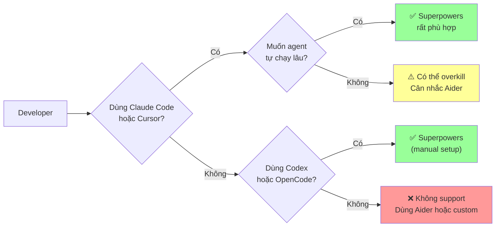
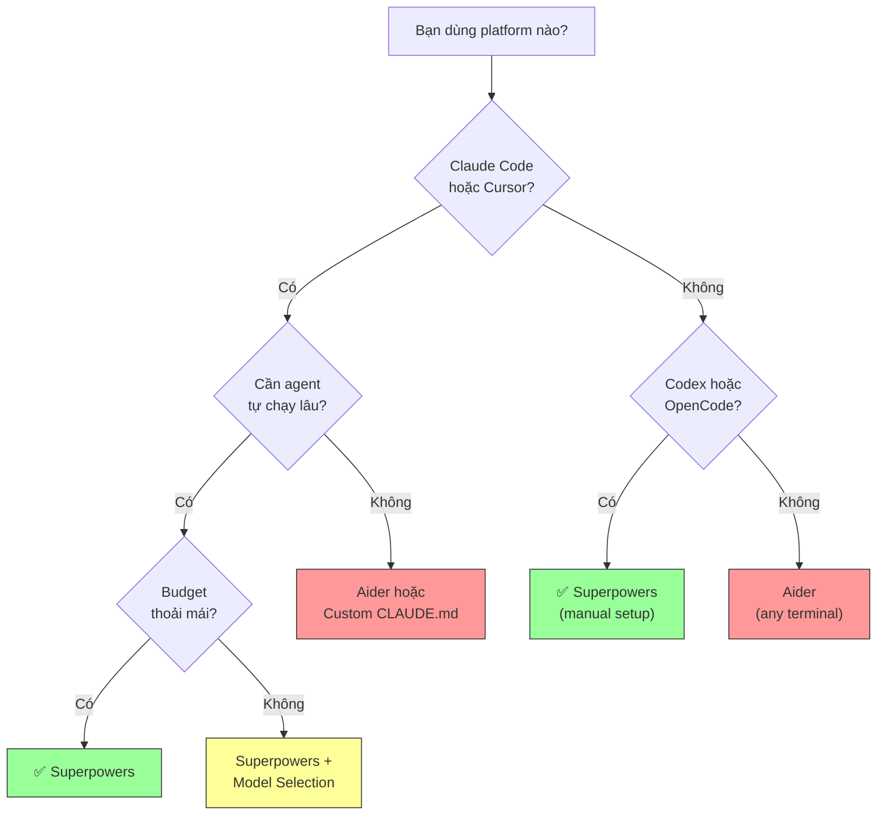

# Superpowers — Decision Guide

## So sánh với Alternatives

### Bảng so sánh feature-by-feature

| Feature | Superpowers | Aider | Custom CLAUDE.md | BMAD Method | Feature-Driven-Flow |
|---------|:-----------:|:-----:|:----------------:|:-----------:|:-------------------:|
| **Brainstorming bắt buộc** | ✅ Mandatory | ❌ | ❌ | ✅ Analysis phase | ⚠️ Phase-based |
| **TDD enforcement** | ✅ Strict Iron Law | ❌ Optional | ❌ Manual rules | ⚠️ Optional | ❌ |
| **Subagent workflow** | ✅ SDD + 2-stage review | ❌ Single agent | ❌ Single context | ✅ 9+ agents | ❌ |
| **Auto-trigger skills** | ✅ 1% rule | ❌ | ❌ | ⚠️ Phase-based | ❌ |
| **Code review tự động** | ✅ Spec + Quality | ❌ | ❌ Manual | ⚠️ Manual | ❌ |
| **Multi-platform** | ✅ CC, Cursor, Codex, OpenCode | ✅ Any terminal | ⚠️ CC only | ⚠️ CC, Cursor | ❌ CC only |
| **LLM flexibility** | ⚠️ Theo platform | ✅ 100+ models (cloud + local) | ⚠️ Theo platform | ⚠️ Theo platform | ⚠️ Theo platform |
| **Git automation** | ✅ Worktrees + PR | ✅ Auto-commit | ⚠️ Manual | ⚠️ Manual | ⚠️ Manual |
| **Document review** | ✅ Automated loops | ❌ | ❌ | ❌ | ❌ |
| **Visual brainstorming** | ✅ Browser companion | ❌ | ❌ | ❌ | ❌ |
| **Debugging framework** | ✅ 4-phase systematic | ❌ | ❌ Manual | ❌ | ❌ |
| **Verification enforcement** | ✅ Evidence before claims | ❌ | ❌ | ❌ | ❌ |
| **Extensibility** | ✅ Custom skills | ✅ Config + conventions | ✅ Full custom | ✅ Custom agents | ⚠️ Limited |
| **Learning curve** | ⚠️ Trung bình | ✅ Thấp | ✅ Thấp | ⚠️ Cao | ⚠️ Trung bình |
| **Cost** | ⚠️ Nhiều subagent calls | ✅ Cheap model support | ✅ Thấp nhất | ⚠️ Multi-agent | ✅ Thấp |
| **Developer control** | ⚠️ Agent tự quyết workflow | ✅ Explicit approval | ✅ Full control | ⚠️ Phase gates | ✅ Full control |

### So sánh chi tiết từng alternative

#### Superpowers vs Aider

| Khía cạnh | Superpowers | Aider |
|-----------|-------------|-------|
| **Triết lý** | Agent tự chạy theo workflow có kỷ luật | Developer pair-programming, control trực tiếp |
| **Autonomy** | Cao — agent tự brainstorm, plan, implement, review | Thấp — developer approve từng change |
| **LLM** | Theo platform (chủ yếu Claude) | 100+ models bao gồm local |
| **Cost hiệu quả** | Nhiều subagent invocations = token cao hơn | Chọn cheap model, fewer tokens per change |
| **Best for** | Autonomous long-running development | Interactive, controlled editing |
| **Kết luận** | Chọn nếu muốn agent tự chạy hàng giờ | Chọn nếu muốn kiểm soát từng bước |

#### Superpowers vs Custom CLAUDE.md

| Khía cạnh | Superpowers | Custom CLAUDE.md |
|-----------|-------------|------------------|
| **Setup** | `plugin install`, xong | Viết rules manual, maintain |
| **Enforcement** | Skills tự kích hoạt, mandatory workflows | Suggestions, agent có thể bỏ qua |
| **Evolution** | Community maintained, auto-update | Bạn tự maintain |
| **Flexibility** | Override bằng CLAUDE.md (priority cao hơn) | Full control |
| **Kết luận** | Dùng Superpowers + CLAUDE.md (complement nhau) | Chỉ dùng riêng nếu workflow quá custom |

#### Superpowers vs BMAD Method

| Khía cạnh | Superpowers | BMAD Method |
|-----------|-------------|-------------|
| **Focus** | Coding workflow end-to-end | Full SDLC (Analysis → Planning → Solutioning → Implementation) |
| **Agents** | Subagent per task (SDD) | 9+ specialized agents (PM, Architect, Developer...) |
| **Scale** | Project-level features | Enterprise-scale với 3 planning tracks |
| **TDD** | Iron Law, non-negotiable | Optional, framework-level |
| **Maturity** | v5.0.0, active development | Open-source, community-driven |
| **Kết luận** | Tốt hơn cho coding discipline | Tốt hơn cho enterprise process management |

## Khi nào NÊN dùng Superpowers

### ✅ Use Cases lý tưởng

| Use Case | Lý do phù hợp |
|----------|----------------|
| **Solo developer muốn agent tự chạy lâu** | SDD workflow cho phép agent tự chạy hàng giờ mà không lệch |
| **Team muốn enforce TDD** | Iron Law + auto-trigger + no exceptions |
| **Dự án cần code quality cao** | Two-stage review (spec + quality) tự động |
| **Feature development từ ý tưởng → merge** | Full pipeline: brainstorm → plan → implement → review → merge |
| **Claude Code users** | Plugin marketplace chính thức, tích hợp liền mạch |
| **Cursor users** | Support qua plugin marketplace |
| **Dự án cần systematic debugging** | 4-phase process, không fix random |
| **Team muốn documentation tự động** | Spec review + plan review loops |
| **Brownfield projects** | Brainstorming khuyến khích follow existing patterns trước |

### Đối tượng phù hợp nhất



## Khi nào KHÔNG nên dùng

### ❌ Anti-Use-Cases

| Scenario | Lý do | Alternative tốt hơn |
|----------|-------|---------------------|
| **Quick one-line fixes** | Overhead brainstorming + planning quá nhiều | Direct Claude Code hoặc Aider |
| **Cần control từng dòng code** | Superpowers agent tự quyết nhiều thứ | Aider (explicit approval model) |
| **Dùng models khác Claude** | Superpowers optimize cho Claude ecosystem | Aider (100+ models, bao gồm local) |
| **Budget rất hạn chế** | Nhiều subagent calls = token cost cao | Aider + cheap model hoặc custom CLAUDE.md |
| **Throwaway prototypes** | Brainstorming + TDD overhead không cần thiết | Direct coding, skip frameworks |
| **Enterprise SDLC management** | Superpowers focus coding, không cover full SDLC | BMAD Method |
| **Team không quen TDD** | Iron Law quá strict, gây frustration | Bắt đầu với custom CLAUDE.md, dần adopt TDD |
| **Generated code / config files** | TDD exceptions cho những loại này | Direct editing |

### Limitations quan trọng

| Limitation | Impact | Workaround |
|-----------|--------|------------|
| **LLM lock-in** | Chủ yếu Claude ecosystem | Codex + OpenCode support giúp mở rộng |
| **Token cost cao** | 3 subagent calls per task (implementer + 2 reviewers) | Model selection strategy: cheap cho mechanical |
| **Visibility hạn chế** | Long-running tasks → ít visibility | Check TodoWrite progress |
| **Context switching** | Worktree ở location khác | Dùng project-local `.worktrees/` |
| **Strict workflows** | Không skip được brainstorming | CLAUDE.md override (priority cao hơn skills) |
| **Slash commands deprecated** | `/brainstorm`, `/write-plan` sẽ bị remove | Dùng skills trực tiếp |

## Case Studies / Ví dụ thực tế

### Case 1: Solo Developer — Feature Development

> **Scenario:** Developer cần build authentication system trong existing app
>
> **Kết quả với Superpowers:**
> - Brainstorming: 15 phút hỏi đáp → 3 approaches proposed → design approved
> - Planning: ~10 phút → 8 tasks, 40+ steps, exact file paths
> - SDD: Agent tự chạy ~2 giờ → 8 tasks complete
> - Review: 16 subagent reviews (2 per task), 3 fix iterations
> - **Output:** Production-ready code với 100% test coverage
>
> **So sánh không có Superpowers:** Developer thường skip design, viết code trước test, miss edge cases → debug 2-3x lâu hơn

### Case 2: Debugging Complex Issue

> **Scenario:** CI pipeline fail, agent được yêu cầu fix
>
> **Với Superpowers (systematic-debugging):**
> 1. Phase 1: Read error messages, reproduce, check recent changes
> 2. Phase 2: Find working examples, compare
> 3. Phase 3: Form hypothesis, test minimally
> 4. Phase 4: Fix at root cause
> **→ Fix đúng lần đầu, thời gian tổng: ~20 phút**
>
> **Không có Superpowers:** Agent thử fix random → 3-4 attempts → có thể gây thêm bugs → ~1-2 giờ

### Case 3: Community Adoption

> **Metrics (tính đến tháng 3/2026):**
> - 76,280 GitHub stars
> - 5,910 forks
> - 371 subscribers
> - 137 open issues (active community)
> - v5.0.0 — 5 major versions trong ~5 tháng (phát triển nhanh)

## Chi phí & Tài nguyên

### Token Cost Analysis

| Component | Token usage per task | Frequency |
|-----------|---------------------|-----------|
| **Implementer subagent** | Medium-High | 1 per task |
| **Spec reviewer** | Low-Medium | 1+ per task (loop) |
| **Quality reviewer** | Low-Medium | 1+ per task (loop) |
| **Spec document reviewer** | Low | 1 per spec |
| **Plan document reviewer** | Low | 1 per plan chunk |

**Ước tính:** Typical feature (8 tasks) với Superpowers SDD ≈ 24-32 subagent invocations (3 reviewers x 8 tasks + re-reviews). So với direct coding ≈ 1-2 sessions.

### Cost Optimization

| Strategy | Cách làm | Savings |
|----------|----------|---------|
| **Model selection** | Cheap model cho mechanical tasks | 40-60% token cost |
| **Better plans** | More specific = fewer review iterations | 20-30% |
| **Scope control** | Decompose large features thành sub-projects | Avoid scope creep |
| **Skip brainstorming** | CLAUDE.md override cho trivial changes | Nhỏ nhưng có |

### Infrastructure yêu cầu

| Yêu cầu | Chi tiết |
|----------|----------|
| **Platform** | Claude Code, Cursor, Codex, hoặc OpenCode |
| **Git** | Required (worktrees) |
| **GitHub CLI** | Optional (cho PR creation) |
| **Node.js** | Required (skills-core.js) |
| **API key** | Theo platform (Anthropic, OpenAI, etc.) |

## Migration Path

### Từ "no framework" → Superpowers

```
1. Cài plugin:  /plugin install superpowers@claude-plugins-official
2. Bắt đầu session mới
3. Agent TỰ ĐỘNG có Superpowers
4. Thử: "Build a simple feature"
5. Quan sát brainstorming → planning → SDD flow
```

**Breaking changes:** Skills tự kích hoạt, thay đổi hành vi mặc định của agent.

### Từ Custom CLAUDE.md → Superpowers

```
1. Cài Superpowers
2. Giữ CLAUDE.md (priority cao hơn skills)
3. Dần loại bỏ rules bị Superpowers cover (TDD, review...)
4. Giữ project-specific rules trong CLAUDE.md
5. Superpowers + CLAUDE.md = complementary
```

**Tip:** Instruction priority: CLAUDE.md > Superpowers skills > System prompt.

### Từ Aider → Superpowers

```
1. Aider và Superpowers KHÔNG xung đột (khác tool)
2. Có thể dùng song song:
   - Aider cho quick edits, interactive work
   - Superpowers cho feature development, long-running tasks
3. Không cần migrate — chọn tool phù hợp cho task
```

### Từ v4.x → v5.0.0

| Breaking change | Migration |
|----------------|-----------|
| Spec location đổi | Move `docs/plans/` → `docs/superpowers/specs/` |
| Plan location đổi | Move `docs/plans/` → `docs/superpowers/plans/` |
| SDD bắt buộc trên CC/Codex | Không cần action — tự động |
| Slash commands deprecated | Dùng skills thay vì `/brainstorm`, `/write-plan`, `/execute-plan` |

## Roadmap & Tương lai

### Community Health

| Metric | Giá trị | Đánh giá |
|--------|---------|----------|
| Stars | 76,280 | 🟢 Rất cao |
| Forks | 5,910 | 🟢 Cao |
| Release frequency | 5 major versions / 5 tháng | 🟢 Rất active |
| Open issues | 137 | 🟡 Active nhưng manageable |
| Maintainer | Jesse Vincent (obra) | 🟢 Experienced, active |
| License | MIT | 🟢 Permissive |
| Language | Shell + JavaScript + Markdown | 🟢 Accessible |

### Hướng phát triển dự kiến

| Trend | Basis |
|-------|-------|
| **More platform support** | Đã có CC, Cursor, Codex, OpenCode — tiếp tục mở rộng |
| **Visual tools** | v5.0.0 thêm brainstorm visual companion — có thể mở rộng |
| **Document review maturity** | Spec + plan review mới thêm — sẽ được polish |
| **Community skills** | Framework hỗ trợ personal skills — ecosystem sẽ grow |
| **Model-agnostic** | Trend towards multi-platform, multi-model support |

### Rủi ro tiềm ẩn

| Rủi ro | Xác suất | Impact |
|--------|----------|--------|
| **Anthropic thay đổi plugin API** | Trung bình | Cao — cần update hooks/integration |
| **Single maintainer** | Thấp (community lớn) | Trung bình — forks có thể tiếp |
| **Token cost tăng** | Thấp | Trung bình — model selection giúp |
| **Competitor tốt hơn** | Trung bình | Thấp — skills composable, dễ adapt |

## Ma trận ra quyết định

| Scenario | Recommendation | Lý do |
|----------|---------------|-------|
| Solo dev, Claude Code, feature dev | ✅ **Dùng Superpowers** | Optimal scenario — agent tự chạy, TDD enforce |
| Team, Cursor, cần code quality | ✅ **Dùng Superpowers** | Two-stage review tự động |
| Quick fix, 1 file | ⚠️ **Skip hoặc override** | Overhead brainstorming không cần thiết |
| Budget hạn chế, cần control | ❌ **Dùng Aider** | Cheap models, explicit approval, fewer tokens |
| Enterprise, full SDLC | ❌ **Dùng BMAD Method** | Covers analysis → planning → solutioning |
| Debugging phức tạp | ✅ **Dùng Superpowers** | 4-phase systematic debugging |
| Prototype / throwaway code | ❌ **Skip frameworks** | TDD overhead không cần thiết |
| Large team, nhiều workflows | ⚠️ **Superpowers + CLAUDE.md** | Complement — skills cho process, CLAUDE.md cho project rules |
| Non-Claude LLM user | ❌ **Dùng Aider** | 100+ model support |
| Muốn học TDD discipline | ✅ **Dùng Superpowers** | Iron Law enforce tốt hơn bất kỳ guide nào |
| Cần audit trail | ⚠️ **Superpowers + Git** | Worktrees + commits nhưng không có built-in audit |
| CI/CD integration | ⚠️ **Partial** | Git + PR nhưng không có CI pipeline integration |

### Quyết định nhanh



## Xem thêm

- [[3-Research/Github/superpowers/0. Overview]] — Tổng quan, triết lý, so sánh nhanh
- [[3-Research/Github/superpowers/1. Architecture and Logic]] — Data flow, modules, config chi tiết
- [[3-Research/Github/superpowers/2. Playbook]] — Cài đặt, Day 1 workflow, cheat sheet, troubleshooting
