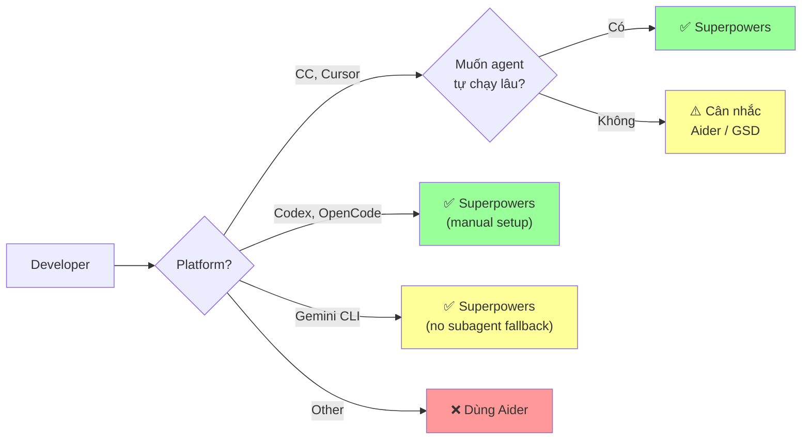
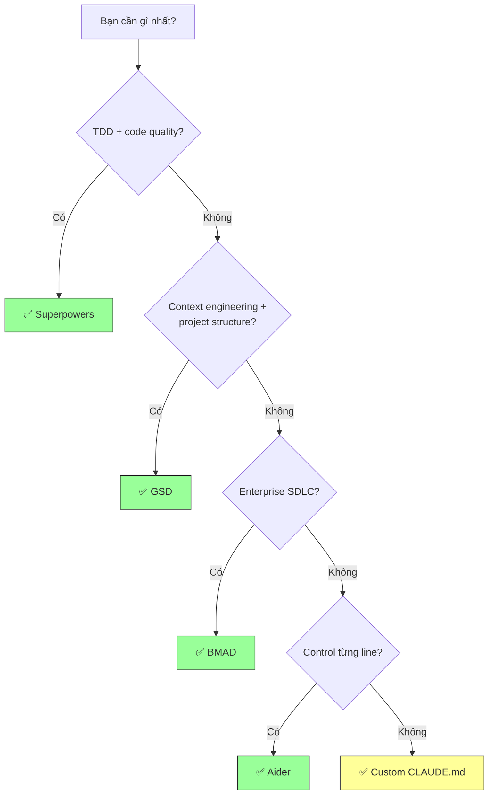

# Superpowers — Decision Guide

## So sánh với Alternatives

### Bảng so sánh feature-by-feature

| Feature | Superpowers v5.0.5 | BMAD v6.2 | GSD v1.26 | Aider | Custom CLAUDE.md |
|---------|:---:|:---:|:---:|:---:|:---:|
| **Brainstorming bắt buộc** | ✅ Mandatory | ✅ Analysis | ❌ | ❌ | ❌ |
| **TDD enforcement** | ✅ Strict Iron Law | ⚠️ TEA module | ❌ | ❌ | ❌ |
| **Subagent workflow** | ✅ SDD + 2-stage review | ✅ Multi-agent | ✅ 16 agents | ❌ | ❌ |
| **Auto-trigger skills** | ✅ 1% rule | ⚠️ Phase-based | ⚠️ Command-based | ❌ | ❌ |
| **Code review tự động** | ✅ Spec + Quality | ❌ Manual | ❌ | ❌ | ❌ |
| **Multi-platform** | ✅ CC, Cursor, Codex, OpenCode, Gemini | ✅ 20+ | ✅ 7 runtimes | ✅ Any | ⚠️ CC only |
| **Context engineering** | ✅ Fresh subagent per task | Partial | ✅ 200K per task | ❌ | ❌ |
| **Document review** | ✅ Automated (refined v5.0.4) | ❌ | ✅ 8-dim verify | ❌ | ❌ |
| **Visual brainstorming** | ✅ Browser companion | ❌ | ❌ | ❌ | ❌ |
| **Debugging framework** | ✅ 4-phase systematic | ❌ | ✅ Persistent debug KB | ❌ | ❌ |
| **Verification enforcement** | ✅ Evidence before claims | ❌ | ✅ verify command | ❌ | ❌ |
| **Custom skills/agents** | ✅ writing-skills | ✅ BMad Builder | ❌ Pre-defined | ✅ Full | ✅ Full |
| **Wave/parallel execution** | ⚠️ Parallel agents skill | ❌ | ✅ Dependency-aware | ❌ | ❌ |
| **Atomic git commits** | Per step (worktree) | ❌ | ✅ Per task | ✅ Auto | ❌ |
| **Learning curve** | ⚠️ Medium | 🔴 High | 🟡 Medium | ✅ Low | ✅ Low |
| **Cost** | ⚠️ SDD = 3 calls/task | ⚠️ Multi-agent | ⚠️ Multi-agent | ✅ Cheap | ✅ Lowest |
| **License** | MIT | MIT | MIT | Apache-2.0 | N/A |

### Superpowers vs GSD — So sánh Chi tiết

| Khía cạnh | Superpowers v5.0.5 | GSD v1.26 |
|-----------|-------------|-----------|
| **Triết lý** | Skills composable, TDD trước tiên | Context engineering, plan verification |
| **Cách kick-off** | Natural language → skills auto-trigger | Slash commands (`/gsd:new-project`) |
| **Planning** | Brainstorming → spec → plan (review loops) | Discuss → Plan (8-dim verification loop) |
| **Execution** | SDD (fresh subagent per task) hoặc inline (v5.0.5) | Wave-based parallel + node repair |
| **Review** | Two-stage (spec + quality) per task | Verify command + regression gate |
| **Debugging** | 4-phase systematic + tools (find-polluter.sh) | Persistent debug knowledge base |
| **State management** | Specs/plans trên disk, worktree isolation | `.planning/` state + HANDOFF.json |
| **UI design** | ❌ | ✅ `/gsd:ui-phase` + 6-pillar audit |
| **PR automation** | ❌ (finish-branch → manual PR) | ✅ `/gsd:ship` auto-generate PR body |
| **Session continuity** | ❌ (state in files, no explicit resume) | ✅ `/gsd:resume-work` + HANDOFF.json |
| **Developer profiling** | ❌ | ✅ `/gsd:profile-user` (8 dimensions) |
| **Cost optimization** | Model selection guidance | Model routing (automatic) |
| **Custom extensibility** | ✅ Custom skills (writing-skills guide) | ❌ Pre-defined agents only |
| **TDD** | ✅ Iron Law (strict) | ❌ Not enforced |
| **Khi nào chọn** | Muốn strict TDD + brainstorming + skills composable | Muốn context engineering + atomic execution + PR automation |

### Superpowers vs BMAD Method

| Khía cạnh | Superpowers v5.0.5 | BMAD v6.2 |
|-----------|-------------|-----------|
| **Focus** | Coding workflow end-to-end | Full SDLC (4 phases, 3 tracks) |
| **Agents** | Subagent per task (SDD) | 9+ specialized agents (PM, Architect, Dev...) |
| **Scale** | Project-level features | Enterprise-scale |
| **TDD** | Iron Law, non-negotiable | Via TEA module |
| **Custom agents** | Custom skills | BMad Builder module |
| **Module ecosystem** | Monolithic (14 skills) | 6 installable modules |
| **Khi nào chọn** | Coding discipline, autonomous development | Enterprise SDLC, custom agents, modular ecosystem |

## Khi nào NÊN dùng Superpowers

### ✅ Use Cases lý tưởng

| Use Case | Lý do phù hợp |
|----------|----------------|
| **Solo developer muốn agent tự chạy lâu** | SDD workflow cho phép agent tự chạy hàng giờ |
| **Team muốn enforce TDD** | Iron Law + auto-trigger + no exceptions |
| **Dự án cần code quality cao** | Two-stage review (spec + quality) tự động |
| **Feature development từ ý tưởng → merge** | Full pipeline: brainstorm → plan → implement → review |
| **Claude Code / Cursor users** | Plugin marketplace chính thức |
| **Gemini CLI users** | Native extension support (v5.0.1) |
| **Dự án cần systematic debugging** | 4-phase process, không fix random |
| **Brownfield projects** | Brainstorming follow existing patterns |
| **Muốn flexibility: SDD vs inline** | v5.0.5 cho phép chọn execution mode |

### Đối tượng phù hợp nhất



## Khi nào KHÔNG nên dùng

### ❌ Anti-Use-Cases

| Scenario | Lý do | Alternative tốt hơn |
|----------|-------|---------------------|
| **Quick one-line fixes** | Overhead brainstorming + planning | Direct Claude Code, Aider, hoặc `/gsd:quick` |
| **Cần control từng dòng code** | Agent tự quyết workflow | Aider (explicit approval) |
| **Budget rất hạn chế** | 3 subagent calls/task = token cao | Aider + cheap model |
| **Throwaway prototypes** | TDD overhead không cần thiết | Direct coding |
| **Enterprise SDLC management** | Focus coding, không cover full SDLC | BMAD Method |
| **Cần UI design system** | Không có UI design workflow | GSD (`/gsd:ui-phase`) |
| **Cần PR automation** | Manual merge/PR | GSD (`/gsd:ship`) |
| **Cần session continuity** | Không có explicit resume mechanism | GSD (`/gsd:resume-work`) |
| **Non-Claude LLM user** | Chủ yếu Claude ecosystem | Aider (100+ models) |

### Limitations quan trọng

| Limitation | Impact | Workaround |
|-----------|--------|------------|
| **LLM lock-in** | Chủ yếu Claude ecosystem | Gemini CLI + OpenCode support mở rộng |
| **Token cost cao** | 3 subagent calls per task | Model selection strategy; inline execution (v5.0.5) |
| **Strict TDD** | Không skip được | CLAUDE.md override (priority cao hơn) |
| **No session continuity** | Context mất khi restart | Specs/plans persisted trên disk |
| **Slash commands deprecated** | `/brainstorm`, `/write-plan` sẽ bị remove | Dùng skills trực tiếp |
| **No UI design** | Không có visual audit | Dùng kèm GSD cho frontend projects |

## Chi phí & Tài nguyên

### Token Cost Analysis

| Component | Token usage | Frequency |
|-----------|------------|-----------|
| **Implementer subagent** | Medium-High | 1 per task |
| **Spec reviewer** | Low-Medium | 1+ per task (loop max 3) |
| **Quality reviewer** | Low-Medium | 1+ per task (loop max 3) |
| **Spec document reviewer** | Low | 1 per spec (loop max 3) |
| **Plan document reviewer** | Low | 1 per plan (v5.0.4: single whole-plan) |

**v5.0.4 savings:** ~30-40% token reduction nhờ single whole-plan review (thay vì chunk-by-chunk) và max 3 iterations (thay vì 5).

**v5.0.5 option:** Chọn inline execution thay vì SDD → giảm ~70% subagent token cost (no separate implementer/reviewer subagents).

### Cost Optimization

| Strategy | Cách làm | Savings |
|----------|----------|---------|
| **Model selection** | Cheap model cho mechanical tasks | 40-60% |
| **Better plans** | More specific = fewer review iterations | 20-30% |
| **Inline execution** | Skip SDD for simple features (v5.0.5) | ~70% subagent cost |
| **CLAUDE.md override** | Skip brainstorming cho trivial changes | Minor |

### Infrastructure yêu cầu

| Yêu cầu | Chi tiết |
|----------|----------|
| **Platform** | Claude Code, Cursor, Codex, OpenCode, hoặc Gemini CLI |
| **Git** | Required (worktrees) |
| **GitHub CLI** | Optional (cho PR creation) |
| **Node.js** | Required cho brainstorm server (v16.7+ recommended; v22+ needs v5.0.5) |
| **API key** | Theo platform (Anthropic, OpenAI, etc.) |

## Community Health

| Metric | Giá trị (2026-03-19) | Đánh giá |
|--------|---------|----------|
| Stars | 76,280 | 🟢 Rất cao |
| Forks | 5,910+ | 🟢 Cao |
| Release frequency | v5.0.0 → v5.0.5 trong 8 ngày | 🟢 Rất active |
| Total versions | 15+ (v2.0 → v5.0.5 trong ~5 tháng) | 🟢 Mature |
| Maintainer | Jesse Vincent (obra) | 🟢 Experienced, responsive |
| License | MIT | 🟢 Permissive |
| Contributors | PR từ @sarbojitrana, @mvanhorn, @karuturi, @daniel-graham... | 🟢 Active community |
| Notable users | Engineers using CC, Cursor, Codex, OpenCode | 🟢 Cross-platform |

## Migration Path

### Từ "no framework" → Superpowers

```
1. /plugin install superpowers@claude-plugins-official
2. Bắt đầu session mới
3. Agent TỰ ĐỘNG có Superpowers
4. "Build a simple feature" → quan sát full workflow
```

### Từ v5.0.0 → v5.0.5

| Change | Migration |
|--------|-----------|
| Review loops: 5→3 max | Tự động — không action |
| SDD optional (v5.0.5) | Agent sẽ hỏi execution mode |
| Gemini CLI support (v5.0.1) | Cài `gemini-extension.json` + `GEMINI.md` ở root |
| Cursor hooks (v5.0.3) | `hooks-cursor.json` auto-detected |
| OpenCode (v5.0.4) | Thêm 1 line vào `opencode.json` |
| Brainstorm server | Tự động — zero-dep, no npm needed |

### Kết hợp Superpowers + GSD

```
Superpowers + GSD KHÔNG xung đột — cài cạnh nhau được.

Chia vai trò:
- Superpowers: TDD enforcement, brainstorming, SDD workflow
- GSD: Context engineering, session state, PR automation, UI design

Cùng dùng khi muốn TDD discipline + structured project management.
```

## Ma trận ra quyết định

| Scenario | Recommendation | Lý do |
|----------|---------------|-------|
| Solo dev, CC, feature dev | ✅ **Superpowers** | Agent tự chạy, TDD enforce |
| Team, Cursor, code quality | ✅ **Superpowers** | Two-stage review tự động |
| Quick fix, 1 file | ⚠️ **Skip / override** | Overhead brainstorm không cần |
| Budget hạn chế | ⚠️ **SP (inline mode)** hoặc **Aider** | v5.0.5 inline = ~70% less tokens |
| Enterprise SDLC | ❌ **BMAD Method** | Full lifecycle management |
| Frontend + UI design | ⚠️ **SP + GSD** | SP lacks UI design system |
| Session continuity cần | ⚠️ **GSD** | SP lacks explicit resume |
| PR automation cần | ⚠️ **GSD** | SP lacks `/gsd:ship` |
| Debugging phức tạp | ✅ **Superpowers** | 4-phase systematic |
| Prototype / throwaway | ❌ **Direct coding** | TDD overhead |
| Muốn học TDD | ✅ **Superpowers** | Iron Law enforce tốt nhất |
| Gemini CLI user | ✅ **Superpowers** | Native extension (v5.0.1) |
| Muốn cả TDD + context eng. | ✅ **SP + GSD** | Complementary |

### Quyết định nhanh



## Xem thêm

- [0. Overview](./0. Overview.md) — Tổng quan, triết lý, so sánh nhanh
- [1. Architecture and Logic](./1. Architecture and Logic.md) — Data flow, modules, config chi tiết
- [2. Playbook](./2. Playbook.md) — Cài đặt, Day 1 workflow, cheat sheet, troubleshooting
